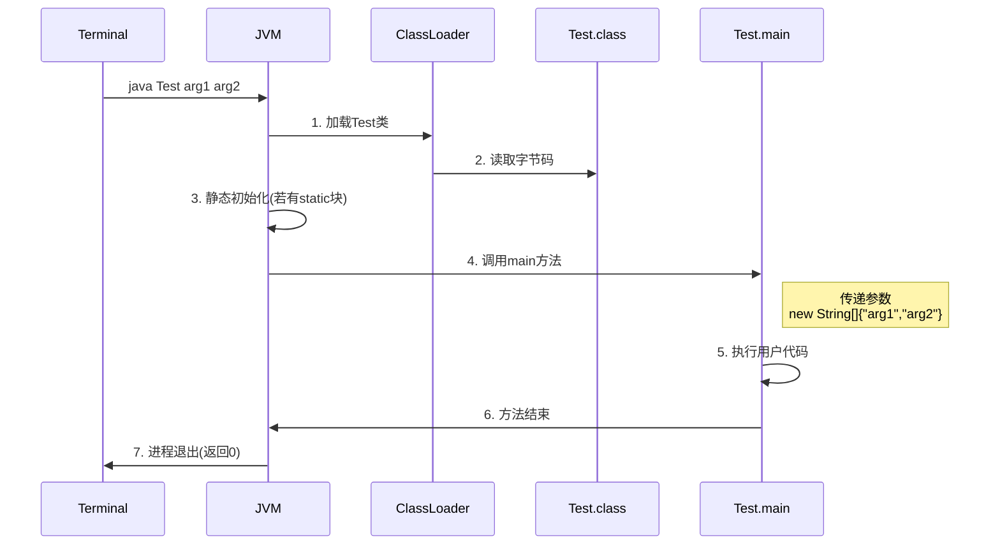

# java 基础

## 面向对象

### **对象**

对象是一种特殊的数据结构，可以用来记住一个事物的数据，从而代表该事物。java 中万物皆对象，任何事物都可以用一个对象、类来表示。如 Person、Student 等等。

```java
// 学生类
// 封装：把数据和对数据的处理放到同一个类中去
public class Student {
    String name;
    double chinese;
    double math;

    public void printAllScore(){
        System.out.println(name + "的总成绩是：" +
                (chinese + math));
    }

    public void printAverageScore(){
        System.out.println(name + "的平均成绩是：" +
                (chinese + math) / 2);
    }
}

public class Test2 {
    public static void main(String[] args) {
        // 目标：创建学生对象存储学生数据，并操作学生数据。
        Student s1 = new Student();		// 直接new
        s1.name = "播妞";
        s1.chinese = 100;
        s1.math = 100;
        s1.printAllScore();
        s1.printAverageScore();
        System.out.println(s1);


        Student s2 = new Student();
        s2.name = "播仔";
        s2.chinese = 50;
        s2.math = 100;
        s2.printAllScore();
        s2.printAverageScore();
        System.out.println(s2);
    }
}
```

学生对象要有学生的属性，如姓名、学号、科目成绩等，以及学生可能会用到的一些方法等。

对象本质上是一种特殊的数据结构，用来模拟真实业务场景下的事物。

**类的成分：构造器、属性（成员变量）、方法**

构造器的注意事项：

- 类默认自带一个无参构造器
- 如果为类定义了有参构造器，类默认的无参构造器就没有了，如果还要用无参构造器，就必须自己手写一个无参构造器。

构造器用于对象的初始化，为对象的属性值进行初始化赋值。

#### 实体类

1、类中的成员变量全部私有，并提供 public 的 getter/setter 方法

2、类中需要提供一个无参数构造器，（有参构造器可选，可有可无）

满足 1、2 的就是实体类，主要作用是用于存储数据和获取数据，实现数据存取和数据处理业务的分离。

```java
package com.itheima.javabean;

public class Student {
    // 1、成员变量需要私有
    private String name;
    private int age;
    private char sex;
    private double math;
    private double english;


    // 3、必须提供无参构造器。有参数构造器可有可无的。
    public Student() {
    }

    public Student(String name, int age, char sex, double math, double english) {
        this.name = name;
        this.age = age;
        this.sex = sex;
        this.math = math;
        this.english = english;
    }

    // 2、必须提供getter和setter方法。
    public String getName() {
        return name;
    }

    public void setName(String name) {
        this.name = name;
    }

    public int getAge() {
        return age;
    }

    public void setAge(int age) {
        this.age = age;
    }

    public char getSex() {
        return sex;
    }

    public void setSex(char sex) {
        this.sex = sex;
    }

    public double getMath() {
        return math;
    }

    public void setMath(double math) {
        this.math = math;
    }

    public double getEnglish() {
        return english;
    }

    public void setEnglish(double english) {
        this.english = english;
    }
}

```

**static 关键字**

静态，可以用来修饰类中的成员变量和成员方法，成员变量按照有无 static 修饰，分为两种：静态变量（类变量），实例变量（对象的变量）

静态变量属于类本身拥有，被类的所有对象共有，不需要实例化类就可以使用；和类初始化时一起加载一次，在内存中只有一份

**如果某个数据只需要一份，且希望能够被共享(访问、修改），则该数据可以定义成静态变量来记住。**

1、成员变量有几种？各自在什么情况下定义？

​	静态变量：数据只需要一份，且需要被共享时（访问，修改）

​	实例变量：每个对象都要有一份，数据各不同（如：name、score、age）

2、访问自己类中的类变量，是否可以省略类名不写？

​	可以的

​	注意：在某个类中访问其他类里的类变量，必须带类名访问

类中变量、方法等在内部的存储原理，如 public、private、static 修饰的变量、方法等

理解类中变量、方法等在内存中的存储原理，关键在于区分它们的作用域、生命周期以及访问控制修饰符（`public`, `private`, `protected`, `package-private`）和存储类别修饰符（`static`, `final`）的影响。Java 虚拟机（JVM）规范定义了内存区域，具体实现（如 HotSpot）会据此管理内存。

以下是核心原理的解析：

1.  **内存区域概览 (JVM 视角)**
    *   **方法区 (Method Area) / 元空间 (Metaspace - HotSpot 实现):**
        *   **存储内容：** **类信息**（类名、父类名、接口列表、字段描述符、方法描述符、方法字节码、常量池、运行时常量池、静态变量 `static`）。
        *   **生命周期：** 从 **类被加载** 时开始存在，直到 **类被卸载**（通常发生在类加载器被回收时）。是 **所有线程共享** 的区域。
    *   **堆 (Heap):**
        *   **存储内容：** **对象实例**（包括对象头、实例数据 `非static字段`、对齐填充）。数组也在堆中。
        *   **生命周期：** 对象实例在 **`new`** 关键字执行时创建，在 **垃圾回收器 (GC)** 确定其不再被引用时回收。也是 **所有线程共享** 的区域。
    *   **Java 虚拟机栈 (JVM Stack - 线程私有):**
        *   **存储内容：** 线程执行方法时创建的 **栈帧 (Stack Frame)**。每个栈帧包含：
            *   **局部变量表 (Local Variable Array):** 存储 **方法参数** 和 **方法内部定义的局部变量**（包括基本类型和对象引用）。
            *   **操作数栈 (Operand Stack):** 用于执行字节码指令时的计算。
            *   **动态链接 (Dynamic Linking):** 指向方法区中该栈帧所属方法的引用。
            *   **方法返回地址 (Return Address):** 方法正常结束或异常退出后应返回的位置。
        *   **生命周期：** 栈帧在 **方法调用** 时创建，在 **方法结束**（正常返回或抛出未捕获异常）时销毁。每个线程有自己的栈。
    *   **程序计数器 (Program Counter Register - 线程私有):**
        *   **存储内容：** 当前线程 **正在执行的字节码指令的地址**（如果执行的是本地方法，则值为 `undefined`）。
        *   **生命周期：** 随线程创建而存在，线程结束而消亡。
    *   **本地方法栈 (Native Method Stack - 线程私有):**
        *   **存储内容：** 为执行 **本地（Native）方法**（用 C/C++等实现）服务的栈。
        *   **生命周期：** 同 Java 虚拟机栈。

2.  **变量存储原理**
    *   **静态变量 (`static` 修饰):**
        *   **存储位置：** **方法区/元空间**。
        *   **生命周期：** **类加载** 时初始化（或在更早的准备阶段赋默认值），**类卸载** 时销毁。
        *   **访问方式：** 通过 **类名.变量名** 直接访问（`ClassName.staticVar`）。所有该类的实例 **共享** 同一个静态变量。
        *   **`public/private` 的影响：** 仅影响 **访问权限**（编译期和运行期访问控制检查），**不影响存储位置**。`public static` 变量可以被任何能访问该类的代码通过类名访问；`private static` 变量只能被该类内部的代码访问。
    *   **实例变量 (非 `static` 修饰):**
        *   **存储位置：** **堆** 中对象实例的内部（作为对象实例数据的一部分）。
        *   **生命周期：** 与 **所属的对象实例** 相同。对象创建时分配空间并初始化（或赋默认值），对象被垃圾回收时销毁。
        *   **访问方式：** 必须通过 **对象引用.变量名** 访问（`objectRef.instanceVar`）。每个对象实例都有自己的独立副本。
        *   **`public/private` 的影响：** 仅影响 **访问权限**。`public` 实例变量可以被任何持有该对象引用的代码访问；`private` 实例变量只能被该类内部的代码访问（通过 `this` 或直接访问）。
    *   **局部变量 (方法内部定义的变量，包括参数):**
        *   **存储位置：** **Java 虚拟机栈** 中当前方法栈帧的 **局部变量表**。
        *   **生命周期：** **方法调用** 时分配空间（进入作用域），**方法结束** 或 **变量超出作用域** 时销毁。
        *   **访问方式：** 在方法内部直接通过变量名访问。
        *   **`public/private/static` 无关：** 局部变量不能使用这些修饰符。它们的可见性和生命周期严格限定在定义它们的方法（或代码块）内。
    *   **常量 (`static final` 修饰的原始类型或字符串):**
        *   **存储位置：** 通常存储在 **方法区/元空间** 的运行时常量池中。
        *   **生命周期：** 同静态变量（类加载到类卸载）。
        *   **访问方式：** 通过类名访问（`ClassName.CONSTANT`）。
        *   **特点：** 编译器可能进行 **常量折叠**（Constant Folding）优化，将引用直接替换为字面值。`final` 修饰的实例变量必须在对象构造完成前初始化，且一旦赋值不能改变。

3.  **方法存储原理**
    *   **方法字节码:**
        *   **存储位置：** **方法区/元空间**（作为类信息的一部分）。
        *   **生命周期：** 类加载到类卸载。
    *   **方法调用与执行:**
        *   当调用一个方法时，JVM 会为该方法创建一个新的 **栈帧**，压入当前线程的 **Java 虚拟机栈**。
        *   栈帧中的 **局部变量表** 用于存储传入的参数和方法内部定义的局部变量。
        *   栈帧中的 **操作数栈** 用于执行方法字节码指令（计算、传递参数等）。
        *   **`static` 方法:**
            *   属于类，而非对象实例。
            *   调用方式：**类名.方法名**（`ClassName.staticMethod()`）。
            *   内部 **不能直接访问** 非静态的实例变量和方法（因为没有隐含的 `this` 引用）。只能访问静态变量/方法。
        *   **非 `static` 方法 (实例方法):**
            *   属于对象实例。
            *   调用方式：**对象引用.方法名**（`objectRef.instanceMethod()`）。
            *   方法内部隐含一个指向调用该方法的对象的 **`this` 引用**（存储在局部变量表的第 0 个槽位），通过 `this` 可以访问该对象的实例变量和其他实例方法。
        *   **`public/private` 的影响：** 仅影响 **访问权限**（编译期和运行期访问控制检查），**不影响方法字节码的存储位置或执行机制**。`public` 方法可以被任何能访问该类的代码调用；`private` 方法只能被该类内部的代码调用。

4.  **访问控制 (`public`, `private`, `protected`, `package-private`) 的实现**
    *   **编译期检查：** Java 编译器在编译源代码时，会严格检查访问权限。如果代码试图访问它无权访问的成员（如在一个类的外部访问其 `private` 成员），编译器会直接报错。
    *   **运行期检查 (可选)：** JVM 在加载和验证类文件时，理论上也会进行访问控制检查（如 `ACC_PUBLIC`, `ACC_PRIVATE` 等访问标志位）。虽然在实际调用时，JVM 通常信任编译器已经完成了权限检查，但规范允许 JVM 在运行时再次验证。反射调用时，JVM 会强制执行访问控制检查（除非使用 `setAccessible(true)` 绕过）。
    *   **存储无关性：** 访问控制修饰符 **不改变** 变量或方法在内存中的 **物理存储位置**。它们纯粹是语言层面的 **访问规则**。一个 `private static` 变量和一个 `public static` 变量都存储在方法区；一个 `private` 实例变量和一个 `public` 实例变量都存储在堆中各自所属的对象实例里。区别仅在于编译器/JVM 是否允许外部代码通过点操作符（`.`）或反射去访问它们。

**总结关键点：**

| 特性                     | 静态变量 (`static`)                | 实例变量 (非 `static`)             | 局部变量                      | 静态方法 (`static`)                     | 实例方法 (非 `static`)                  |
| :----------------------- | :--------------------------------- | :--------------------------------- | :---------------------------- | :-------------------------------------- | :-------------------------------------- |
| **存储位置**             | 方法区/元空间                      | 堆 (对象实例内部)                  | Java 栈 (栈帧的局部变量表)     | 方法区/元空间 (字节码)                  | 方法区/元空间 (字节码)                  |
| **生命周期**             | 类加载 -> 类卸载                   | 对象创建 -> 对象被 GC 回收           | 方法调用 -> 方法结束/作用域出 | 类加载 -> 类卸载                        | 类加载 -> 类卸载                        |
| **访问方式**             | `ClassName.var`                    | `objectRef.var`                    | 方法内直接使用变量名          | `ClassName.method()`                    | `objectRef.method()`                    |
| **`this` 引用**           | 无                                 | 有 (通过 `this` 访问)                | 无                            | **无**                                  | **有** (隐含 `this`，可访问实例成员)     |
| **共享性**               | 所有实例共享同一份                 | 每个实例有独立副本                 | 每个方法调用有独立副本        | 属于类                                  | 属于对象实例                            |
| **`public/private` 作用** | 控制访问权限 **(不改变存储位置!)** | 控制访问权限 **(不改变存储位置!)** | 不可用                        | 控制访问权限 **(不改变存储/执行机制!)** | 控制访问权限 **(不改变存储/执行机制!)** |

**核心原则：**

1.  **`static` 决定位置和生命周期：** `static` 成员（变量、方法）属于 **类本身**，存储在 **方法区/元空间**，生命周期与 **类加载/卸载** 绑定。非 `static` 成员属于 **对象实例**，存储在 **堆** 中，生命周期与 **对象** 绑定。
2.  **访问控制是逻辑规则：** `public`, `private` 等修饰符是 **编译器和 JVM 强制执行的语言规则**，用于限制代码的访问权限。它们 **不** 影响变量或方法在内存中的 **物理存储位置** 或底层执行机制。`private` 变量并不是被“藏”在某个特殊的、别人找不到的内存区域，只是编译器/JVM 不允许外部代码访问它。
3.  **对象是实例数据的容器：** 当你创建一个对象 (`new ClassName()`) 时，在堆上分配的内存块包含了该对象所有非 `static` 字段（实例变量）的值（以及对象头、对齐填充等）。
4.  **方法是共享的代码：** 同一个类的方法（无论 `static` 还是非 `static`）的字节码 **只有一份**，存储在方法区/元空间。调用方法时，只是在线程栈上创建栈帧来执行这段共享的代码。对于实例方法，JVM 通过隐含传入的 `this` 引用知道当前操作的是哪个对象的数据。

理解这些底层原理有助于写出更高效、内存管理更合理的代码，并深刻理解面向对象概念（如封装、类与对象的关系）在 JVM 层面的实现方式。

---

#### 深入解析 Java 的 `main` 方法

##### 1. `main` 方法的本质

```java
public class Test {
    public static void main(String[] args) {
        // 程序入口代码
    }
}
```

- **特殊身份**：`main` 方法是 JVM 规定的 **程序唯一入口点**，没有它 JVM 无法启动程序。
- **固定签名**：必须严格满足以下格式：
  - `public`：允许 JVM 从外部访问
  - `static`：无需创建类实例即可调用
  - `void`：不返回任何值
  - `String[] args`：接收命令行参数的字符串数组

##### 2. 执行原理详解

先 javac Test.java 生成 Test.class 文件，然后执行 `java Test` 命令时：



##### 关键步骤解析：

1. **类加载**：
   - JVM 的类加载器（Bootstrap ClassLoader）加载 `Test.class`
   - 类元信息存入方法区（Metaspace）
2. **静态初始化**：
   - 若有 `static{}` 代码块，此时执行
   - 静态变量初始化完成
3. **方法调用**：
   - JVM 通过反射机制定位 `main` 方法
   - 创建线程栈帧（Stack Frame）
   - 参数处理：命令行参数 → `String[] args`
4. **执行环境**：
   - 在 JVM 栈中创建局部变量表
   - 无 `this` 引用（因为是 static 方法）
   - 可访问静态成员，但不能直接访问实例成员

##### 3. 特殊设计的原因

| 特性       | 为什么必需               | 不这样设计的后果      |
| :--------- | :----------------------- | :-------------------- |
| `public`   | JVM 需要跨包访问入口方法 | JVM 无法调用私有方法  |
| `static`   | 避免先实例化的死循环问题 | 需要先 new 对象才能启动 |
| `void`     | 无返回值给操作系统       | 返回值语义不明确      |
| `String[]` | 统一接收命令行参数       | 无法获取启动参数      |

##### 4. 常见误区澄清

- **误区 1**：每个类都可以有 main 方法

  - ✅ 正确：但只有执行 `java 类名` 的类才会被作为入口

- **误区 2**：main 方法是第一个执行的方法

  - ❌ 错误：静态初始化块先于 main 执行

  ```java
  public class Test {
      static { System.out.println("先执行我！"); }
      public static void main(String[] args) {
          System.out.println("然后执行我");
      }
  }
  ```

- **误区 3**：args 参数不能为 null

  - ✅ 实际上：`java Test` 时 args 是空数组（非 null）
  - `args.length == 0`

##### 5. 高级特性

**多入口支持**（需要自定义启动器）：

```java
public class Launcher {
    public static void main(String[] args) {
        if(args[0].equals("web")) 
            WebServer.main(Arrays.copyOfRange(args, 1, args.length));
        else if(args[0].equals("cli"))
            CLIApp.main(Arrays.copyOfRange(args, 1, args.length));
    }
}
```

**JEP 445 预览**（Java 21+）：

```java
// 未来可能简化的入口（预览特性）
void main() {
    System.out.println("更简洁的入口!");
}
```

##### 总结关键点

1. **核心作用**：JVM 启动的 **强制入口点**，如同程序的 `main()` 函数
2. **执行机制**：`java 类名` → 类加载 → 静态初始化 → 反射调用 main
3. **设计约束**：`public static void main(String[])` 是 JVM 规范强制要求
4. **参数传递**：命令行参数 → `String[] args`（空格分隔，引号处理含空格的参数）
5. **执行环境**：在 **主线程** 中运行，独立栈帧，无 `this` 引用

> 理解 `main` 方法的设计，是掌握 Java 程序启动机制和 JVM 工作原理的重要基础。它的特殊地位源于 JVM 规范的定义，而非语言层面的特殊语法。

---

#### 静态方法

静态方法通常应用于工具类中，每个方法用来完成一个功能，以便供给开发人员直接使用

**为什么工具类中的方法要用静态方法，而不是实例方法？**

实例方法需要创建对象来调用，此时对象只是为了调用方法，对象会占内存，这样会浪费内存，静态方法无需创建实例即可调用，直接用类名调用即可，调用方便，节省内存。（工具类没有创建对象的需求，可以直接将工具类的构造器私有）

**静态方法、实例方法访问相关的几点注意事项**

- ==静态方法中可以直接访问静态成员，不可以直接访问实例成员；==（因为静态方法调用不依赖于实例，调用静态方法时可能并没有创建实例，自然就无法直接在静态方法中访问实例成员）
- 实例方法中既可以直接访问静态成员，也可以直接访问实例成员；（因为静态成员、静态方法都是类所有，并被类的所有实例共享）
- 实例方法中可以出现 this 关键字，静态方法中不可以出现 this 关键字；（因为 this 指代当前类的对象实例，需要初始化实例才可以使用）

### 继承

类和类之间可以有继承关系，java 中只支持类的单继承，也就是一个类最多只能有一个父类

**作用：减少代码重复，提高代码的复用性**

java 中提高关键字 `extends`，让当前类继承一个类；

> 子类可以继承父类的 **非私有成员**（成员变量、成员方法）
>
> 子类的对象由子类、父类共同完成

#### Java 创建子类的完整过程详解

在 Java 中创建子类对象时，**必须首先创建父类对象**。这个过程是递归进行的，直到顶层的 `Object` 类。以下是详细的创建过程：

```java
class Animal { // 父类
    public Animal() {
        System.out.println("Animal 构造器");
    }
}

class Dog extends Animal { // 子类
    public Dog() {
        System.out.println("Dog 构造器");
    }
}

// 创建子类实例
Dog myDog = new Dog();
```

#### 创建过程的完整步骤（核心顺序：Object → 父类 → 子类）

1. **类加载阶段（JVM 完成）**
   - 当首次创建子类对象时，JVM 会加载所有相关类
   - 加载顺序：`Object` → 父类 → 子类
   - 每个类的静态初始化块（`static{}`）在类加载时执行

2. **内存分配**
   - 在堆内存中为整个对象分配空间（包含父类+子类的所有字段）
   - 内存结构示例：
     ```
     [对象头]
     [Animal 字段]  // 父类部分
     [Dog 字段]     // 子类新增部分
     ```

3. **递归初始化父类（关键步骤）**
   - 从 `Object` 开始向下初始化：
     ```mermaid
     graph LR
     A[Object 初始化] --> B[父类字段初始化]
     B --> C[父类构造器]
     C --> D[子类字段初始化]
     D --> E[子类构造器]
     ```
   - 具体流程：
     a. 初始化 `Object` 类（隐式进行）
     b. 初始化父类（`Animal`）的实例变量（赋默认值）
     c. 执行父类（`Animal`）的构造器
     d. **只有父类完全初始化后，才开始子类初始化**

4. **子类初始化**
   - 初始化子类（`Dog`）的实例变量
   - 执行子类（`Dog`）的构造器
   - 此时可通过 `super` 访问已初始化的父类成员

#### 构造器调用规则

1. **隐式 `super()` 调用**：
   ```java
   class Dog extends Animal {
       // 编译器自动添加：
       // super();  // 调用父类无参构造器
       public Dog() {
           System.out.println("Dog 构造器");
       }
   }
   ```

2. **显式 `super` 调用**（必须第一行）：
   ```java
   class Dog extends Animal {
       private String breed;
       
       public Dog(String breed) {
           super("Canine");  // 显式调用父类有参构造器
           this.breed = breed;
       }
   }
   ```

#### 内存模型图解

```
堆内存中的 Dog 对象：
+-----------------------+
|      对象头           |
+-----------------------+
| Object 类的字段       | <-- 隐式继承
+-----------------------+
| Animal 类的字段       | <-- 父类部分
| - species: String     |
| - age: int            |
+-----------------------+
| Dog 类的字段          | <-- 子类新增
| - breed: String       |
| - isTrained: boolean  |
+-----------------------+
```

#### 重要规则与陷阱

1. **构造器链规则**：
   - 子类构造器 **必须** 直接或间接调用父类构造器
   - 如果父类 **没有无参构造器**，子类 **必须显式调用** `super(...)`
   ```java
   class Animal {
       public Animal(String species) {...} // 只有有参构造器
   }
   
   class Dog extends Animal {
       public Dog() {
           super("Canine"); // 必须显式调用
       }
   }
   ```

2. **初始化顺序**：
   ```java
   class Parent {
       // 1. 父类静态初始化
       static { System.out.println("Parent 静态块"); }
       
       // 3. 父类实例初始化
       { System.out.println("Parent 实例块"); }
       
       // 4. 父类构造器
       public Parent() { System.out.println("Parent 构造器"); }
   }
   
   class Child extends Parent {
       // 2. 子类静态初始化
       static { System.out.println("Child 静态块"); }
       
       // 5. 子类实例初始化
       { System.out.println("Child 实例块"); }
       
       // 6. 子类构造器
       public Child() { System.out.println("Child 构造器"); }
   }
   
   // 输出顺序：
   // Parent 静态块
   // Child 静态块
   // Parent 实例块
   // Parent 构造器
   // Child 实例块
   // Child 构造器
   ```

3. **`this()` 与 `super()` 冲突**：
   - `this()`（调用本类其他构造器）和 `super()` 不能共存
   - 解决方法：通过 `this()` 调用的构造器最终必须调用 `super()`
   ```java
   class Dog extends Animal {
       public Dog() {
           this("未知品种"); // 调用本类其他构造器
       }
       
       public Dog(String breed) {
           super(); // 最终调用父类构造器
           // ...
       }
   }
   ```

#### 为什么需要先创建父类？

1. **继承完整性**：
   - 子类依赖父类的正确初始化
   - 父类字段必须先于子类字段初始化

2. **多态基础**：
   ```java
   Animal animal = new Dog(); // 子类对象可视为父类类型
   animal.eat(); // 实际调用 Dog 的 eat() 方法
   ```
   - JVM 需要通过父类结构定位正确的方法实现

3. **内存安全**：
   - 防止访问未初始化的父类字段
   - 确保对象从根类（Object）到子类完全构造

#### 特殊案例：抽象父类

```java
abstract class Animal {
    public Animal() {
        System.out.println("抽象父类构造器");
    }
}

class Dog extends Animal {
    public Dog() {
        // 仍然隐式调用 super()
    }
}

// 创建过程仍然遵循：
// 1. 分配内存
// 2. 调用抽象父类构造器
// 3. 初始化子类
```

总结：创建子类对象的关键点

1. **必然创建父类**：子类实例化时，JVM 会递归创建完整的父类结构
2. **严格初始化顺序**：
   - 静态初始化（父 → 子）
   - 父类实例字段 → 父类构造器
   - 子类实例字段 → 子类构造器
3. **构造器链**：子类构造器必须首先调用父类构造器（显式或隐式）
4. **内存包含关系**：子类对象包含完整的父类字段空间
5. **设计意义**：确保面向对象三大特性（封装、继承、多态）的正确实现

> 通过这个机制，Java 保证了：**每个子类对象都是一个完整的父类对象，但父类对象不一定是子类对象**。这是 Java 继承和多态实现的基础。

---

#### 权限修饰符

用来限制类中的成员（成员变量、成员方法、构造器）能够被访问的范围

- `private`：只能本类访问
- `缺省`：只能本类、同一个包中的类内访问；
- `protected`：本类，同一个包中的类、子孙类中访问；
- `public`：任意位置访问

#### 继承的特点

- 单继承：java 是单继承模式，一个类只能继承一个直接父类；（因为如果支持多继承，如果多个父类中对同一个方法有不同实现，子类继承时就不知道该继承哪个方法了）
- 多层继承：java 不支持多继承，但支持多级继承；
- 祖宗类：java 中所有的类都是 Object 类的子类；
- 就近原则：优先访问自己类中，自己类中没有的东西才会访问父类，逐级寻找；

如果子类和父类中出现了重名的成员，而此时一定要在子类中使用父类的成员怎么办？`super.父类成员变量/父类成员方法`

#### 方法重写

当子类觉得父类中的某个方法不好用，或者无法满足自己的需求时，子类可以重写一个方法名称、参数列表一样的方法，去覆盖父类的这个方法，这就是方法重写。

重写小技巧：使用 `@Override` 注解，他可以指定 java 编译器，检查我们方法重写的格式是否正确，代码可读性也会更好。

**方法重写的其它注意事项**

子类重写父类方法时，访问权限必须大于或者等于父类该方法的权限（ public > protected > 缺省 ）。

重写的方法返回值类型，必须与被重写方法的返回值类型一样，或者范围更小。

私有方法、静态方法不能被重写，如果重写会报错的。

**常用场景：子类重写Object类的toSting()方法，以便返回对象的内容**

#### 子类构造器的特点

子类的全部构造器，都会先调用父类的构造器，再执行自己；

子类构造器是如何实现调用父类构造器的：

- 默认情况下，子类全部构造器的第一行代码都是super()（写不写都有），它会调用父类的无参数构造器。
- 如果父类没有无参构造器，则必须在子类构造器的第一行手写super(...)，指定去调用父类的有参数构造器。

> super(…)调用父类有参数构造器的常见应用场景是什么？

为当前子类中包含父类这部分的成员变量进行赋值。（也就是为子类需要用到的父类中定义的成员变量进行初始化）

**this(...)调用兄弟构造器**

任意类的构造器中，都可以通过this来调用该类的其他构造器

this(…) 、super(…) 都只能放在构造器的第一行，因此，有了this(…)就不能写super(…)了，反之亦然

```java
package com.itheima.extends6constructor;

public class Student {
    private String name;
    private char sex;
    private int age;
    private String schoolName;

    public Student() {
    }

    public Student(String name, char sex, int age) {
        // this调用兄弟构造器。
        // 注意：super(...) this(...) 必须写在构造器的第一行，而且两者不能同时出现。
        this(name, sex, age, "黑马程序员");
    }

    public Student(String name, char sex, int age, String schoolName) {
        // super(); // 必须在第一行
        this.name = name;
        this.sex = sex;
        this.age = age;
        this.schoolName = schoolName;
    }

    public String getName() {
        return name;
    }

    public void setName(String name) {
        this.name = name;
    }

    public char getSex() {
        return sex;
    }

    public void setSex(char sex) {
        this.sex = sex;
    }

    public int getAge() {
        return age;
    }

    public void setAge(int age) {
        this.age = age;
    }

    public String getSchoolName() {
        return schoolName;
    }

    public void setSchoolName(String schoolName) {
        this.schoolName = schoolName;
    }

    @Override
    public String toString() {
        return "Student{" +
                "name='" + name + '\'' +
                ", sex=" + sex +
                ", age=" + age +
                ", schoolName='" + schoolName + '\'' +
                '}';
    }
}

```


### 多态

多态是在继承/实现情况下的一种现象，表现为：对象多态、行为多态

```java
package com.itheima.polymorphsm1;

/**
 * 多态是在继承/实现情况下的一种现象，表现为：对象多态、行为多态。
 * 多态的前提：有继承/实现关系，存在父类引用子类对象，存在方法重写
 * 多态是对象、行为的多态，java中的属性（成员变量）不谈多态性
 */


public class Test {
    public static void main(String[] args) {
        // 目标：认识多态的代码。
        // 1、对象多态、行为多态。成员变量没有多态性质
        Animal a1 = new Wolf();     // 多态形式下，右边的对象是解耦的，更便于扩展和维护
        // 方法的多态，子类重写父类方法的情况下，父类调用的run方法，实际是子类重写的run方法
        a1.run(); // 方法：编译看左边，运行看右边
        // 成员变量不存在多态性，子类没有定义name，直接访问父类的name
        System.out.println(a1.name); // 成员变量：编译看左边，运行也看左边

        Animal a2 = new Tortoise();
        a2.run(); // 方法：编译看左边，运行看右边
        System.out.println(a2.name); // 成员变量：编译看左边，运行也看左边
    }

    // 多态的前提：继承/实现关系；父类引用指向子类对象；存在方法重写
}

// 这里是通过子类继承父类的方式写的多态，这里Wolf和Tortoise都是Animal的子类，通过Animal声明的变量a1，既可以接收Wolf的实例对象，也可以接收Tortoise的实例对象，调用a1的方法时，如果右边接收的子类重写了该方法，则优先调用重写的方法，这就是方法的多态；调用a1的变量时，优先调用父类的变量，成员变量不谈多态

// 父类
public class Animal {
    String name = "动物";
    public void run(){
        System.out.println("动物会跑~~~");
    }
}

// 子类，重写父类Animal的run方法
public class Wolf extends Animal {
    String name = "狼";

    @Override
    public void run() {
        System.out.println("🐺跑的贼溜~~~");
    }

    public void eatSheep() {
        System.out.println("狼吃羊");
    }
}

// 子类，重写父类Animal的run方法
public class Tortoise extends Animal {
    String name = "乌龟";
    @Override
    public void run() {
        System.out.println("🐢跑的贼慢~~~");
    }

    public void shrinkHead() {
        System.out.println("乌龟缩头了~~~");
    }
}
```

多态的好处：

- 多态下，右边对象是解耦合的，便于扩展和维护，右边的子类/实现作为一个整体可以直接替换；
- 定义方法时，使用父类类型的形参，可以接收一切子类对象，扩展性更强、更便利；

多态的问题：多态左边的变量是用父类声明的，无法使用子类独有的功能；

#### 多态下的类型转换问题

当对象之间存在==继承/实现==关系时，就可以实现强制类型转换，编译阶段不会报错

```java
package com.itheima.polymorphsm3;

public class Test {
    public static void main(String[] args) {
        // 目标：认识多态的代码。
        // 1、多态的好处1: 右边对象是解耦合的。
        Animal a1 = new Tortoise();	// 自动类型转换，子类对象可以自动转化为父类对象
        a1.run();
        // a1.shrinkHead(); // 多态下的一个问题：多态下不能调用子类独有功能。

        // 强制类型转换：可以解决多态下调用子类独有功能
        Tortoise t1 = (Tortoise) a1;  // 强制类型转换，将父类对象a1强转为子类Tortoise，从而实现调用子类的独有功能
        t1.shrinkHead();

        // 有继承关系就可以强制转换，编译阶段不会报错！
        //
        // 运行时可能会出现类型转换异常：ClassCastException
        // Wolf w1 = (Wolf) a1;

        System.out.println("=======================");

        Wolf w = new Wolf();
        go(w);

        Tortoise t = new Tortoise();
        go(t);
    }

    public static void go(Animal a){
        System.out.println("开始。。。。。");
        a.run();
        // a1.shrinkHead(); // 报错，多态下不能调用子类独有功能。
        // java建议强制转换前，应该判断对象的真实类型，再进行强制类型转换。
        if(a instanceof Wolf){  // 如果a确实是Wolf类型，返回True
            Wolf w1 = (Wolf) a;
            w1.eatSheep();
        }else if(a instanceof Tortoise){
            Tortoise t1 = (Tortoise) a;
            t1.shrinkHead();
        }
    }
}

```

### 抽象

#### final关键字

final：最终的意思，可以修饰类、方法、变量

- 修饰类，该类被称为最终类，特点是不能被继承了；
- 修饰方法，该方法被称为最终方法，特点是不能被重写了；
- 修饰变量：该变量有且仅能被赋值一次；

final修饰变量的注意事项：

- final修饰基本类型的变量时，变量存储的数据不能被改变；
- final修饰引用类型的变量，变量存储的地址不能被改变，但是地址所指向的对象的内容是可以被改变的；

#### 常量

使用static final修饰的成员变量就被称为常量；作用：常用于记录系统的配置信息，也就是一些固定常量；

常量名的命名规范：建议使用大写英文单词，多个单词使用下划线连接起来；

**使用常量记录系统配置信息的优势、执行原理**

- 代码可读性更好，可维护性也更好。

- 程序编译后，常量会被“宏替换”：出现常量的地方全部会被替换成其记住的字面量，这样可以保证使用常量和直接用字面量的性能是一样的。


#### 设计模式

好的，Java 中的设计模式通常指的是在软件设计过程中，针对特定问题或场景的、可重用的、经过验证的解决方案。这些模式并非具体的代码，而是一种思想和蓝图。最经典、最广为人知的是 “四人帮”（GoF, Gang of Four）在其著作《设计模式：可复用面向对象软件的基础》中提出的 23 种设计模式。

这些模式按其目的可以分为三大类：**创建型 (Creational)**、**结构型 (Structural)** 和 **行为型 (Behavioral)**。

下面对这 23 种经典设计模式进行总结，并附上简单的理解和在 Java 中的应用实例。

------

##### 一、 创建型模式 (Creational Patterns) - 共 5 种

这类模式专注于**对象的创建过程**，旨在以一种灵活、可控的方式创建对象，将对象的创建与使用解耦。

| **模式名称**                           | **核心思想**                                                 | **通俗比喻 / 解释**                                          | **Java 中的典型应用**                                        |
| -------------------------------------- | ------------------------------------------------------------ | ------------------------------------------------------------ | ------------------------------------------------------------ |
| **1. 单例模式 (Singleton)**            | 保证一个类只有一个实例，并提供一个全局访问点。               | 一个国家只有一个皇帝。无论谁需要找皇帝办事，都只能找到这唯一的一个。 | `java.lang.Runtime.getRuntime()`                             |
| **2. 工厂方法模式 (Factory Method)**   | 定义一个用于创建对象的接口，但让子类决定实例化哪一个类。     | 开一家车厂（工厂接口），具体是生产特斯拉还是法拉利，由其子工厂（具体工厂）来决定。 | `java.util.Calendar.getInstance()` 根据不同的地区和时区返回不同的日历子类。 |
| **3. 抽象工厂模式 (Abstract Factory)** | 提供一个接口，用于创建一系列相关或相互依赖的对象，而无需指定它们的具体类。 | 一家手机代工厂（抽象工厂），可以生产一套完整的产品（手机、充电器、耳机）。A 品牌代工厂生产 A 品牌全家桶，B 品牌代工厂生产 B 品牌全家桶。 | `java.sql.Connection` 接口，不同数据库的驱动（如 MySQL, Oracle）提供了其具体的实现工厂来创建 `Statement`, `PreparedStatement` 等一系列对象。 |
| **4. 建造者模式 (Builder)**            | 将一个复杂对象的构建与其表示分离，使得同样的构建过程可以创建不同的表示。 | 组装电脑。电脑的组件（CPU, 内存, 硬盘）是固定的，但你可以自由选择不同的品牌和型号（不同的表示），组装过程（先装 CPU，再插内存）是标准化的。 | `StringBuilder.append()`&lt;br>`Lombok` 的 `@Builder` 注解   |
| **5. 原型模式 (Prototype)**            | 用原型实例指定创建对象的种类，并通过拷贝这些原型创建新的对象。 | 细胞分裂。通过复制一个已有的细胞来快速创建一个功能相同的新细胞，而不是从头开始合成一个。 | `Object.clone()` 方法。所有实现了 `Cloneable` 接口的类都可以使用此模式。 |

------

##### 二、 结构型模式 (Structural Patterns) - 共 7 种

这类模式关注**类和对象的组合**，旨在通过组合不同的类和对象来形成更大的、功能更强的结构。

| **模式名称**                  | **核心思想**                                                 | **通俗比喻 / 解释**                                          | **Java 中的典型应用**                                        |
| ----------------------------- | ------------------------------------------------------------ | ------------------------------------------------------------ | ------------------------------------------------------------ |
| **6. 适配器模式 (Adapter)**   | 将一个类的接口转换成客户希望的另外一个接口，使得原本由于接口不兼容而不能一起工作的那些类可以一起工作。 | 万能充电头或读卡器。你的笔记本只有 USB-C 接口，但你的 U 盘是 USB-A 接口，适配器让它们可以协同工作。 | `java.io.InputStreamReader` 将 `InputStream` (字节流) 适配成 `Reader` (字符流)。 |
| **7. 桥接模式 (Bridge)**      | 将抽象部分与它的实现部分分离，使它们都可以独立地变化。       | 开关和电器。开关（抽象）可以控制不同的电器（实现），如灯、风扇。你可以独立更换开关的样式，也可以独立更换电器，互不影响。 | JDBC 驱动程序。`DriverManager` (抽象) 通过桥接不同的数据库驱动 (实现) 来连接不同的数据库。 |
| **8. 组合模式 (Composite)**   | 将对象组合成树形结构以表示“部分-整体”的层次结构。组合模式使得用户对单个对象和组合对象的使用具有一致性。 | 文件系统。一个文件夹（组合对象）中可以包含文件（单个对象）和其他文件夹。你可以对文件和文件夹执行相同的操作，如“计算大小”。 | `java.awt.Container` 和 `Component`。一个容器可以包含其他组件和容器。 |
| **9. 装饰者模式 (Decorator)** | 动态地给一个对象添加一些额外的职责。就增加功能来说，装饰者模式相比生成子类更为灵活。 | 给一个人穿衣服。人（核心对象）是固定的，但你可以给他穿上 T恤、外套、围巾（装饰者），每穿一件就增加一层功能（保暖、美观）。 | `java.io` 包中的各种流，如 `BufferedInputStream` 为 `FileInputStream` 增加了缓冲功能。 |
| **10. 外观模式 (Facade)**     | 为子系统中的一组接口提供一个统一的、高层的接口，这个接口使得子系统更容易使用。 | 去医院看病。你只需要去挂号处（外观）说明情况，它会帮你处理好所有与医生、缴费、检查等子系统的交互，而无需你亲自跑遍所有科室。 | `SLF4J` 日志门面。它为底层的 Log4j, Logback 等多种日志框架提供了一个统一的 API。 |
| **11. 享元模式 (Flyweight)**  | 运用共享技术有效地支持大量细粒度的对象，以减少内存消耗。     | 共享单车。城市里有无数人要骑车，但不需要每人都买一辆。大家共享有限数量的单车（享元对象），只需在使用时获取即可。 | `java.lang.String` 的字符串常量池。多个内容相同的字符串变量其实指向的是同一个对象。`Integer.valueOf()` 也是例子，它缓存了 -128 到 127 的整数对象。 |
| **12. 代理模式 (Proxy)**      | 为其他对象提供一种代理以控制对这个对象的访问。               | 明星和经纪人。你想找明星谈合作（访问目标对象），但你不能直接联系他，而是通过他的经纪人（代理）来沟通。经纪人可以帮你过滤掉不必要的请求。 | Spring AOP (面向切面编程)，通过动态代理为目标方法添加事务、日志、安全等功能。 |

------

##### 三、 行为型模式 (Behavioral Patterns) - 共 11 种

这类模式专注于**对象之间的职责分配和算法封装**，描述了对象之间如何协作和通信。

| **模式名称**                                 | **核心思想**                                                 | **通俗比喻 / 解释**                                          | **Java 中的典型应用**                                        |
| -------------------------------------------- | ------------------------------------------------------------ | ------------------------------------------------------------ | ------------------------------------------------------------ |
| **13. 责任链模式 (Chain of Responsibility)** | 使多个对象都有机会处理请求，从而避免请求的发送者和接收者之间的耦合关系。将这些对象连成一条链，并沿着这条链传递该请求，直到有一个对象处理它为止。 | 公司报销审批流程。你的报销单先给小组长批，他处理不了（金额太大）就传给部门经理，再传给财务总监，形成一条审批链。 | `javax.servlet.Filter` 过滤器链。一个 HTTP 请求会依次通过链上的多个 Filter，每个 Filter 都可以处理该请求或将其传递给下一个。 |
| **14. 命令模式 (Command)**                   | 将一个请求封装为一个对象，从而使你可用不同的请求对客户进行参数化；对请求排队或记录请求日志，以及支持可撤销的操作。 | 去餐厅点餐。你把想吃的菜（请求）告诉服务员，服务员写在订单（命令对象）上交给后厨。后厨不关心是谁点的，只看订单执行。 | `java.lang.Runnable` 接口。`run()` 方法封装了要执行的操作，你可以将 `Runnable` 对象传递给 `Thread` 来执行。 |
| **15. 解释器模式 (Interpreter)**             | 给定一个语言，定义它的文法的一种表示，并定义一个解释器，这个解释器使用该表示来解释语言中的句子。 | 音乐乐谱。乐谱（特定语言）定义了音高、节奏等规则，演奏家（解释器）看到乐谱就能演奏出相应的音乐。 | `java.util.regex.Pattern`。正则表达式就是一种迷你语言，`Pattern` 类就是它的解释器，用于匹配字符串。 |
| **16. 迭代器模式 (Iterator)**                | 提供一种方法顺序访问一个聚合对象中各个元素，而又无须暴露该对象的内部表示。 | 电视遥控器。你不需要打开电视机外壳，只需按“下一个频道”按钮（迭代器方法），就能遍历所有频道（聚合对象）。 | `java.util.Iterator` 接口。所有的集合类 (`List`, `Set` 等) 都实现了该接口，允许你遍历集合元素。 |
| **17. 中介者模式 (Mediator)**                | 用一个中介对象来封装一系列的对象交互。中介者使各对象不需要显式地相互引用，从而使其耦合松散，而且可以独立地改变它们之间的交互。 | 机场塔台。各架飞机（对象）之间不直接通信，而是都与塔台（中介者）联系，由塔台统一协调指挥，避免混乱。 | `java.util.Timer`。`Timer` 负责调度所有的 `TimerTask`，任务之间没有直接交互。 |
| **18. 备忘录模式 (Memento)**                 | 在不破坏封装性的前提下，捕获一个对象的内部状态，并在该对象之外保存这个状态。这样以后就可将该对象恢复到原先保存的状态。 | 游戏存档。在打 BOSS 前存个档（创建备忘录），如果失败了，可以读档（恢复备忘录）回到之前的状态。 | `java.io.Serializable` 接口。通过序列化可以将对象的状态写入文件或网络，未来可以反序列化来恢复对象。 |
| **19. 观察者模式 (Observer)**                | 定义对象间的一种一对多的依赖关系，当一个对象的状态发生改变时，所有依赖于它的对象都得到通知并被自动更新。 | B站 UP 主和粉丝。UP 主（被观察者）发布了新视频（状态改变），所有关注他的粉丝（观察者）都会收到通知。 | Swing 中的事件监听器 `ActionListener`。按钮（被观察者）被点击时，所有注册的监听器（观察者）都会被调用。 |
| **20. 状态模式 (State)**                     | 允许一个对象在其内部状态改变时改变它的行为。对象看起来似乎修改了它的类。 | 订单状态。一个订单对象，当它的状态是“待支付”时，行为是“去支付”；当状态变为“待发货”时，行为变为“催发货”；当状态是“已完成”时，行为变为“评价”。 | `javax.faces.lifecycle.Lifecycle` 在 JSF (JavaServer Faces) 中的应用，根据生命周期的不同阶段执行不同操作。 |
| **21. 策略模式 (Strategy)**                  | 定义一系列的算法,把它们一个个封装起来, 并且使它们可相互替换。本模式使得算法可独立于使用它的客户而变化。 | 出行旅游。根据不同情况选择不同的出行方式（策略）：赶时间就坐飞机，想看风景就坐火车，短途就骑车。 | `java.util.Comparator` 接口。`Collections.sort()` 方法可以接收不同的 `Comparator` 实现（策略）来按不同规则排序。 |
| **22. 模板方法模式 (Template Method)**       | 定义一个操作中的算法的骨架，而将一些步骤延迟到子类中。模板方法使得子类可以不改变一个算法的结构即可重定义该算法的某些特定步骤。 | 制作饮料。制作流程（算法骨架）是固定的：烧水 -> 加入主料 -> 倒入杯中 -> 加辅料。但具体是加咖啡还是茶叶（特定步骤），由子类决定。 | `java.io.InputStream` 中的 `read(byte[] b)` 方法，它调用了子类必须实现的抽象方法 `read()`。 |
| **23. 访问者模式 (Visitor)**                 | 表示一个作用于某对象结构中的各元素的操作。它使你可以在不改变各元素的类的前提下定义作用于这些元素的新操作。 | KPI 考核。CEO 和 CTO（访问者）都要考核员工（元素），但他们关注的点不同。CEO 关心产出，CTO 关心技术成长。这样，在不改变员工类的前提下，增加了新的考核操作。 | `javax.lang.model.element.ElementVisitor` 用于遍历 Java 语言模型的元素（如类、方法、字段）。 |

------

##### 其他重要的 Java 设计思想/模式

除了 GoF 的 23 种模式，在现代 Java (尤其是 Java EE 和 Spring) 开发中，还有一些模式和原则也非常重要：

- **依赖注入 (DI) / 控制反转 (IoC)**: 这是 Spring 框架的核心。组件不自己创建它所依赖的对象，而是由外部容器（如 Spring）来“注入”给它。这极大地降低了代码耦合度。
- **MVC (Model-View-Controller)**: 一种广泛用于 Web 应用的架构模式，将业务逻辑（Model）、用户界面（View）和流程控制（Controller）分离，使代码结构更清晰。
- **DAO (Data Access Object)**: 数据访问对象模式，将业务逻辑与数据持久化（如数据库操作）分离，提供一个统一的接口来访问数据，而不用关心底层实现是 JDBC、Hibernate 还是 MyBatis。

---

#### 单例设计模式

作用：确保某个类只能创建一个对象

写法、实现步骤：

- 把类的构造器私有（让类只能在类内部通过构造器创建一份，外部拿不到构造器，就无法创建新的实例对象）；
- 定义一个静态变量记住类的一个对象；
- 定义一个public的静态方法，返回前面静态变量保存的该类的一个对象；（向外面暴露一个获取该唯一实例对象的接口）

饿汉式单例，在单例类中类加载时就已经创建好了唯一的实例对象，调用获取实例对象时，对象已经创建好，直接返回即可；

```java
// 设计成单例设计模式
// 饿汉式单例，调用获取单例对象实例的时候，对象实例已经创建好，直接返回即可。
// 对象实例在初始化类的时候创建。通过静态方法返回对象实例。同时私有化构造器，确保单例类不能创建对象。
// 早早创建好对象实例，需要用的时候就可以更快返回
public class A {
    // 2、定义一个静态变量，用于存储本类的一个唯一对象。
    // public static final A a = new A();
    private static A a = new A();

    // 1、私有化构造器: 确保单例类对外不能创建太多对象，单例才有可能性。
    private A() {
    }

    // 3、提供一个公开的静态方法，返回这个类的唯一对象。
    public static A getInstance() {
        return a;
    }
}
```

懒汉式单例，单例类中类加载时不会创建唯一的实例对象，而是在调用getInstance()方法时，如果是第一次调用，才正式创建实例对象，后续调用，会直接返回第一次创建的实例对象；

```java
// 懒汉式单例类。
// 需要用到的时候才创建对象。
public class B {
    // 2、私有化静态变量
    private static B b;

    // 1、私有化构造器
    private B() {
    }

    // 3、提供静态方法返回对象： 真正需要对象的时候才开始创建对象。
    public static B getInstance() {
        if (b == null) {
            // 第一次拿对象时，会创建对象，给静态变量b记住。
            b = new B();
        }
        return b;
    }
}
```

单例应用场景，有什么好处？

- 任务管理器，获取运行时对象；
- 在这些业务场景下，使用单例模式，可以避免浪费内存；

#### 枚举类

枚举是一种特殊的类；

特点：

- 枚举类中的第一行，只能写枚举类的对象名称，且要用逗号隔开；
- 这些名称，本质是常量，每个常量都记住了枚举类的一个对象；

```java
// 枚举类
/*
优点:
    简洁明了: 语法简单，易于理解。
    类型安全: 编译器会检查枚举类型的使用，避免传入非法值。
    可读性好: 枚举名称本身就具有一定的含义。
缺点:
    功能有限: 只能表示一组简单的常量，无法关联额外的数据或行为。
    缺乏灵活性: 无法自定义枚举值的具体数值。
适用场景: 当只需要表示一组简单的、互斥的选项时，例如表示一周的星期几、颜色的种类等。
*/
public enum A {
    // 枚举类的第一行：只能罗列枚举对象的名称，这些名称本质是常量。
    X, Y, Z;
}

public class Constant {
    public static final int UP = 0; // 上
    public static final int DOWN = 1; // 下
    public static final int LEFT = 2; // 左
    public static final int RIGHT = 3; // 右
}

public enum Direction {
    UP, DOWN, LEFT, RIGHT;	// 这些常量是枚举类的实例
}

// 增强型枚举类（关联数据和行为），为每个枚举类实例关联具体的实际数据，并赋予具体操作
public enum Direction {  
    UP(0, -1),  
    DOWN(0, 1),  
    LEFT(-1, 0),  
    RIGHT(1, 0);  

    private final int xOffset;  
    private final int yOffset;  

    Direction(int xOffset, int yOffset) {  
        this.xOffset = xOffset;  
        this.yOffset = yOffset;  
    }  

    public int getXOffset() {  
        return xOffset;  
    }  

    public int getYOffset() {  
        return yOffset;  
    }  

    public Direction opposite() {  
        switch (this) {  
            case UP: return DOWN;  
            case DOWN: return UP;  
            case LEFT: return RIGHT;  
            case RIGHT: return LEFT;  
            default: throw new AssertionError("Unknown direction: " + this);  
        }  
    }  
} 
```

枚举类的特点：

- 枚举类都是最终类，不可以被继承，枚举类都是继承java.lang.Enum类的；
- 枚举类的第一行只能罗列一些名称，这些名称都是常量，并且每个常量都是一个枚举类的对象；
- 枚举类的构造器都是私有的（写不写都是私有的），因此枚举类对外不能创建对象；
- 编译器为枚举类新增了几个方法；

Java 中的枚举 (Enum) 是一种特殊的类，用于表示一组固定的常量。它比使用静态常量 (`public static final`) 的方式更具类型安全性，并且功能更强大。

#### Java 枚举类介绍

**枚举** 是一种特殊的数据类型，它允许变量成为一组预定义常量中的一个。这些常量是该枚举类型的实例。从本质上讲，枚举是一个特殊的类，它的每个枚举常量都是该类的一个唯一的、公开的、静态的 final 实例。

##### 主要特点

- **类型安全 (Type Safety)**：枚举提供了编译时的类型安全。如果你定义了一个类型为 `Color` 的变量，它只能被赋予 `Color` 枚举中定义的值，或者 `null`。你不能赋给它一个整数或不相关的字符串，这防止了许多常见的错误。

- 功能强大

  ：与许多其他语言中的枚举不同，Java 的枚举本质上是类。这意味着它们可以拥有：

  - **构造函数 (Constructors)**：可以在定义常量时为其附加额外的数据。
  - **成员变量 (Fields)**：每个枚举常量可以有自己的属性。
  - **方法 (Methods)**：可以定义在枚举类中，供所有常量使用，甚至可以为每个常量定义不同的行为。

- **易于使用**：枚举可以方便地与 `switch` 语句结合使用，使代码更清晰、更易读。

- 内置方法

  ：Java 自动为所有枚举提供了几个有用的方法，例如：

  - `values()`: 返回一个包含所有枚举常量的数组。
  - `valueOf(String name)`: 根据名称字符串返回对应的枚举常量。
  - `ordinal()`: 返回枚举常量的序数（它在枚举声明中的位置，从 0 开始）。

------

##### 枚举中可选值的数据类型

**枚举中每个可选值的数据类型就是该枚举类型本身**。

换句话说，当您定义一个枚举时，您实际上是在创建一个新的类。该枚举中声明的每一个常量都是这个新类的一个实例 (instance) 或对象 (object)。

它们 **不是** 字符串 (`String`) 或整数 (`int`)，尽管它们可以与这些类型的数据关联。

##### 示例说明

让我们来看一个简单的 `Color` 枚举：

```Java
public enum Color {
    RED,
    GREEN,
    BLUE
}
```

在这里：

- `Color` 是一个枚举类型（一个特殊的类）。
- `RED`、`GREEN` 和 `BLUE` 是三个可选的常量值。
- `RED` 的数据类型是 `Color`。
- `GREEN` 的数据类型是 `Color`。
- `BLUE` 的数据类型是 `Color`。

您可以像这样使用它：

```java
Color myColor = Color.RED;
```

在这个例子中，变量 `myColor` 的类型是 `Color`，它被赋予了 `Color.RED` 这个值，而 `Color.RED` 本身就是一个 `Color` 类型的对象。

##### 带有属性的复杂示例

枚举的强大之处在于可以为其常量关联额外的数据。

```java
public enum TrafficLight {
    // 每个常量在创建时都调用了构造函数
    RED("请停止"),
    YELLOW("请准备"),
    GREEN("请通行");

    // 定义一个私有成员变量
    private final String description;

    // 定义私有构造函数
    private TrafficLight(String description) {
        this.description = description;
    }

    // 定义公共方法
    public String getDescription() {
        return this.description;
    }
}
```

在这个例子中：

- `TrafficLight.RED`、`TrafficLight.YELLOW` 和 `TrafficLight.GREEN` 仍然是 `TrafficLight` 类型的对象。
- 每个对象都有一个私有的、不可变的 `description` 字符串属性，该属性通过构造函数在创建时被初始化。
- 我们可以通过调用 `getDescription()` 方法来获取每个枚举常量关联的描述信息。

```java
TrafficLight currentLight = TrafficLight.GREEN;
System.out.println(currentLight); // 输出: GREEN
System.out.println(currentLight.getDescription()); // 输出: 请通行
```

---

### 抽象

java中有一个关键字：abstract，可以用来修饰类、成员方法；

abstract修饰类，这个类就是抽象类；

abstract修饰方法，这个方法就是抽象方法；

抽象类的注意实现、特点：

- 抽象类中不一定要有抽象方法，但是有抽象方法的类必须是抽象类，只有抽象类才能有抽象方法；
- 普通类有的成员（成员变量、方法、构造器），抽象类都可以有；
- 抽象类最主要的特点是**抽象类不能创建对象**，仅作为一种特殊的父类，让子类继承并实现；
- 一个类继承抽象类，必须重写抽象类的全部抽象方法，否则这个类也必须被定义为抽象类；

使用抽象类的好处：父类知道每个子类都要做某个行为，但每个子类要做的情况不一样，父类就定义成抽象方法，交给子类去重写实现，我们设计这样的抽象类，就是为了更好的支持多态。

```java
/*父类知道每个子类都要做某个行为，但每个子类要做的情况不一样，父类就定义成抽象方法，交给子类去重写实现，
我们设计这样的抽象类，就是为了更好的支持多态。
*/
public abstract class Animal {
    // 每个动物的叫声。
    public abstract void cry();
}

public class Cat extends Animal{
    @Override
    public void cry() {
        System.out.println("🐱是喵喵喵的叫~~~");
    }
}

public class Dog extends Animal{
    @Override
    public void cry() {
        System.out.println("🐕是汪汪汪的叫~~~");
    }
}

public class Test {
    public static void main(String[] args) {
        // 目标：搞清楚使用抽象类的好处。
        Animal a = new Cat();
        a.cry();
    }
}
```

#### 模板方法设计模式

通过抽象方法，实现模板中特异的、每个人不同的地方，每个人相同的地方直接在抽象类中用普通方法实现，然后在普通方法中调用抽象方法，类似模板中的×××，用抽象类的子类重写抽象方法来填×××

```java
public abstract class People {
   // 1、模板方法设计模式。
    // 模板方法，建议用final修饰，模板方法是直接给子类调用使用的，不能修改，一旦修改，模板就被破坏了
    public final void write(){
        System.out.println("\t\t\t《我的爸爸》");
        System.out.println("\t我爸爸是一个好人，我特别喜欢他，他对我很好，我来介绍一下：");
        // 2、模板方法知道子类一定要写这个正文，但是每个子类写的信息是不同的，父类定义一个抽象方法
        // 具体的实现交给子类来重写正文。
        writeMain();
        System.out.println("\t我爸爸真好，你有这样的爸爸吗？");
    }
	// 模板中的抽象方法，也就是模板中的×××，通过抽象类的子类重写这个方法得到不同实现
    public abstract void writeMain();
}

public class Student extends People{
    @Override
    public void writeMain() {
        System.out.println("\t我爸爸很牛逼，是个管理者，我开车不用看红绿灯的，有这样的爸爸真好，下辈子还要做他儿子！");
    }
}

public class Teacher extends People {
    @Override
    public void writeMain() {
        System.out.println("\t我爸爸经常让我站在这里别动，他要去买几斤橘子~~柚子我也吃，毕竟是亲生的！");
    }
}

public class Test {
    public static void main(String[] args) {
        // 目标：理解抽象类的使用场景之二：模板方法设计模式。
        // 学生和老师都要写一篇作文：《我的爸爸》
        //         第一段是一样的：我爸爸是一个好人，我特别喜欢他，他对我很好，我来介绍一下：
        //         第二段是不一样：老师和学生各自写各自的。(模板中每个人不同的地方，由抽象类的子类重写抽象方法实现)
        //         第三段是一样的：我爸爸真好，你有这样的爸爸吗？
        // 解决：抽出一个父类。父类中还抽取一个模板方法给子类直接用。
        Student s = new Student();
        s.write();
    }
}
```


### 接口

java提供了一个关键字`interface`定义接口，JDK8之前，接口中只能定义常量（可以省略`public static final`）和抽象方法（只有生命，没有大括号具体实现），接口中定义的抽象方法由实现接口的实现类具体实现；

- 接口不能创建对象；因为接口中抽象方法无法调用；
- 接口是用来被类实现（`implements`）的，实现接口的类称为实现类，**一个类可以同时实现多个接口**。

接口的好处：

- 实现多态，一个接口可以由多个类实现；

- 弥补了类只能单继承的不足，一个类可以同时实现多个接口，使类的角色更多，功能更强大；
- 让程序可以面向接口编程，这样程序员就可以灵活方便的切换各种业务实现（更有利于程序的解耦合，例如提供一套完整的接口，可以让不同公司实现，切换时）；

```java
public class Test {
    public static void main(String[] args) {
        // 目标：认识接口，搞清楚接口的特点，基本使用.
        System.out.println(A.SCHOOL_NAME);
        // 注意：接口不能创建对象。
        // 接口是用来被类实现的。
        C c = new C();
        c.run();
        System.out.println(c.go());
        c.play();
    }
}

// C被称为实现类。同时实现了多个接口。
// 实现类实现多个接口，必须重写完全部接口的全部抽象方法，否则这个类必须定义成抽象类
class C implements  B , A{
    @Override
    public void run() {
        System.out.println("C类重写了run方法");
    }

    @Override
    public String go() {
        return "黑马找磊哥！";
    }

    @Override
    public void play() {
        System.out.println("C类重写了play方法");
    }
}

// A、B都是接口，用interface定义
// 接口：使用interface关键字定义的
public interface A {
    // JDK 8之前，接口中只能定义“常量”和“抽象方法”。
    // 1、常量：接口中定义常量可以省略public static final不写，默认会加上去。
    String SCHOOL_NAME = "黑马程序员";
    // public static final String SCHOOL_NAME2 = "黑马程序员";

    // 2、抽象方法: 接口中定义抽象方法可以省略public abstract不写，默认会加上去。
    // public abstract void run();
    void run();
    String go();
}

public interface B {
    void play(); // 玩
}

```

JDK8开始，接口新增了三种形式的方法：

- 默认方法（实例方法），使用`default`修饰，默认会被加上public修饰，**只能使用接口的实现类调用**（接口本身不能实例化，接口自身无法直接调用）；
- 私有方法，必须`private`修饰（JDK9开始支持），只能使用接口中的其他实例方法（非静态方法）来调用（因为实现类不能调用接口中的私有方法，只能通过接口的非静态方法来调用，间接实现）；
- 静态方法，使用`static`修饰，默认会被加上`public`修饰，**只能用接口名来调用**（静态方法属于接口本身）；

接口中新增这些方法，增强了接口的能力，更便于项目的扩展和维护；

```java
public class Test {
    public static void main(String[] args) {
        // 目标：搞清楚接口JDK 8新增的三种方法，并理解其好处。
        AImpl a = new AImpl();
        a.go();
        A.show(); // 静态方法'
    }
}

class AImpl implements A{

}

public interface A {
    // 1、默认方法（普通实例方法）：必须加default修饰，
    // 默认会用public修饰。
    // 如何调用？ 使用接口的实现类的对象来调用。
    default void go(){
        System.out.println("==go方法执行了===");
        run();
    }

    // 2、私有方法（JDK 9开始才支持的）
    // 私有的实例方法。
    // 如何调用？ 使用接口中的其他实例方法来调用它
    private void run(){
        System.out.println("==run方法执行了===");
    }

    // 3、静态方法
    // 默认会用public修饰。
    // 如何调用？ 只能使用当前接口名来调用。
    static void show(){
        System.out.println("==show方法执行了===");
        // run();   静态方法中只能调用静态方法，不能调用非静态方法
    }
}
```

接口的注意事项：

1. 接口与接口可以多继承，一个接口可以同时继承多个接口（接口和接口之间也可以继承/多继承，实现一个接口，就要实现这个接口及其父接口的所有方法）；
2. 一个接口继承多个接口，如果多个接口中存在方法签名冲突，则此时不支持多继承，也不支持多实现（因为方法签名相同，实现接口时不知道该实现哪个）；
3. 一个类继承了父类，又同时实现了接口，如果父类和接口中有同名的默认方法，实现类会优先用父类的（父类是亲爹，接口是干爹）；
4. 一个类实现了多个接口，如果多个接口中存在同名的默认方法，可以不冲突，这个类重写该方法即可；

```java
// 1、接口与接口可以多继承：一个接口可以同时继承多个接口[重点]。
// 类与类： 单继承 一个类只能继承一个直接父类
// 类与接口：多实现，一个类可以同时实现多个接口。
// 接口与接口： 多继承，一个接口可以同时继承多个接口。
interface A {
    void show1();
}
interface B {
    void show2();
}
interface C extends B , A{
    void show3();
}
class D implements C{
    @Override
    public void show3() {
    }
    @Override
    public void show1() {
    }
    @Override
    public void show2() {
    }
}

// 2、一个接口继承多个接口，如果多个接口中存在方法签名冲突，则此时不支持多继承，也不支持多实现。[了解]
interface A1 {
    void show();
}
interface B1 {
    String show();
}
// interface C1 extends A1, B1 {
// }
//class D1 implements A1, B1{
//}


// 3、一个类继承了父类，又同时实现了接口，如果父类中和接口中有同名的方法，实现类会优先用父类的。[了解]
interface A2 {
    default void show(){
        System.out.println("接口中的 A2 show 方法");
    }
}

class Animal{
    public void show(){
        System.out.println("父类中的 show 方法");
    }
}

class Dog extends Animal implements A2 {
    public void go(){
        show(); // 父类的
        super.show(); // 父类的
        A2.super.show(); // A2接口的方法
    }
}


// 4、一个类实现了多个接口，如果多个接口中存在同名的默认方法，可以不冲突，这个类重写该方法即可。
interface A3 {
    default void show(){
        System.out.println("接口中的 A3 show 方法");
    }
}

interface B3 {
    default void show(){
        System.out.println("接口中的 B3 show 方法");
    }
}

class Dog2 implements A3, B3 {
    // show();
    @Override
    public void show() {
        A3.super.show(); // A3干爹的
        B3.super.show(); // B3干爹的
    }
}
```

**相同点：**
      	1、多是抽象形式，都可以有抽象方法，都不能创建对象。
      	2、都是派生子类形式：抽象类是被子类继承使用，接口是被实现类实现。
     	 3、一个类继承抽象类，或者实现接口，都必须重写完他们的抽象方法，否则自己要成为抽象类或者报错！
     	 4、都能支持的多态，都能够实现解耦合。

**不同点：**
     	 1、抽象类中可以定义类的全部普通成员，接口只能定义常量，抽象方法（JDK8新增的三种方式）
     	 2、抽象类只能被类单继承，接口可以被类多实现。
     	 3、一个类继承抽象类就不能再继承其他类，一个类实现了接口（还可以继承其他类或者实现其他接口）。
     	 4、抽象类体现模板思想：更利于做父类，实现代码的复用性。  最佳实践
     	 5、接口更适合做功能的解耦合：解耦合性更强更灵活。   最佳实践


### 代码块

代码块是类的5大成分之一（成员变量、构造器、成员方法、代码块、内部类）

代码块分为两种：

- 静态代码块：
  - 格式：static{}
  - 特点：类加载时自动执行，由于类只会加载一次，所以静态代码块也只会执行一次；
  - 作用：完成类的初始化，例如：对静态变量的初始化赋值
- 实例代码块：
  - 格式：{}
  - 特点：每次创建对象时，执行实例代码块，并在构造器前执行
  - 作用：和构造器一样，都是用来完成对象的初始化的，例如：对实例变量进行初始化赋值

### 内部类

如果一个类定义在另一个类的内部，这个类就是内部类。

使用场景：当一个类的内部，包含了一个完整的事物，且这个事物没有必要单独设计一个类的时候，就可以把这个事物设计成内部类；

内部类：成员内部类、静态内部类、局部内部类、匿名内部类

==成员内部类：==

- 就是类中的一个普通成员，类似前面学过的普通的成员变量、成员方法；


```java
// 外部类和内部类定义写法，直接在外部类内部写一个类
// 外部类
public class Outer {
    public static String schoolName = "黑马程序员";
    public static void test(){
        System.out.println("test()");
    }
    private int age;
    public void run(){
    }
    // 成员内部类：无static修饰，属于外部类的对象持有的。
    public class Inner {
        private String name;
        // 构造器
        public Inner() {
            System.out.println("Inner() name = " + name);
        }
        // 有参数构造器
        public Inner(String name) {
            this.name = name;
            System.out.println("Inner(String name)");
        }

        public void show() {
            System.out.println("show");
            // 成员内部类中可以直接访问外部类的静态成员
            System.out.println(schoolName);	// 直接在内部类访问外部类的静态成员变量
            test();
            // 也可以直接访问外部类的实例成员
            System.out.println(age);
            run();
            System.out.println(this); // 自己的对象
            System.out.println(Outer.this); // 寄生的外部类对象
        }

        public String getName() {
            return name;
        }

        public void setName(String name) {
            this.name = name;
        }
    }
}

```

成员内部类中访问其他成员的特点：

1. 成员内部类可以直接访问外部类的实例成员、静态成员
2. 成员内部类的实例方法中，可以直接拿到当前外部类对象，格式是外部类类名.this

```java
public class InnerClassDemo1 {
    public static void main(String[] args) {
        // 目标：搞清楚成员内部类的语法。
        // 成员内部类创建对象的格式：
        // 外部类名称.内部类名称 对象名 = new 外部类名称().new 内部类名称();
        Outer.Inner oi = new Outer().new Inner();	// 内部类创建方式，先new一个外部类，在.new内部类
        oi.setName("王麻子");
        oi.show();
        // 成员内部类访问外部类成员的特点（拓展）：
        // 1、成员内部类中可以直接访问外部类的静态成员,也可以直接访问外部类的实例成员
        // 2、成员内部类的实例方法中，可以直接拿到当前寄生的外部类对象：外部类名.this
        People.Heart heart = new People().new Heart();
        heart.show();
    }
}


class People {
    private int heartBeat = 100;

    public class Heart {
        private int heartBeat = 80;
        public void show() {
            int heartBeat = 200;
            System.out.println(heartBeat);// 200
            System.out.println(this.heartBeat);// 80
            System.out.println(People.this.heartBeat);// 100
        }
    }
}
```

==静态内部类：==

- 有static修饰的内部类，属于外部类这个类自己持有；
- 静态内部类可以直接访问外部类的静态成员，但是不可以直接访问外部类的实例成员（因为外部类可能还没有实例）；

静态内部类类创建对象的方式和成员内部类不同，`Outer.Inner inner = new Outer.Inner();`只需要new Outer.Inner()即可；

```java
// 外部类
public class Outer {
    public static String schoolName;
    private int age; // 实例成员
    // 静态内部类: 属于外部类本身持有
    public static class Inner{
        private String name;
        public void show() {
            // 静态内部类中是否可以直接访问外部类的静态成员？ 可以！
            System.out.println(schoolName);
            // 静态内部类中是否可以直接访问外部类的实例成员？不可以！
            // System.out.println(age); // 报错！不能访问外部类的实例成员
        }

        public void setName(String name) {
            this.name = name;
        }

        public String getName() {
            return name;
        }
    }
}

public class InnerClassDemo2 {
    public static void main(String[] args) {
        // 目标：搞清楚静态内部类的语法。
        // 创建对象：外部类名.内部类名 对象名 = new 外部类名.内部类名();
        Outer.Inner inner = new Outer.Inner();
        inner.show();
        // 1、静态内部中是否可以直接访问外部类的静态成员？ 可以！
        // 2、静态内部类中是否可以直接访问外部类的实例成员？不可以！
    }
}

```

==局部内部类：==定义在方法中、代码块中、构造器等执行体中；没什么用，了解下就可以；


==匿名内部类：==

- 是一种特殊的局部内部类；
- 所谓匿名：指的是程序员不需要为这个类声明名字，默认有个隐藏的名字；
- 特点：匿名内部类本质就是一个子类，并会立即创建出一个子类对象；
- 作用：用于更方便的创建一个子类对象；

```java
// Animal接口，需要一个类来实现
public abstract class Animal {
    public abstract void cry();
}

public class Test {
    public static void main(String[] args) {
        // 目标：认识匿名内部类，搞清楚其基本作用。
        // 匿名内部类实际上是有名字：外部类名$编号.class
        // 匿名内部类本质是一个子类，同时会立即构建一个子类对象
        Animal a = new Animal(){	// 直接在Test类的内部new一个Animal接口的实现类，并重写接口的cry()方法
            @Override
            public void cry() {
                System.out.println("🐱猫是喵喵喵的叫~~~~");
            }
        };
        a.cry();
    }
}
```

**匿名内部类在开发中的常见形式：**

- 通常作为一个对象参数传输给方法；
- 需求：学生、老师都要参加游泳比赛；

```java
// 匿名内部类：可以在不显式的写出接口的实现类的情况下，在类的内部直接new一个该接口的实现类，并重写接口的方法；
public class Test2 {
    public static void main(String[] args) {
        // 目标：搞清楚匿名内部类的使用形式（语法）： 通常可以做为一个对象参数传输给方法使用。
        // 需求：学生，老师都要参加游泳比赛。
        Swim s1 = new Swim() {
            @Override
            public void swimming() {
                System.out.println("学生🏊‍贼快~~~~");
            }
        };
        start(s1);

        System.out.println("====================================");

        start(new Swim() {
            @Override
            public void swimming() {
                System.out.println("老师🏊‍贼溜~~~~");
            }
        });
    }

    // 设计一个方法，既可以接收老师，也可以接收学生开始游泳比赛。
    public static void start(Swim s) {
        System.out.println("开始。。。。");
        s.swimming();
        System.out.println("结束。。。。");
    }
}

interface Swim {
    void swimming(); // 游泳方法
}
```

匿名内部类使用场景：自定义sort函数比较规则；

**调用别人提供的方法实现需求时，这个方法正好可以让我们传输一个匿名内部类对象给其使用；**

```java
package com.itheima.innerclass3;

import java.util.Arrays;
import java.util.Comparator;

public class Test4 {
    public static void main(String[] args) {
        // 目标：完成给数组排序，理解其中匿名内部类的用法。
        // 准备一个学生类型的数组，存放6个学生对象。
        Student[] students = new Student[6];
        students[0] = new Student("殷素素", 35, 171.5, '女');
        students[1] = new Student("杨幂", 28, 168.5, '女');
        students[2] = new Student("张无忌", 25, 181.5, '男');
        students[3] = new Student("小昭", 19, 165.5, '女');
        students[4] = new Student("赵敏", 27, 167.5, '女');
        students[5] = new Student("刘亦菲", 36, 168, '女');

        // 需求：按钮年龄升序排序。可以调用sun公司写好的API直接对数组进行排序。
        // public static void sort(T[] a, Comparator<T> c)
        //           参数一： 需要排序的数组
        //           参数二： 需要给sort方法声明一个Comparator比较器对象（指定排序的规则）
        //    sort方法内部会调用匿名内部类对象的compare方法，对数组中的学生对象进行两两比较，从而实现排序。
        Arrays.sort(students, new Comparator<Student>() {
            @Override
            public int compare(Student o1, Student o2) {
                // 指定排序规则：
                // 如果你认为左边对象 大于 右边对象 那么返回正整数。
                // 如果你认为左边对象 小于 右边对象 那么返回负整数。
                // 如果两边相等那么返回0
//				if(o1.getAge() > o2.getAge()){
//                    return 1;
//                }else if(o1.getAge() < o2.getAge()){
//                      return -1;
//                }
//                return 0;
//                return o1.getAge() - o2.getAge(); // 按照年龄升序！
                 return o2.getAge() - o1.getAge(); // 按照年龄降序！
            }
        });
        
        
        // lambda函数的省略规则
        /*
        1、参数类型全部可以省略不写；
        2、如果只有一个参数，参数类型省略的同时“（）”也可以省略，但多个参数不能省略“（）”
        3、如果lambda函数只有一行代码，大括号可以不写，同时要省略分号“;”，如果这行代码刚好是return语句，也必须去掉return
        */
        // 需求：按钮年龄升序排序。可以调用sun公司写好的API直接对数组进行排序。
        // 1、正常匿名内部类写法
        //        Arrays.sort(students, new Comparator<Student>() {
        //            @Override
        //            public int compare(Student o1, Student o2) {
        //                return o1.getAge() - o2.getAge(); // 按照年龄升序！
        //            }
        //        });
		
        // 2、lambda函数的写法
        //        Arrays.sort(students, (Student o1, Student o2) -> {
        //            return o1.getAge() - o2.getAge(); // 按照年龄升序！
        //        });

        // 3、简化后的lambda函数的写法（参数类型省略不写）
        //        Arrays.sort(students, (o1,  o2) -> {
        //            return o1.getAge() - o2.getAge(); // 按照年龄升序！
        //        });

        // 4、进一步简化后的lambda函数的写法（只有一行代码，大括号省略，return省略，分号;省略
        // Arrays.sort(students, (o1, o2) -> o1.getAge() - o2.getAge());
        
        

        // 遍历数组中的学生对象并输出
        for (int i = 0; i < students.length; i++) {
            Student s = students[i];
            System.out.println(s);
        }
    }
}
```

### 函数式编程

使用lambda函数替代某些匿名内部类对象，从而让程序代码更简洁，可读性更好；

**函数式接口**

- 有且仅有一个抽象方法的接口；
- 注意：将来我们见到的大部分函数式接口，上面都可能会有一个`@FunctionalInterface`的注解，该注解用于约束当前接口必须是函数式接口。

```java
package com.itheima.lambda;

public class LambdaDemo1 {
    public static void main(String[] args) {
        // 目标：认识Lambda表达式：搞清楚其基本作用。
        Animal a = new Animal() {	// 匿名内部类写法
            @Override
            public void cry() {
                System.out.println("🐱是喵喵喵的叫~~~~");
            }
        };
        a.cry();

        // 错误示范：Lambda并不是可以简化全部的匿名内部类，Lambda只能简化函数式接口的匿名内部类。
        // Animal a1 = () -> {
        //     System.out.println("🐱是喵喵喵的叫~~~~");
        // };
        // a1.cry();

        System.out.println("=====================================================");

       /* Swim s1 = new Swim() {
            @Override
            public void swimming() {
                System.out.println("学生🏊‍贼快~~~~");
            }
        }; */

        // Lambda只能简化函数式接口的匿名内部类。
        // 去掉接口实现类的声明，直接() -> {唯一抽象方法的重写}
        Swim s1 = () -> {
            System.out.println("学生🏊‍贼快~~~~");
        };
        s1.swimming();	// 已经通过lambda函数重写了抽象方法的方法体
    }
}

abstract class Animal{
    public abstract void cry();
}

// 函数式接口：只有一个抽象方法的接口。
@FunctionalInterface // 声明函数式接口的注解。
interface Swim{
    void swimming();
}

```

静态方法引用：

```java
// 学生类定义

import lombok.AllArgsConstructor;
import lombok.Data;
import lombok.NoArgsConstructor;

@Data
@NoArgsConstructor
@AllArgsConstructor
public class Student {
    // 姓名 年龄 身高 性别
    private String name;
    private int age;
    private double height;
    private char sex;

    // 静态方法
    public static int compareByAge(Student o1, Student o2) {
        return o1.getAge() - o2.getAge();
    }

    // 实例方法
    public int compareByHeight(Student o1, Student o2) {
        // 按照身高比较
        return Double.compare(o1.getHeight(), o2.getHeight());
    }
}


package com.itheima.method1reference;

import java.util.Arrays;

public class Demo1 {
    public static void main(String[] args) {
        // 目标：静态方法引用：演示一个场景。
        test();
    }

    public static void test() {
        Student[] students = new Student[6];
        students[0] = new Student("殷素素", 35, 171.5, '女');
        students[1] = new Student("杨幂", 28, 168.5, '女');
        students[2] = new Student("张无忌", 25, 181.5, '男');
        students[3] = new Student("小昭", 19, 165.5, '女');
        students[4] = new Student("赵敏", 27, 167.5, '女');
        students[5] = new Student("刘亦菲", 36, 168, '女');

        // 需求：按钮年龄升序排序。可以调用sun公司写好的API直接对数组进行排序。
//        Arrays.sort(students, (o1, o2) ->  o1.getAge() - o2.getAge());
//
//        Arrays.sort(students, (o1, o2) -> Student.compareByAge(o1, o2));

        // 1、静态方法引用： 类名:: 静态方法
        // 前提：-> 前后参数的形式一致，才可以使用实例方法引用
        // compareByAge是Student中定义的静态方法
        // (o1, o2) -> Student.compareByAge(o1, o2)前后参数形式一致，可以使用静态方法引用进一步简化
        Arrays.sort(students, Student::compareByAge);

        // 2、实例方法引用
        Student t = new Student();
        // Arrays.sort(students, (o1, o2) ->  t.compareByHeight(o1, o2));
        // 实例方法引用：对象名::实例方法
        // 前提：-> 前后参数的形式一致，才可以使用实例方法引用
        Arrays.sort(students, t::compareByHeight);
        
        
        // 遍历数组中的学生对象并输出
        for (int i = 0; i < students.length; i++) {
            Student s = students[i];
            System.out.println(s);
        }
    }
}

```


特定类型方法引用

```java
import java.util.Arrays;

public class Demo3 {
    public static void main(String[] args) {
        // 目标：特定类型的方法引用。
        // 需求：有一个字符串数组，里面有一些人的名字都是，英文名称，请按照名字的首字母升序排序。
        String[] names = {"Tom", "Jerry", "Bobi", "曹操" ,"刘备", "Mike", "angela",  "Dlei", "Jack", "Rose", "Andy", "caocao"};

        // 把这个数组进行排序：Arrays.sort(names, Comparator)
        Arrays.sort(names); // 默认就是按照首字母的编号升序排序。

        // 要求：忽略首字母的大小进行升序排序（java官方默认是搞不定的，需要我们自己指定比较规则）
//        Arrays.sort(names, new Comparator<String>() {
//            @Override
//            public int compare(String o1, String o2) {
//                // o1 angela
//                // o2 Andy
//                return o1.compareToIgnoreCase(o2); // java已经为我们提供了字符串按照首字母忽略大小写比较的方法：compareToIgnoreCase
//            }
//        });

//        Arrays.sort(names, (o1,  o2)  ->  o1.compareToIgnoreCase(o2) );

        // 特定类型方法引用：类型名称::方法名
        // 如果某个Lambda表达式里只是调用一个特定类型的实例方法，并且前面参数列表中的第一个参数是作为方法的主调，
        // 后面的所有参数都是作为该实例方法的入参的，则此时就可以使用特定类型的方法引用。
        // Arrays.sort(names, String::compareToIgnoreCase);

        System.out.println(Arrays.toString(names));
    }
}

```

构造器引用

```java
package com.itheima.method1reference;

import lombok.AllArgsConstructor;
import lombok.Data;
import lombok.NoArgsConstructor;

public class Demo4 {
    public static void main(String[] args) {
        // 目标：理解构造器引用。
        // 创建了接口的匿名内部类对象
//        CarFactory cf = new CarFactory() {
//            @Override
//            public Car getCar(String name) {
//                return new Car(name);
//            }
//        };

//      CarFactory cf = name -> new Car(name);

        // 构造器引用： 类名::new
        CarFactory cf = Car::new;

        Car c1 = cf.getCar("奔驰");
        System.out.println(c1);
    }
}

@FunctionalInterface
interface CarFactory {
    Car getCar(String name);
}


@Data
@AllArgsConstructor
@NoArgsConstructor
class Car{
    private String name;
}

```


