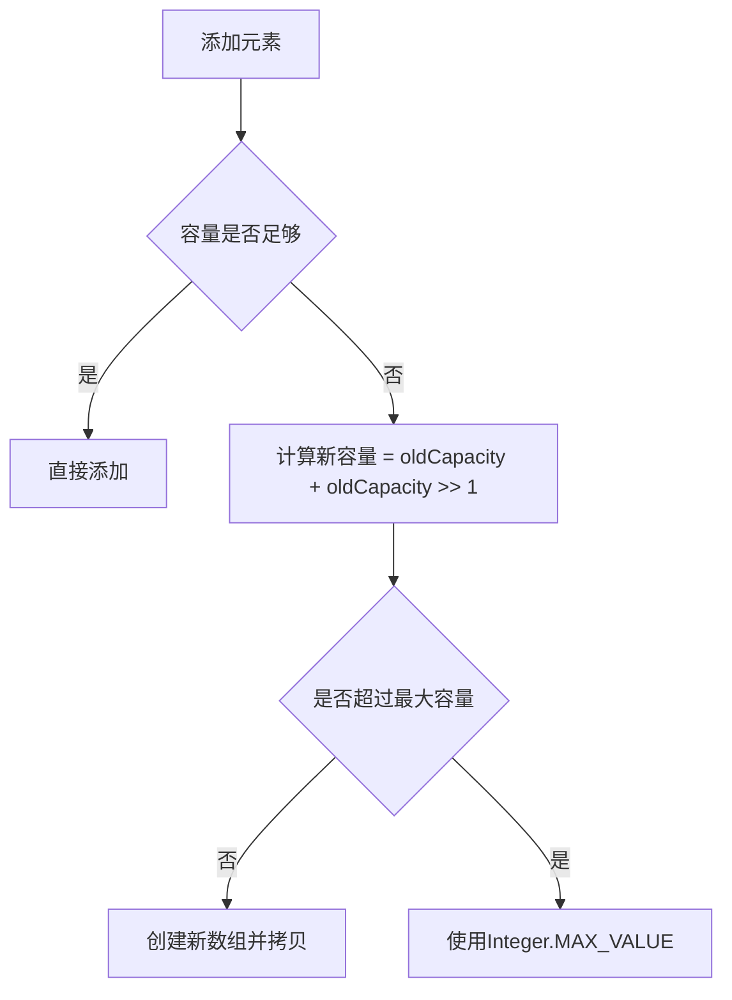
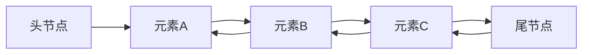
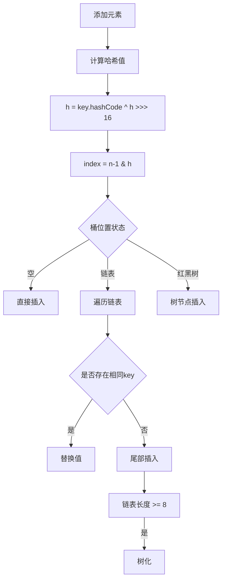
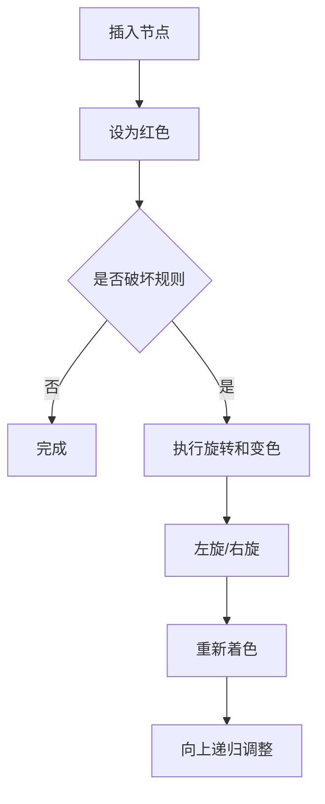
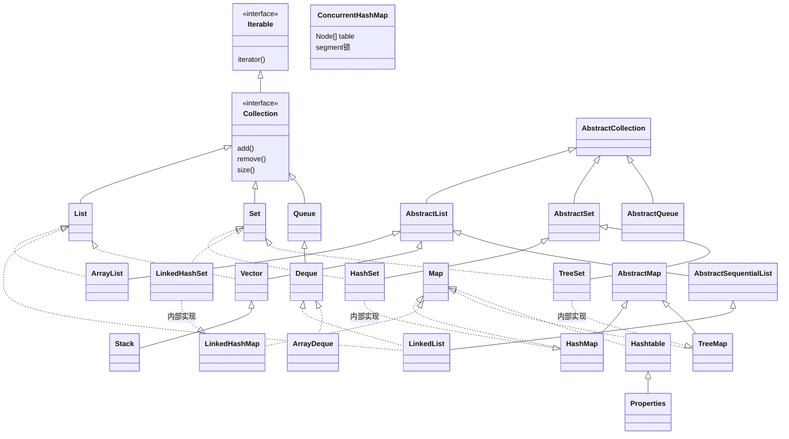

[TOC]

# 常用 API


## Java 常用数据结构总结（String、List、Set、Map 实现类）

---

### Collection 集合

集合：**集合是一种容器**，用来装数据的，类似于<span style="color:#330000;">数组</span>，但 **集合的大小可变**，开发中也非常常用；

Collection 代表单列集合，每个元素只包含一个值；

Map 代表双列集合，每个元素包含两个值（<span style="color:#CC00CC;">键值对</span>）；


Collection 是单列集合的祖宗，它规定的方法（功能）是全部单列集合都会继承的；

|               方法名                |              说明              |
| :---------------------------------: | :----------------------------: |
|       public boolean add(E e)       |   把给定对象添加到当前集合中   |
|         public void clear()         |      清空集合中的所有元素      |
|     public boolean remove(E e)      |   把给定对象从当前集合中删除   |
| public boolean contains(Object obj) | 判断当前集合是否包含给定的对象 |
|      public boolean isEmpty()       |      判断当前集合是否为空      |
|          public int size()          |      返回集合中元素的个数      |
|      public Object [] toArray()      |   把集合中的元素存储到数组中   |


Collection 的三种遍历方式：

- 迭代器遍历：迭代器是用来遍历集合的专用方式(数组没有迭代器)，在 Java 中迭代器的代表是 **Iterator**。

```java
public class CollectionTraversalDemo3 {
    public static void main(String[] args) {
        // 目标：掌握Collection的遍历方式一：迭代器遍历
        ArrayList<String> names = new ArrayList<>();
        names.add("张无忌");
        names.add("玄冥二老");
        names.add("宋青书");
        //        names.add("殷素素"); 
        System.out.println(names); // [张无忌, 玄冥二老, 宋青书]

        // 1、得到这个集合的迭代器对象
        Iterator<String> it = names.iterator();
        //        System.out.println(it.next());
        //        System.out.println(it.next());
        //        System.out.println(it.next());
        //        System.out.println(it.next());
        //        System.out.println(it.next()); // NoSuchElementException

        // 2、使用一个while循环来遍历
        // it.hasNext()判断当前位置是否有元素存在，存在返回true，不存在返回false
        while (it.hasNext()) {
            String name = it.next();			  // 获取当前位置的元素，并将迭代器对象指向下一个元素处
            System.out.println(name);
        }
    }
}
```

- 增强 for 循环：

  - 增强 for 可以用来遍历集合或者数组；

  - 增强 for 遍历集合，本质就是迭代器遍历集合的简化写法

```java
public class CollectionTraversalDemo4 {
    public static void main(String[] args) {
        // 目标：掌握Collection的遍历方式二：增强for
        Collection<String> names = new ArrayList<>();
        names.add("张无忌");
        names.add("玄冥二老");
        names.add("宋青书");
        names.add("殷素素");

        for (String name : names) {
            System.out.println(name);
        }

        String[] users = {"张无忌", "玄冥二老", "宋青书", "殷素素"};

        for (String user : users) {
            System.out.println(user);
        }
    }
      }
```

- Lambda 表达式

```java
package com.itheima.demo6collection;

import java.util.ArrayList;
import java.util.Collection;
import java.util.function.Consumer;

public class CollectionTraversalDemo5 {
public static void main(String[] args) {
// 目标：掌握Collection的遍历方式三：lambda
Collection<String> names = new ArrayList<>();
names.add("张无忌");
names.add("玄冥二老");
names.add("宋青书");
names.add("殷素素");


//        names.forEach(new Consumer<String>() {
//            @Override
//            public void accept(String s) {
//                System.out.println(s);
//            }
//        });

//        names.forEach(s -> System.out.println(s));
// lambda函数的省略写法
names.forEach(System.out::println);
}
}

```

**解决并发修改异常问题的方案**

什么是并发修改异常？以下面例子为例，在循环遍历数组的过程中，对数组中元素进行删除操作就可能导致并发异常。

如果我们想删除`[Java入门, 宁夏枸杞, 黑枸杞, 人字拖, 特级枸杞, 枸杞子, 西洋参]`中所有包含枸杞的项，逐个遍历（如采用for循环索引遍历），如果当前项包含枸杞，则删除该项，在执行过程中，当遍历到宁夏枸杞时，发现该项包含枸杞，应该删除，删除宁夏枸杞后，当前索引指向的元素就变成了黑枸杞，但是for循环会默认继续执行`i++`，导致索引指向下一个元素人字拖，从而跳过了元素黑枸杞，出现异常；

```java
import java.util.ArrayList;
import java.util.Iterator;

public class CollectionTraversalTest6 {
    public static void main(String[] args) {
        // 目标：认识并发修改异常问题，搞清楚每种遍历的区别
        ArrayList<String> list = new ArrayList<>();
        list.add("Java入门");
        list.add("宁夏枸杞");
        list.add("黑枸杞");
        list.add("人字拖");
        list.add("特级枸杞");
        list.add("枸杞子");
        list.add("西洋参");
        System.out.println(list);

        // 需求1：删除全部枸杞
        for (int i = 0; i < list.size(); i++) {
            String name = list.get(i);
            if(name.contains("枸杞")){
                list.remove(name);
            }
        }
        System.out.println(list);   //出现并发修改异常问题。
        // [Java入门, 宁夏枸杞, 黑枸杞, 人字拖, 特级枸杞, 枸杞子, 西洋参]
        // [Java入门, 黑枸杞, 人字拖, 枸杞子, 西洋参]
        //           i
        // [Java入门, 黑枸杞, 人字拖, 枸杞子, 西洋参]

        System.out.println("=====================================================");

        ArrayList<String> list2 = new ArrayList<>();
        list2.add("Java入门");
        list2.add("宁夏枸杞");
        list2.add("黑枸杞");
        list2.add("人字拖");
        list2.add("特级枸杞");
        list2.add("枸杞子");
        list2.add("西洋参");
        System.out.println(list2);

        // 需求1：删除全部枸杞
        for (int i = 0; i < list2.size(); i++) {
            String name = list2.get(i);
            if(name.contains("枸杞")){
                list2.remove(name);
                i--; // 解决方案1：删除数据后做一步i--操作 （前提是支持索引）
            }
        }
        // [Java入门, 宁夏枸杞, 黑枸杞, 人字拖, 特级枸杞, 枸杞子, 西洋参]
        // [Java入门, 人字拖,  西洋参]
        //                  i
        System.out.println(list2);

        System.out.println("=====================================================");

        ArrayList<String> list3 = new ArrayList<>();
        list3.add("Java入门");
        list3.add("宁夏枸杞");
        list3.add("黑枸杞");
        list3.add("人字拖");
        list3.add("特级枸杞");
        list3.add("枸杞子");
        list3.add("西洋参");
        System.out.println(list3);

        // 需求1：删除全部枸杞
        // 解决方案2：倒着遍历并删除（前提是支持索引）
        for (int i = list3.size() - 1; i >= 0; i--) {
            String name = list3.get(i);
            if(name.contains("枸杞")){
                list3.remove(name);
            }
        }
        // [Java入门, 人字拖, 西洋参]
        //     i
        System.out.println(list3);

        System.out.println("=====================================================");
        ArrayList<String> list4 = new ArrayList<>();
        list4.add("Java入门");
        list4.add("宁夏枸杞");
        list4.add("黑枸杞");
        list4.add("人字拖");
        list4.add("特级枸杞");
        list4.add("枸杞子");
        list4.add("西洋参");
        System.out.println(list4);

        // 需求1：删除全部枸杞
        // 方案一：迭代器遍历并删除默认也存在并发修改异常问题。
        // 可以解决，解决方案3：使用迭代器自己的方法来删除
        Iterator<String> it = list4.iterator();
        while(it.hasNext()){
            String name = it.next();
            if(name.contains("枸杞")){
                it.remove();   // 可以解决 解决方案3：使用迭代器自己的方法来删除当前数据
            }
        }
        System.out.println(list4);

        System.out.println("=====================================================");

        ArrayList<String> list5 = new ArrayList<>();
        list5.add("Java入门");
        list5.add("宁夏枸杞");
        list5.add("黑枸杞");
        list5.add("人字拖");
        list5.add("特级枸杞");
        list5.add("枸杞子");
        list5.add("西洋参");
        System.out.println(list5);

        // 需求1：删除全部枸杞
        // 方案二和三：用增强for还有Lambda(都没有办法解决并发修改异常问题)
        // 结论：增强for和Lambda只适合做遍历，不适合做遍历并修改操作
        // for (String s : list5) {
        //     if(s.contains("枸杞")){
        //         list5.remove(s);
        //     }
        // }

        // Lambda
        // list5.forEach(s -> {
        //     if(s.contains("枸杞")){
        //         list5.remove(s);
        //     }
        // });
        System.out.println(list5);
    }
}

```


1. 如果集合支持索引，可以使用 for 循环遍历，每删除数据后做 `i--`；或者可以<span style="background:#cadefc;">倒着遍历</span>
2. 可以使用迭代器做遍历，并用迭代器提供的删除方法删除数据；

<span style="color:#CC00CC;">注意：增强for循环/Lambda遍历均不能解决并发修改异常问题，因此增它们只适合做数据的遍历，不适合同时做增删操作；</span>


### 一、String（不可变字符序列）

**底层原理**：Java 9+ 使用 `byte[]` + 编码标记（LATIN1/UTF16），Java 8 使用 `char[]`

**底层结构**：

- Java 8 及之前：`char[]` 数组（UTF-16 编码，每个字符 2 字节）
- Java 9+：`byte[]` + 编码标记（LATIN1 或 UTF16）
  - LATIN1：单字节编码（ISO-8859-1 字符集）
  - UTF16：双字节编码（支持 Unicode）

**关键特性**：

1. 不可变性：所有修改操作都返回新对象
2. 字符串常量池：字面量存储在堆内存的特殊区域
3. 哈希缓存：首次调用 `hashCode()` 后缓存结果

**内存优化**：

```java
String s1 = "abc";       // 常量池
String s2 = new String("abc");  // 堆内存新对象
String s3 = s2.intern(); // 返回常量池引用
```

```java
// 构造方法
String s1 = new String();                 // 空字符串
String s2 = new String("hello");          // 从字面量
String s3 = new String(charArr);          // 从char数组
String s4 = new String(byteArr, "UTF-8"); // 从字节数组

// 常用API
int len = s.length();                     // 长度
char c = s.charAt(1);                     // 获取字符
String sub = s.substring(0,3);            // 截取子串
String s2 = s.concat("!");                // 拼接（返回新对象）
String s3 = s.replace('l','L');           // 替换字符
int pos = s.indexOf("ll");                // 查找位置
String[] arr = s.split(",");              // 分割
boolean eq = s.equals("hello");           // 内容比较
```


### 二、List 接口（有序、可重复）

List集合家族


List系列集合特点：**有序、可重复、有索引；**

- ArrayList：有序、可重复、有索引；（底层<span style="background:#cadefc;">数组</span>实现）
- LinkedList：有序、可重复、有索引；（底层<span style="background:#cadefc;">双链表</span>实现）

二者底层实现不同，适合的场景不同！

List提供的独有的方法

|            方法名称            |                  说明                  |
| :----------------------------: | :------------------------------------: |
| void add(int index, E element) |    在此集合中指定位置插入指定的元素    |
|      E remove(int index)       | 删除指定索引处的元素，返回被删除的元素 |
|  E set(int index, E element)   | 修改指定索引处的元素，返回被修改的元素 |
|        E get(int index)        |          返回指定索引处的元素          |

#### 1. ArrayList（动态数组）

**底层原理**：`Object[] elementData`，默认容量 10，扩容 1.5 倍

**底层结构**：动态数组

- 根据索引查询速度快

```java
transient Object[] elementData;
```

- 初始容量：默认 10（首次添加元素时初始化）
- 扩容机制：
  - 新容量 = 旧容量 * 1.5
  - 扩容操作：`Arrays.copyOf()`
  - 最大容量：`Integer.MAX_VALUE - 8`

**扩容流程**：




```java
// 构造方法
List<String> list1 = new ArrayList<>();       // 默认容量10
List<String> list2 = new ArrayList<>(100);    // 指定容量
List<String> list3 = new ArrayList<>(otherList); // 从其他集合

// 增删改查
list.add("A");                // 尾部添加
list.add(0, "B");             // 指定位置插入
list.set(0, "C");             // 修改位置0元素
list.remove(0);               // 按索引删除
list.remove("A");             // 按对象删除
String item = list.get(0);    // 获取元素
int idx = list.indexOf("A");  // 查找索引
int size = list.size();       // 元素数量
```

#### 2. LinkedList（双向链表）
**底层原理**：`Node<E>` 节点（item, next, prev）

**节点结构**：

```java
private static class Node<E> {
    E item;
    Node<E> next;
    Node<E> prev;
}
```

**内存布局**：



**操作特性**：

- 插入删除：$O(1)$（修改相邻节点指针）
- 随机访问：$O(n)$（从头/尾遍历）
- 内存占用：每个元素额外增加 24 字节（12 字节对象头 + 3 个引用）

```java
// 构造方法
List<String> list = new LinkedList<>(); 
Deque<String> deque = new LinkedList<>(); // 作为队列使用

// 增删改查
list.add("A");                 // 尾部添加
list.addFirst("B");            // 头部添加（特有）
list.removeLast();             // 尾部删除（特有）
list.get(1);                   // 按索引访问（需遍历）
```

---

### 三、Set 接口（无序、唯一）

Set系列集合的特点：无序（添加数据的顺序和获取出的数据顺序不一致）；不重复；无索引；

- HashSet：无序、不重复、无索引；
- LinkedHashSet：有序、不重复、无索引；
- TreeSet：排序、不重复、无索引；

#### 1. HashSet（哈希表）

哈希值：

- 就是一个int类型的随机值，java中每个对象都有一个哈希值；
- java中的所有对象，都可以调用Object类提供的hashCode方法，返回该对象自己的哈希值；
- `public int hashCode()`

> 同一个对象多次调用hashCode()方法返回的哈希值是相同的。l不同的对象，它们的哈希值大概率不相等，但也有可能会相等(哈希碰撞)。

哈希表：

- JDK8之前，哈希表=数组+链表
- JDK8开始，哈希表=数组+链表+红黑树
- 哈希表是一种增删改查性能都比较好的数据结构

**底层原理**：基于 `HashMap` 实现，值存储在 Key 中


**HashSet集合去重复的机制**

HashSet通过判断加入集合的两个元素的哈希值是否相等，以及两个元素对象本身的equals()方法；对于自定义对象，如果希望HashSet集合能够自动去重，需要重写该对象的hashCode()方法和equals()方法；

```java
public class SetDemo2 {
    public static void main(String[] args) {
        // 目标：掌握HashSet集合去重操作。
        Student s1 = new Student("张三", 18, "北京", "123456");
        Student s2 = new Student("李四", 19, "上海", "989876");
        Student s3 = new Student("张三", 18, "北京", "123456");
        Student s4 = new Student("李四", 19, "上海", "989876");

        // s1和s3的hashcode值相同吗？
        // 重写hashCode()和equals()方法前，s1和s3的hash值不同，equals()原始方法的“==”也无法判断两个元素是否相同
        System.out.println(s1.hashCode());
        System.out.println(s2.hashCode());
        System.out.println(s3.hashCode());
        System.out.println(s4.hashCode());

        Set<Student> set = new HashSet<>(); // 不重复的！
        set.add(s1);
        set.add(s2);
        set.add(s3);
        set.add(s4);

        System.out.println(set);
    }
}


// 学生类的定义
import java.util.Objects;
public class Student {
    private String name;
    private int age;
    private String address;
    private String phone;
    
    public Student() {
    }

    public Student(String name, int age, String address, String phone) {
        this.name = name;
        this.age = age;
        this.address = address;
        this.phone = phone;
    }

    public String getName() {
        return name;
    }

    public void setName(String name) {
        this.name = name;
    }

    public int getAge() {
        return age;
    }

    public void setAge(int age) {
        this.age = age;
    }

    public String getAddress() {
        return address;
    }

    public void setAddress(String address) {
        this.address = address;
    }

    public String getPhone() {
        return phone;
    }

    public void setPhone(String phone) {
        this.phone = phone;
    }

    // 只要两个对象的内容一样结果一定是true.
    // s3.equals(s1)
    @Override
    public boolean equals(Object o) {
        // 1、如果是自己和自己比直接返回true
        if (this == o) return true;
        // 2、如果o为空或者o不是Student类型，直接返回false
        if (o == null || this.getClass() != o.getClass()) return false;
        // 3、比较两个对象的内容是否一样
        Student student = (Student) o;
        return this.age == student.age && Objects.equals(name, student.name) && Objects.equals(address, student.address) && Objects.equals(phone, student.phone);
    }

    @Override
    public int hashCode() {
        // 不同学生对象，如果内容一样返回的哈希值一定是一样的，
        return Objects.hash(name, age, address, phone);
    }

    @Override
    public String toString() {
        return "Student{" +
                "name='" + name + '\'' +
                ", age=" + age +
                ", address='" + address + '\'' +
                ", phone='" + phone + '\'' +
                '}' + "\n";
    }
}

```

**底层结构**：

```java
Node<K,V>[] table;  // 桶数组
```

**节点类型**：

1. 链表节点：`Node`（哈希冲突时使用）
2. 树节点：`TreeNode`（链表长度 ≥8 时转换）

**哈希处理流程**：



**树化条件**：

1. 链表长度 ≥ 8
2. 桶数组长度 ≥ 64

```java
// 构造方法
Set<String> set = new HashSet<>();         // 默认容量16
Set<String> set2 = new HashSet<>(100);     // 指定容量
Set<String> set3 = new HashSet<>(list);    // 从集合初始化

// 常用操作
set.add("A");                   	// 添加元素
set.remove("A");                	// 删除元素
boolean exists = set.contains("B"); 	// 检查存在
```

#### 2. LinkedHashSet（有序哈希表）
**底层原理**：继承 `HashSet`，底层使用 `LinkedHashMap`（双向链表维护插入顺序）

- 基于哈希表（数组、链表、红黑树）实现；
- 每个元素都额外的多了一个双链表的机制记录它前后元素的位置；

```java
public LinkedHashSet() {
		    super(16, .75f, true);
}
HashSet(int initialCapacity, float loadFactor, boolean dummy) {
	    map = new LinkedHashMap<>(initialCapacity, loadFactor);
}
```


```java
Set<String> set = new LinkedHashSet<>();  // 保持插入顺序
```

**LinkedHashSet/LinkedHashMap（有序哈希表）底层结构**：

```java
// 继承HashMap.Node并添加链表指针
static class Entry<K,V> extends HashMap.Node<K,V> {
    Entry<K,V> before, after;
}
```

**排序机制**：

1. 插入顺序：默认模式（`accessOrder=false`）

2. 访问顺序：`accessOrder=true`（适合 LRU 缓存）

```java
// 访问后移动节点到末尾
void afterNodeAccess(Node<K,V> p) {
// 调整双向链表指针
}
```

**LRU 缓存实现**：

```java
new LinkedHashMap(16, 0.75f, true) {
    protected boolean removeEldestEntry(Map.Entry eldest) {
        return size() > MAX_SIZE;
    }
};
```

#### 3. TreeSet（红黑树）

**底层原理**：基于 `TreeMap` 实现，元素按自然顺序或 Comparator 排序

注意：

- 对于数值类型：Integer、Double，默认按照数值本身大小进行升序排序；
- 对于字符串类型，默认按照首字符的编号升序排序；
- 对于自定义对象，如Student对象，TreeSet默认无法直接排序，需要重新实现comparator

```java
			public class SetDemo3 {
    public static void main(String[] args) {
        // 目标：搞清楚TreeSet集合对于自定义对象的排序
        Set<Teacher> teachers = new TreeSet<>(new Comparator<Teacher>() {
            @Override
            public int compare(Teacher o1, Teacher o2) {
                // return o2.getAge() - o1.getAge(); //降序
                // if(o1.getSalary() > o2.getSalary()){
                //     return 1;
                // }else if(o1.getSalary() < o2.getSalary()){
                //     return -1;
                // }
                // return 0;
                // return Double.compare(o1.getSalary(), o2.getSalary()); // 薪水升序
                return Double.compare(o2.getSalary(), o1.getSalary()); // 薪水升序
            }
        }); // 排序，不重复，无索引

        // 简化形式
        // Set<Teacher> teachers = new TreeSet<>((o1, o2) -> Double.compare(o1.getSalary(), o2.getSalary())); // 排序，不重复，无索引

        teachers.add(new Teacher("老陈", 20, 6232.4));
        teachers.add(new Teacher("dlei", 18, 3999.5));
        teachers.add(new Teacher("老王", 22, 9999.9));
        teachers.add(new Teacher("老李", 20, 1999.9));
        System.out.println(teachers);

        // 结论：TreeSet集合默认不能 给自定义对象排序啊，因为不知道大小规则。
        // 一定要能解决怎么办？两种方案。
        // 1、对象类实现一个Comparable比较接口，重写compareTo方法，指定大小比较规则
        // 2、public TreeSet（Comparator c）集合自带比较器Comparator对象，指定比较规则

    }
}
```


```java
// new一个TreeSet对象时，底层本质上new了一个TreeMap对象，通过comparator实现插入元素的排序，可以重写来对自定义对象排序
public TreeSet(Comparator<? super E> comparator) {
    this(new TreeMap<>(comparator));
}
```


```java
// 构造方法
Set<String> set = new TreeSet<>();                   // 自然排序
Set<String> set2 = new TreeSet<>(Comparator.reverseOrder()); // 自定义排序

// 特有方法
String first = set.first();              // 获取最小元素
String last = set.last();                // 获取最大元素
Set<String> headSet = set.headSet("M");  // 获取小于"M"的子集
```

---

### 四、Map 接口（键值对）

Map集合体系的特点

注意：Map体系集合的特点都是由键决定的，值只是一个附属品，值是不做要求的

- HashMap（由键决定特点）: 无序、不重复、无索引； （用的最多）
- LinkedHashMap （由键决定特点）:由键决定的特点：有序（<span style="color:#CC00CC;">但不排序</span>，指的是获取元素的顺序和输入元素的顺序一致）、不重复、无索引；
- TreeMap （由键决定特点）:按照大小默认升序排序、不重复、无索引；

|                **方法名称**                |               **说明**                |
| :----------------------------------------: | :-----------------------------------: |
|        public V put(K key,V value)         |               添加元素                |
|             public int size()              |            获取集合的大小             |
|            public void clear()             |               清空集合                |
|          public boolean isEmpty()          | 判断集合是否为空，为空返回true , 反之 |
|          public V get(Object key)          |           根据键获取对应值            |
|        public V remove(Object key)         |          根据键删除整个元素           |
|  public boolean containsKey(Object  key)   |          判断是否包含某个键           |
| public boolean containsValue(Object value) |          判断是否包含某个值           |
|           public Set<K> keySet()           |           获取全部键的集合            |
|       public Collection<V> values()        |          获取Map集合的全部值          |

Map集合的三种遍历方式

```java
package com.itheima.demo2map;

import java.util.HashMap;
import java.util.Map;
import java.util.Set;

public class MapTraverseDemo3 {
    public static void main(String[] args) {
        // 目标：掌握Map集合的遍历方式一：键找值。
        Map<String,Integer> map = new HashMap<>();
        map.put("嫦娥", 20);
        map.put("女儿国王", 31);
        map.put("嫦娥", 28);
        map.put("铁扇公主", 38);
        map.put("紫霞", 31);
        System.out.println(map); // {嫦娥=28, 铁扇公主=38, 紫霞=31, 女儿国王=31}

        // ===================================================================
        // 1、提起Map集合的全部键到一个Set集合中去
        Set<String> keys = map.keySet();
        // 2、遍历Set集合，得到每一个键
        for (String key : keys) {
            // 3、根据键去找值
            Integer value = map.get(key);
            System.out.println(key + "=" + value);
        }

        // ===================================================================
        // 1、把Map集合转换成Set集合，里面的元素类型都是键值对类型（Map.Entry<String, Integer>）
        Set<Map.Entry<String, Integer>> entries = map.entrySet();
        // 2、遍历Set集合，得到每一个键值对类型元素
        for (Map.Entry<String, Integer> entry : entries) {
            String key = entry.getKey();
            Integer value = entry.getValue();
            System.out.println(key + "=" + value);
        }

        // ===================================================================
        // 1、直接调用Map集合的forEach方法完成遍历
        // map.forEach(new BiConsumer<String, Integer>() {
        //     @Override
        //     public void accept(String key, Integer value) {
        //         System.out.println(key + "=" + value);
        //     }
        // });

        map.forEach((k,v) -> System.out.println(k + "=" + v));
    }
}

```

> **Set**系列集合的底层就是基于**Map**实现的，只是**Set**集合中的元素只要键数据，不要值数据而已。

#### 1. HashMap（哈希表）
**底层原理**：哈希表，数组+链表+红黑树（链表 > 8 且数组 > 64 时转红黑树）

```java
// 构造方法
Map<String, Integer> map = new HashMap<>();        // 默认16
Map<String, Integer> map2 = new HashMap<>(32);     // 指定容量
Map<String, Integer> map3 = new HashMap<>(otherMap); // 从其他Map

// 增删改查
map.put("key", 100);             // 添加/更新
map.remove("key");               // 删除键
int val = map.get("key");        // 获取值
boolean hasKey = map.containsKey("key");
Set<String> keys = map.keySet(); // 获取所有键
```

#### 2. LinkedHashMap（有序哈希表）
**底层原理**：继承 `HashMap`，通过双向链表维护插入顺序或访问顺序
```java
// 构造方法（true表示按访问顺序排序，适合LRU缓存）
Map<String, Integer> map = new LinkedHashMap<>(16, 0.75f, true); 

// 特有方法：保持插入顺序（迭代时按插入顺序输出）
```

#### 3. TreeMap（红黑树）
**底层原理**：红黑树实现，按**键**的自然顺序或 Comparator 排序

**TreeSet/TreeMap（红黑树）底层结构**：

```java
private transient Entry<K,V> root;  // 根节点

static final class Entry<K,V> implements Map.Entry<K,V> {
    K key;
    V value;
    Entry<K,V> left;
    Entry<K,V> right;
    Entry<K,V> parent;
    boolean color = BLACK;
}
```

**红黑树特性**：

1. 节点颜色：红或黑
2. 根节点：黑色
3. 叶子节点（NIL）：黑色
4. 红色节点的子节点必须为黑
5. 从任一节点到叶子的路径包含相同数量黑节点

**平衡操作**：



**时间复杂度**：

| 操作 | 平均     | 最坏     |
| :--- | :------- | :------- |
| 插入 | O(log n) | O(log n) |
| 删除 | O(log n) | O(log n) |
| 查找 | O(log n) | O(log n) |

```java
// 构造方法
Map<String, Integer> map = new TreeMap<>();  // 自然排序
Map<String, Integer> map2 = new TreeMap<>(Comparator.reverseOrder());

// 特有方法
String firstKey = map.firstKey();                    // 最小键
Map.Entry<String,Integer> entry = map.floorEntry("K"); // 小于等于K的最大键
SortedMap<String,Integer> subMap = map.subMap("A", "M"); // 范围视图
```

---

### 五、继承关系树状图（Mermaid）


---

### 六、关键特性对比
| 数据结构          | 重复元素 | 有序性          | 线程安全 | 时间复杂度                |
| ----------------- | -------- | --------------- | -------- | ------------------------- |
| **ArrayList**     | 允许     | 插入顺序        | 不安全   | 查/改: O(1)，增/删: O(n)  |
| **LinkedList**    | 允许     | 插入顺序        | 不安全   | 增/删头尾: O(1)，查: O(n) |
| **HashSet**       | 不允许   | 无              | 不安全   | 增/删/查: O(1)            |
| **LinkedHashSet** | 不允许   | 插入顺序        | 不安全   | 增/删/查: O(1)            |
| **TreeSet**       | 不允许   | 自然/比较器顺序 | 不安全   | 增/删/查: O(log n)        |
| **HashMap**       | Key 唯一  | 无              | 不安全   | 增/删/查: O(1)            |
| **LinkedHashMap** | Key 唯一  | 插入/访问顺序   | 不安全   | 增/删/查: O(1)            |
| **TreeMap**       | Key 唯一  | 自然/比较器顺序 | 不安全   | 增/删/查: O(log n)        |

> **线程安全替代方案**：  
> - `Collections.synchronizedList()`  
> - `CopyOnWriteArrayList`  
> - `ConcurrentHashMap`  
> - `ConcurrentSkipListSet`

### 七、并发数据结构原理

**ConcurrentHashMap（JDK8+）**：

- 分段设计：Node 数组 + 链表/红黑树
- 并发控制：
  - CAS + synchronized（桶级别锁）
  - 扩容时多线程协作
- 计数机制：`LongAdder` 风格的分段计数

**CopyOnWriteArrayList**：

1. 写操作：复制整个数组（加锁）
2. 读操作：无锁访问原数组
3. 适用场景：读多写少（监听器列表）

### 九、关键性能对比

| 数据结构                 | 随机访问 | 插入删除 | 内存占用 | 线程安全 | 有序性          |
| :----------------------- | :------- | :------- | :------- | :------- | :-------------- |
| **ArrayList**            | O(1)     | O(n)     | 低       | 不安全   | 插入顺序        |
| **LinkedList**           | O(n)     | O(1)     | 高       | 不安全   | 插入顺序        |
| **HashSet**              | N/A      | O(1)     | 中       | 不安全   | 无              |
| **LinkedHashSet**        | N/A      | O(1)     | 高       | 不安全   | 插入顺序        |
| **TreeSet**              | N/A      | O(log n) | 高       | 不安全   | 自然/比较器顺序 |
| **HashMap**              | O(1)     | O(1)     | 中       | 不安全   | 无              |
| **LinkedHashMap**        | O(1)     | O(1)     | 高       | 不安全   | 插入/访问顺序   |
| **TreeMap**              | O(log n) | O(log n) | 高       | 不安全   | 键排序          |
| **ConcurrentHashMap**    | O(1)     | O(1)     | 高       | 安全     | 无              |
| **CopyOnWriteArrayList** | O(1)     | O(n)     | 很高     | 安全     | 插入顺序        |

> **设计选择建议**：
>
> 1. 随机访问多：`ArrayList`
> 2. 频繁增删：`LinkedList`
> 3. 快速查找：`HashMap/HashSet`
> 4. 需要排序：`TreeMap/TreeSet`
> 5. 保持插入顺序：`LinkedHashMap/LinkedHashSet`
> 6. 高并发读：`ConcurrentHashMap`
> 7. 读多写少：`CopyOnWriteArrayList`