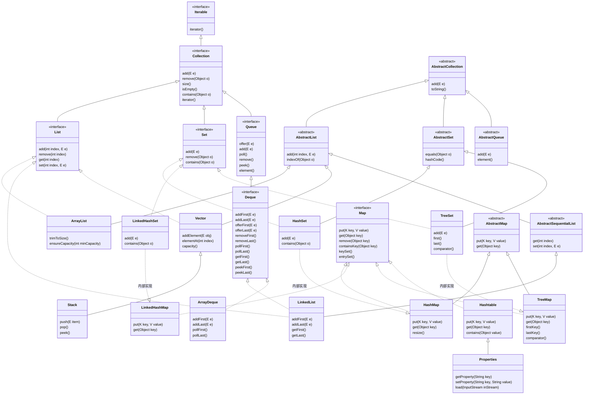
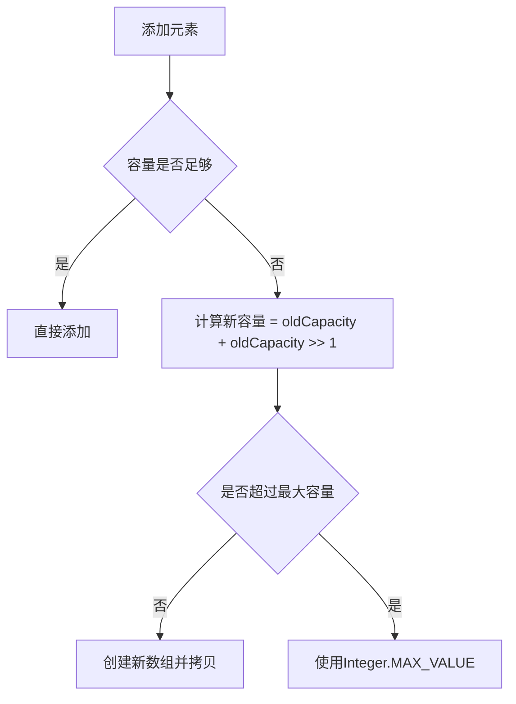
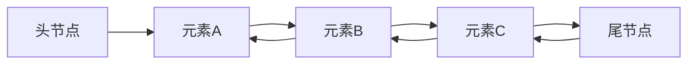
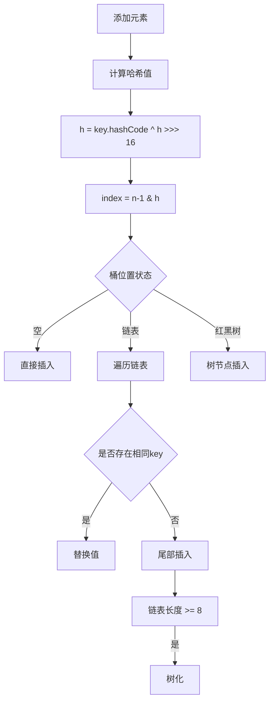
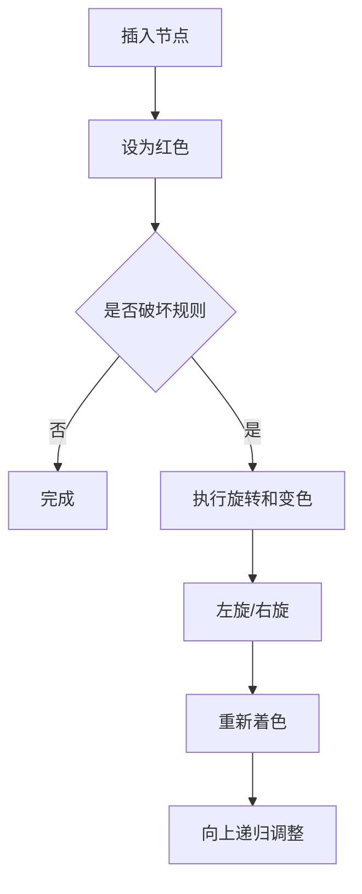
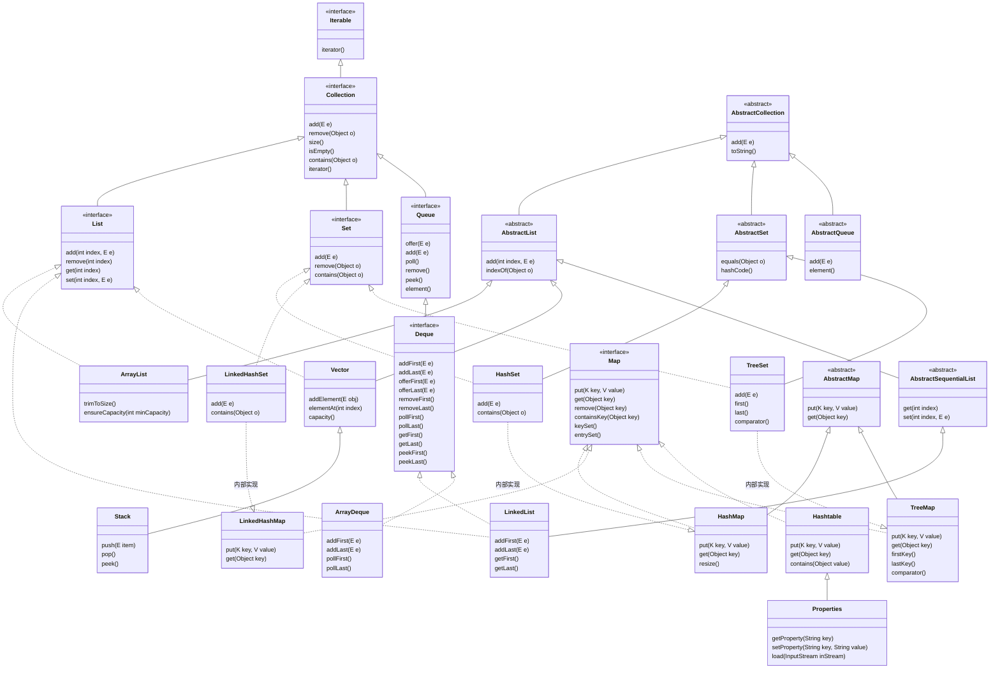

[TOC]



## Java 常用数据结构总结（String、List、Set、Map 实现类）

---

### Collection 集合

集合：**集合是一种容器**，用来装数据的，类似于<span style="color:#330000;">数组</span>，但 **集合的大小可变**，开发中也非常常用；

Collection 代表单列集合，每个元素只包含一个值；

Map 代表双列集合，每个元素包含两个值（<span style="color:#CC00CC;">键值对</span>）；


Collection 是单列集合的祖宗，它规定的方法（功能）是全部单列集合都会继承的；

|               方法名                |              说明              |
| :---------------------------------: | :----------------------------: |
|       public boolean add(E e)       |   把给定对象添加到当前集合中   |
|         public void clear()         |      清空集合中的所有元素      |
|     public boolean remove(E e)      |   把给定对象从当前集合中删除   |
| public boolean contains(Object obj) | 判断当前集合是否包含给定的对象 |
|      public boolean isEmpty()       |      判断当前集合是否为空      |
|          public int size()          |      返回集合中元素的个数      |
|      public Object [] toArray()      |   把集合中的元素存储到数组中   |


Collection 的三种遍历方式：

- 迭代器遍历：迭代器是用来遍历集合的专用方式(数组没有迭代器)，在 Java 中迭代器的代表是 **Iterator**。

```java
public class CollectionTraversalDemo3 {
    public static void main(String[] args) {
        // 目标：掌握Collection的遍历方式一：迭代器遍历
        ArrayList<String> names = new ArrayList<>();
        names.add("张无忌");
        names.add("玄冥二老");
        names.add("宋青书");
        //        names.add("殷素素"); 
        System.out.println(names); // [张无忌, 玄冥二老, 宋青书]

        // 1、得到这个集合的迭代器对象
        Iterator<String> it = names.iterator();
        //        System.out.println(it.next());
        //        System.out.println(it.next());
        //        System.out.println(it.next());
        //        System.out.println(it.next());
        //        System.out.println(it.next()); // NoSuchElementException

        // 2、使用一个while循环来遍历
        // it.hasNext()判断当前位置是否有元素存在，存在返回true，不存在返回false
        while (it.hasNext()) {
            String name = it.next();			  // 获取当前位置的元素，并将迭代器对象指向下一个元素处
            System.out.println(name);
        }
    }
}
```

- 增强 for 循环：

  - 增强 for 可以用来遍历集合或者数组；

  - 增强 for 遍历集合，本质就是迭代器遍历集合的简化写法

```java
public class CollectionTraversalDemo4 {
    public static void main(String[] args) {
        // 目标：掌握Collection的遍历方式二：增强for
        Collection<String> names = new ArrayList<>();
        names.add("张无忌");
        names.add("玄冥二老");
        names.add("宋青书");
        names.add("殷素素");

        for (String name : names) {
            System.out.println(name);
        }

        String[] users = {"张无忌", "玄冥二老", "宋青书", "殷素素"};

        for (String user : users) {
            System.out.println(user);
        }
    }
      }
```

- Lambda 表达式

```java
package com.itheima.demo6collection;

import java.util.ArrayList;
import java.util.Collection;
import java.util.function.Consumer;

public class CollectionTraversalDemo5 {
public static void main(String[] args) {
// 目标：掌握Collection的遍历方式三：lambda
Collection<String> names = new ArrayList<>();
names.add("张无忌");
names.add("玄冥二老");
names.add("宋青书");
names.add("殷素素");


//        names.forEach(new Consumer<String>() {
//            @Override
//            public void accept(String s) {
//                System.out.println(s);
//            }
//        });

//        names.forEach(s -> System.out.println(s));
// lambda函数的省略写法
names.forEach(System.out::println);
}
}

```

**解决并发修改异常问题的方案**

什么是并发修改异常？以下面例子为例，在循环遍历数组的过程中，对数组中元素进行删除操作就可能导致并发异常。

如果我们想删除`[Java入门, 宁夏枸杞, 黑枸杞, 人字拖, 特级枸杞, 枸杞子, 西洋参]`中所有包含枸杞的项，逐个遍历（如采用for循环索引遍历），如果当前项包含枸杞，则删除该项，在执行过程中，当遍历到宁夏枸杞时，发现该项包含枸杞，应该删除，删除宁夏枸杞后，当前索引指向的元素就变成了黑枸杞，但是for循环会默认继续执行`i++`，导致索引指向下一个元素人字拖，从而跳过了元素黑枸杞，出现异常；

```java
import java.util.ArrayList;
import java.util.Iterator;

public class CollectionTraversalTest6 {
    public static void main(String[] args) {
        // 目标：认识并发修改异常问题，搞清楚每种遍历的区别
        ArrayList<String> list = new ArrayList<>();
        list.add("Java入门");
        list.add("宁夏枸杞");
        list.add("黑枸杞");
        list.add("人字拖");
        list.add("特级枸杞");
        list.add("枸杞子");
        list.add("西洋参");
        System.out.println(list);

        // 需求1：删除全部枸杞
        for (int i = 0; i < list.size(); i++) {
            String name = list.get(i);
            if(name.contains("枸杞")){
                list.remove(name);
            }
        }
        System.out.println(list);   //出现并发修改异常问题。
        // [Java入门, 宁夏枸杞, 黑枸杞, 人字拖, 特级枸杞, 枸杞子, 西洋参]
        // [Java入门, 黑枸杞, 人字拖, 枸杞子, 西洋参]
        //           i
        // [Java入门, 黑枸杞, 人字拖, 枸杞子, 西洋参]

        System.out.println("=====================================================");

        ArrayList<String> list2 = new ArrayList<>();
        list2.add("Java入门");
        list2.add("宁夏枸杞");
        list2.add("黑枸杞");
        list2.add("人字拖");
        list2.add("特级枸杞");
        list2.add("枸杞子");
        list2.add("西洋参");
        System.out.println(list2);

        // 需求1：删除全部枸杞
        for (int i = 0; i < list2.size(); i++) {
            String name = list2.get(i);
            if(name.contains("枸杞")){
                list2.remove(name);
                i--; // 解决方案1：删除数据后做一步i--操作 （前提是支持索引）
            }
        }
        // [Java入门, 宁夏枸杞, 黑枸杞, 人字拖, 特级枸杞, 枸杞子, 西洋参]
        // [Java入门, 人字拖,  西洋参]
        //                  i
        System.out.println(list2);

        System.out.println("=====================================================");

        ArrayList<String> list3 = new ArrayList<>();
        list3.add("Java入门");
        list3.add("宁夏枸杞");
        list3.add("黑枸杞");
        list3.add("人字拖");
        list3.add("特级枸杞");
        list3.add("枸杞子");
        list3.add("西洋参");
        System.out.println(list3);

        // 需求1：删除全部枸杞
        // 解决方案2：倒着遍历并删除（前提是支持索引）
        for (int i = list3.size() - 1; i >= 0; i--) {
            String name = list3.get(i);
            if(name.contains("枸杞")){
                list3.remove(name);
            }
        }
        // [Java入门, 人字拖, 西洋参]
        //     i
        System.out.println(list3);

        System.out.println("=====================================================");
        ArrayList<String> list4 = new ArrayList<>();
        list4.add("Java入门");
        list4.add("宁夏枸杞");
        list4.add("黑枸杞");
        list4.add("人字拖");
        list4.add("特级枸杞");
        list4.add("枸杞子");
        list4.add("西洋参");
        System.out.println(list4);

        // 需求1：删除全部枸杞
        // 方案一：迭代器遍历并删除默认也存在并发修改异常问题。
        // 可以解决，解决方案3：使用迭代器自己的方法来删除
        Iterator<String> it = list4.iterator();
        while(it.hasNext()){
            String name = it.next();
            if(name.contains("枸杞")){
                it.remove();   // 可以解决 解决方案3：使用迭代器自己的方法来删除当前数据
            }
        }
        System.out.println(list4);

        System.out.println("=====================================================");

        ArrayList<String> list5 = new ArrayList<>();
        list5.add("Java入门");
        list5.add("宁夏枸杞");
        list5.add("黑枸杞");
        list5.add("人字拖");
        list5.add("特级枸杞");
        list5.add("枸杞子");
        list5.add("西洋参");
        System.out.println(list5);

        // 需求1：删除全部枸杞
        // 方案二和三：用增强for还有Lambda(都没有办法解决并发修改异常问题)
        // 结论：增强for和Lambda只适合做遍历，不适合做遍历并修改操作
        // for (String s : list5) {
        //     if(s.contains("枸杞")){
        //         list5.remove(s);
        //     }
        // }

        // Lambda
        // list5.forEach(s -> {
        //     if(s.contains("枸杞")){
        //         list5.remove(s);
        //     }
        // });
        System.out.println(list5);
    }
}

```


1. 如果集合支持索引，可以使用 for 循环遍历，每删除数据后做 `i--`；或者可以<span style="background:#cadefc;">倒着遍历</span>
2. 可以使用迭代器做遍历，并用迭代器提供的删除方法删除数据；

<span style="color:#CC00CC;">注意：增强for循环/Lambda遍历均不能解决并发修改异常问题，因此增它们只适合做数据的遍历，不适合同时做增删操作；</span>


### 一、String（不可变字符序列）

**底层原理**：Java 9+ 使用 `byte[]` + 编码标记（LATIN1/UTF16），Java 8 使用 `char[]`

**底层结构**：

- Java 8 及之前：`char[]` 数组（UTF-16 编码，每个字符 2 字节）
- Java 9+：`byte[]` + 编码标记（LATIN1 或 UTF16）
  - LATIN1：单字节编码（ISO-8859-1 字符集）
  - UTF16：双字节编码（支持 Unicode）

**关键特性**：

1. 不可变性：所有修改操作都返回新对象
2. 字符串常量池：字面量存储在堆内存的特殊区域
3. 哈希缓存：首次调用 `hashCode()` 后缓存结果

**内存优化**：

```java
String s1 = "abc";       // 常量池
String s2 = new String("abc");  // 堆内存新对象
String s3 = s2.intern(); // 返回常量池引用
```

```java
// 构造方法
String s1 = new String();                 // 空字符串
String s2 = new String("hello");          // 从字面量
String s3 = new String(charArr);          // 从char数组
String s4 = new String(byteArr, "UTF-8"); // 从字节数组

// 常用API
int len = s.length();                     // 长度
char c = s.charAt(1);                     // 获取字符
String sub = s.substring(0,3);            // 截取子串
String s2 = s.concat("!");                // 拼接（返回新对象）
String s3 = s.replace('l','L');           // 替换字符
int pos = s.indexOf("ll");                // 查找位置
String[] arr = s.split(",");              // 分割
boolean eq = s.equals("hello");           // 内容比较
```


### 二、List 接口（有序、可重复）

List集合家族


List系列集合特点：**有序、可重复、有索引；**

- ArrayList：有序、可重复、有索引；（底层<span style="background:#cadefc;">数组</span>实现）
- LinkedList：有序、可重复、有索引；（底层<span style="background:#cadefc;">双链表</span>实现）

二者底层实现不同，适合的场景不同！

List提供的独有的方法

|            方法名称            |                  说明                  |
| :----------------------------: | :------------------------------------: |
| void add(int index, E element) |    在此集合中指定位置插入指定的元素    |
|      E remove(int index)       | 删除指定索引处的元素，返回被删除的元素 |
|  E set(int index, E element)   | 修改指定索引处的元素，返回被修改的元素 |
|        E get(int index)        |          返回指定索引处的元素          |

#### 1. ArrayList（动态数组）

**底层原理**：`Object[] elementData`，默认容量 10，扩容 1.5 倍

**底层结构**：动态数组

- 根据索引查询速度快

```java
transient Object[] elementData;
```

- 初始容量：默认 10（首次添加元素时初始化）
- 扩容机制：
  - 新容量 = 旧容量 * 1.5
  - 扩容操作：`Arrays.copyOf()`
  - 最大容量：`Integer.MAX_VALUE - 8`

**扩容流程**：




```java
// 构造方法
List<String> list1 = new ArrayList<>();       // 默认容量10
List<String> list2 = new ArrayList<>(100);    // 指定容量
List<String> list3 = new ArrayList<>(otherList); // 从其他集合

// 增删改查
list.add("A");                // 尾部添加
list.add(0, "B");             // 指定位置插入
list.set(0, "C");             // 修改位置0元素
list.remove(0);               // 按索引删除
list.remove("A");             // 按对象删除
String item = list.get(0);    // 获取元素
int idx = list.indexOf("A");  // 查找索引
int size = list.size();       // 元素数量
```

#### 2. LinkedList（双向链表）
**底层原理**：`Node<E>` 节点（item, next, prev）

**节点结构**：

```java
private static class Node<E> {
    E item;
    Node<E> next;
    Node<E> prev;
}
```

**内存布局**：



**操作特性**：

- 插入删除：$O(1)$（修改相邻节点指针）
- 随机访问：$O(n)$（从头/尾遍历）
- 内存占用：每个元素额外增加 24 字节（12 字节对象头 + 3 个引用）

```java
// 构造方法
List<String> list = new LinkedList<>(); 
Deque<String> deque = new LinkedList<>(); // 作为队列使用

// 增删改查
list.add("A");                 // 尾部添加
list.addFirst("B");            // 头部添加（特有）
list.removeLast();             // 尾部删除（特有）
list.get(1);                   // 按索引访问（需遍历）
```

---

### 三、Set 接口（无序、唯一）

Set系列集合的特点：无序（添加数据的顺序和获取出的数据顺序不一致）；不重复；无索引；

- HashSet：无序、不重复、无索引；
- LinkedHashSet：有序、不重复、无索引；
- TreeSet：排序、不重复、无索引；

#### 1. HashSet（哈希表）

哈希值：

- 就是一个int类型的随机值，java中每个对象都有一个哈希值；
- java中的所有对象，都可以调用Object类提供的hashCode方法，返回该对象自己的哈希值；
- `public int hashCode()`

> 同一个对象多次调用hashCode()方法返回的哈希值是相同的。l不同的对象，它们的哈希值大概率不相等，但也有可能会相等(哈希碰撞)。

哈希表：

- JDK8之前，哈希表=数组+链表
- JDK8开始，哈希表=数组+链表+红黑树
- 哈希表是一种增删改查性能都比较好的数据结构

**底层原理**：基于 `HashMap` 实现，值存储在 Key 中


**HashSet集合去重复的机制**

HashSet通过判断加入集合的两个元素的哈希值是否相等，以及两个元素对象本身的equals()方法；对于自定义对象，如果希望HashSet集合能够自动去重，需要重写该对象的hashCode()方法和equals()方法；

```java
public class SetDemo2 {
    public static void main(String[] args) {
        // 目标：掌握HashSet集合去重操作。
        Student s1 = new Student("张三", 18, "北京", "123456");
        Student s2 = new Student("李四", 19, "上海", "989876");
        Student s3 = new Student("张三", 18, "北京", "123456");
        Student s4 = new Student("李四", 19, "上海", "989876");

        // s1和s3的hashcode值相同吗？
        // 重写hashCode()和equals()方法前，s1和s3的hash值不同，equals()原始方法的“==”也无法判断两个元素是否相同
        System.out.println(s1.hashCode());
        System.out.println(s2.hashCode());
        System.out.println(s3.hashCode());
        System.out.println(s4.hashCode());

        Set<Student> set = new HashSet<>(); // 不重复的！
        set.add(s1);
        set.add(s2);
        set.add(s3);
        set.add(s4);

        System.out.println(set);
    }
}


// 学生类的定义
import java.util.Objects;
public class Student {
    private String name;
    private int age;
    private String address;
    private String phone;
    
    public Student() {
    }

    public Student(String name, int age, String address, String phone) {
        this.name = name;
        this.age = age;
        this.address = address;
        this.phone = phone;
    }

    public String getName() {
        return name;
    }

    public void setName(String name) {
        this.name = name;
    }

    public int getAge() {
        return age;
    }

    public void setAge(int age) {
        this.age = age;
    }

    public String getAddress() {
        return address;
    }

    public void setAddress(String address) {
        this.address = address;
    }

    public String getPhone() {
        return phone;
    }

    public void setPhone(String phone) {
        this.phone = phone;
    }

    // 只要两个对象的内容一样结果一定是true.
    // s3.equals(s1)
    @Override
    public boolean equals(Object o) {
        // 1、如果是自己和自己比直接返回true
        if (this == o) return true;
        // 2、如果o为空或者o不是Student类型，直接返回false
        if (o == null || this.getClass() != o.getClass()) return false;
        // 3、比较两个对象的内容是否一样
        Student student = (Student) o;
        return this.age == student.age && Objects.equals(name, student.name) && Objects.equals(address, student.address) && Objects.equals(phone, student.phone);
    }

    @Override
    public int hashCode() {
        // 不同学生对象，如果内容一样返回的哈希值一定是一样的，
        return Objects.hash(name, age, address, phone);
    }

    @Override
    public String toString() {
        return "Student{" +
                "name='" + name + '\'' +
                ", age=" + age +
                ", address='" + address + '\'' +
                ", phone='" + phone + '\'' +
                '}' + "\n";
    }
}

```

**底层结构**：

```java
Node<K,V>[] table;  // 桶数组
```

**节点类型**：

1. 链表节点：`Node`（哈希冲突时使用）
2. 树节点：`TreeNode`（链表长度 ≥8 时转换）

**哈希处理流程**：



**树化条件**：

1. 链表长度 ≥ 8
2. 桶数组长度 ≥ 64

```java
// 构造方法
Set<String> set = new HashSet<>();         // 默认容量16
Set<String> set2 = new HashSet<>(100);     // 指定容量
Set<String> set3 = new HashSet<>(list);    // 从集合初始化

// 常用操作
set.add("A");                   	// 添加元素
set.remove("A");                	// 删除元素
boolean exists = set.contains("B"); 	// 检查存在
```

#### 2. LinkedHashSet（有序哈希表）
**底层原理**：继承 `HashSet`，底层使用 `LinkedHashMap`（双向链表维护插入顺序）

- 基于哈希表（数组、链表、红黑树）实现；
- 每个元素都额外的多了一个双链表的机制记录它前后元素的位置；

```java
public LinkedHashSet() {
		    super(16, .75f, true);
}
HashSet(int initialCapacity, float loadFactor, boolean dummy) {
	    map = new LinkedHashMap<>(initialCapacity, loadFactor);
}
```


```java
Set<String> set = new LinkedHashSet<>();  // 保持插入顺序
```

**LinkedHashSet/LinkedHashMap（有序哈希表）底层结构**：

```java
// 继承HashMap.Node并添加链表指针
static class Entry<K,V> extends HashMap.Node<K,V> {
    Entry<K,V> before, after;
}
```

**排序机制**：

1. 插入顺序：默认模式（`accessOrder=false`）

2. 访问顺序：`accessOrder=true`（适合 LRU 缓存）

```java
// 访问后移动节点到末尾
void afterNodeAccess(Node<K,V> p) {
// 调整双向链表指针
}
```

**LRU 缓存实现**：

```java
new LinkedHashMap(16, 0.75f, true) {
    protected boolean removeEldestEntry(Map.Entry eldest) {
        return size() > MAX_SIZE;
    }
};
```

#### 3. TreeSet（红黑树）

**底层原理**：基于 `TreeMap` 实现，元素按自然顺序或 Comparator 排序

注意：

- 对于数值类型：Integer、Double，默认按照数值本身大小进行升序排序；
- 对于字符串类型，默认按照首字符的编号升序排序；
- 对于自定义对象，如Student对象，TreeSet默认无法直接排序，需要重新实现comparator

```java
			public class SetDemo3 {
    public static void main(String[] args) {
        // 目标：搞清楚TreeSet集合对于自定义对象的排序
        Set<Teacher> teachers = new TreeSet<>(new Comparator<Teacher>() {
            @Override
            public int compare(Teacher o1, Teacher o2) {
                // return o2.getAge() - o1.getAge(); //降序
                // if(o1.getSalary() > o2.getSalary()){
                //     return 1;
                // }else if(o1.getSalary() < o2.getSalary()){
                //     return -1;
                // }
                // return 0;
                // return Double.compare(o1.getSalary(), o2.getSalary()); // 薪水升序
                return Double.compare(o2.getSalary(), o1.getSalary()); // 薪水升序
            }
        }); // 排序，不重复，无索引

        // 简化形式
        // Set<Teacher> teachers = new TreeSet<>((o1, o2) -> Double.compare(o1.getSalary(), o2.getSalary())); // 排序，不重复，无索引

        teachers.add(new Teacher("老陈", 20, 6232.4));
        teachers.add(new Teacher("dlei", 18, 3999.5));
        teachers.add(new Teacher("老王", 22, 9999.9));
        teachers.add(new Teacher("老李", 20, 1999.9));
        System.out.println(teachers);

        // 结论：TreeSet集合默认不能 给自定义对象排序啊，因为不知道大小规则。
        // 一定要能解决怎么办？两种方案。
        // 1、对象类实现一个Comparable比较接口，重写compareTo方法，指定大小比较规则
        // 2、public TreeSet（Comparator c）集合自带比较器Comparator对象，指定比较规则

    }
}
```


```java
// new一个TreeSet对象时，底层本质上new了一个TreeMap对象，通过comparator实现插入元素的排序，可以重写来对自定义对象排序
public TreeSet(Comparator<? super E> comparator) {
    this(new TreeMap<>(comparator));
}
```


```java
// 构造方法
Set<String> set = new TreeSet<>();                   // 自然排序
Set<String> set2 = new TreeSet<>(Comparator.reverseOrder()); // 自定义排序

// 特有方法
String first = set.first();              // 获取最小元素
String last = set.last();                // 获取最大元素
Set<String> headSet = set.headSet("M");  // 获取小于"M"的子集
```

---

### 四、Map 接口（键值对）

Map集合体系的特点

注意：Map体系集合的特点都是由键决定的，值只是一个附属品，值是不做要求的

- HashMap（由键决定特点）: 无序、不重复、无索引； （用的最多）
- LinkedHashMap （由键决定特点）:由键决定的特点：有序（<span style="color:#CC00CC;">但不排序</span>，指的是获取元素的顺序和输入元素的顺序一致）、不重复、无索引；
- TreeMap （由键决定特点）:按照大小默认升序排序、不重复、无索引；

|                **方法名称**                |               **说明**                |
| :----------------------------------------: | :-----------------------------------: |
|        public V put(K key,V value)         |               添加元素                |
|             public int size()              |            获取集合的大小             |
|            public void clear()             |               清空集合                |
|          public boolean isEmpty()          | 判断集合是否为空，为空返回true , 反之 |
|          public V get(Object key)          |           根据键获取对应值            |
|        public V remove(Object key)         |          根据键删除整个元素           |
|  public boolean containsKey(Object  key)   |          判断是否包含某个键           |
| public boolean containsValue(Object value) |          判断是否包含某个值           |
|           public Set<K> keySet()           |           获取全部键的集合            |
|       public Collection<V> values()        |          获取Map集合的全部值          |

Map集合的三种遍历方式

```java
package com.itheima.demo2map;

import java.util.HashMap;
import java.util.Map;
import java.util.Set;

public class MapTraverseDemo3 {
    public static void main(String[] args) {
        // 目标：掌握Map集合的遍历方式一：键找值。
        Map<String,Integer> map = new HashMap<>();
        map.put("嫦娥", 20);
        map.put("女儿国王", 31);
        map.put("嫦娥", 28);
        map.put("铁扇公主", 38);
        map.put("紫霞", 31);
        System.out.println(map); // {嫦娥=28, 铁扇公主=38, 紫霞=31, 女儿国王=31}

        // ===================================================================
        // 1、提起Map集合的全部键到一个Set集合中去
        Set<String> keys = map.keySet();
        // 2、遍历Set集合，得到每一个键
        for (String key : keys) {
            // 3、根据键去找值
            Integer value = map.get(key);
            System.out.println(key + "=" + value);
        }

        // ===================================================================
        // 1、把Map集合转换成Set集合，里面的元素类型都是键值对类型（Map.Entry<String, Integer>）
        Set<Map.Entry<String, Integer>> entries = map.entrySet();
        // 2、遍历Set集合，得到每一个键值对类型元素
        for (Map.Entry<String, Integer> entry : entries) {
            String key = entry.getKey();
            Integer value = entry.getValue();
            System.out.println(key + "=" + value);
        }

        // ===================================================================
        // 1、直接调用Map集合的forEach方法完成遍历
        // map.forEach(new BiConsumer<String, Integer>() {
        //     @Override
        //     public void accept(String key, Integer value) {
        //         System.out.println(key + "=" + value);
        //     }
        // });

        map.forEach((k,v) -> System.out.println(k + "=" + v));
    }
}

```

> **Set**系列集合的底层就是基于**Map**实现的，只是**Set**集合中的元素只要键数据，不要值数据而已。

#### 1. HashMap（哈希表）
**底层原理**：哈希表，数组+链表+红黑树（链表 > 8 且数组 > 64 时转红黑树）

```java
// 构造方法
Map<String, Integer> map = new HashMap<>();        // 默认16
Map<String, Integer> map2 = new HashMap<>(32);     // 指定容量
Map<String, Integer> map3 = new HashMap<>(otherMap); // 从其他Map

// 增删改查
map.put("key", 100);             // 添加/更新
map.remove("key");               // 删除键
int val = map.get("key");        // 获取值
boolean hasKey = map.containsKey("key");
Set<String> keys = map.keySet(); // 获取所有键
```

#### 2. LinkedHashMap（有序哈希表）
**底层原理**：继承 `HashMap`，通过双向链表维护插入顺序或访问顺序
```java
// 构造方法（true表示按访问顺序排序，适合LRU缓存）
Map<String, Integer> map = new LinkedHashMap<>(16, 0.75f, true); 

// 特有方法：保持插入顺序（迭代时按插入顺序输出）
```

#### 3. TreeMap（红黑树）
**底层原理**：红黑树实现，按**键**的自然顺序或 Comparator 排序

**TreeSet/TreeMap（红黑树）底层结构**：

```java
private transient Entry<K,V> root;  // 根节点

static final class Entry<K,V> implements Map.Entry<K,V> {
    K key;
    V value;
    Entry<K,V> left;
    Entry<K,V> right;
    Entry<K,V> parent;
    boolean color = BLACK;
}
```

**红黑树特性**：

1. 节点颜色：红或黑
2. 根节点：黑色
3. 叶子节点（NIL）：黑色
4. 红色节点的子节点必须为黑
5. 从任一节点到叶子的路径包含相同数量黑节点

**平衡操作**：



**时间复杂度**：

| 操作 | 平均     | 最坏     |
| :--- | :------- | :------- |
| 插入 | O(log n) | O(log n) |
| 删除 | O(log n) | O(log n) |
| 查找 | O(log n) | O(log n) |

```java
// 构造方法
Map<String, Integer> map = new TreeMap<>();  // 自然排序
Map<String, Integer> map2 = new TreeMap<>(Comparator.reverseOrder());

// 特有方法
String firstKey = map.firstKey();                    // 最小键
Map.Entry<String,Integer> entry = map.floorEntry("K"); // 小于等于K的最大键
SortedMap<String,Integer> subMap = map.subMap("A", "M"); // 范围视图
```

---

### 五、LinkedList 链表（实现了List和Deque）

#### 1. 构造方法 (Constructors)

-   `LinkedList()`: 构造一个空列表。
-   `LinkedList(Collection<? extends E> c)`: 构造一个包含指定集合中所有元素的列表，顺序由集合的迭代器返回的顺序决定。

#### 2. 添加元素 (Add Elements)

**在列表末尾添加：**

-   `boolean add(E e)`: 将指定元素追加到列表的末尾。
-   `void addLast(E e)`: 与 `add(E e)` 相同，将元素追加到列表末尾。

**在列表开头添加：**

-   `void addFirst(E e)`: 将指定元素插入列表的开头。

**在指定索引处插入：**

-   `void add(int index, E element)`: 在列表的指定位置插入指定元素。

继承自`Deque`接口的等效方法：

-   `boolean offer(E e)`: 等效于 `add(E e)`。将指定元素添加到列表末尾
-   `boolean offerFirst(E e)`: 等效于 `addFirst(E e)`。将指定元素添加到列表开头
-   `boolean offerLast(E e)`: 等效于 `addLast(E e)`。将指定元素添加到列表末尾

#### 3. 获取元素 (Get Elements)

**根据索引获取：**

-   `E get(int index)`: 返回列表中指定位置的元素。
-   `E getFirst()`: 返回此列表的第一个元素。
-   `E getLast()`: 返回此列表的最后一个元素。

来自 `Deque` 接口的查看方法（不删除元素）：

-   `E peek()`: 获取但不移除此列表的头（第一个元素）。
-   `E peekFirst()`: 获取但不移除此列表的第一个元素；如果此列表为空，则返回 `null`。
-   `E peekLast()`: 获取但不移除此列表的最后一个元素；如果此列表为空，则返回 `null`。
-   `E element()`: 获取但不移除此列表的头（第一个元素）。如果列表为空则抛出异常，等效于 `getFirst()`。

#### 4. 删除元素 (Remove Elements)

**根据索引删除：**

-   `E remove(int index)`: 移除此列表中指定位置的元素。

**根据对象删除（首次出现）：**

-   `boolean remove(Object o)`: 如果存在指定元素，则从此列表中移除该元素的第一个出现。

**删除头/尾元素：**

-   `E remove()`: 检索并移除此列表的头（第一个元素）。等效于 `removeFirst()`。
-   `E removeFirst()`: 移除并返回此列表的第一个元素。
-   `E removeLast()`: 移除并返回此列表的最后一个元素。

来自 `Deque` 接口的等效方法：

-   `E poll()`: 获取并移除此列表的头（第一个元素），如果此列表为空，则返回 `null`。
-   `E pollFirst()`: 获取并移除此列表的第一个元素，如果此列表为空，则返回 `null`。
-   `E pollLast()`: 获取并移除此列表的最后一个元素，如果此列表为空，则返回 `null`。
-   `boolean removeFirstOccurrence(Object o)`: 从此列表中**移除第一次出现**的指定元素（相当于 `remove(Object o)`）。
-   `boolean removeLastOccurrence(Object o)`: 从此列表中**移除最后一次出现**的指定元素。

#### 5. 修改元素 (Update Elements)

-   `E set(int index, E element)`: 用指定元素替换此列表中指定位置的元素。

#### 6. 查询和搜索 (Query & Search)

-   `int size()`: 返回此列表中的元素数。
-   `boolean isEmpty()`: 如果此列表不包含元素，则返回 `true`。
-   `boolean contains(Object o)`: 如果此列表包含指定元素，则返回 `true`。
-   `int indexOf(Object o)`: 返回此列表中第一次出现的指定元素的索引，如果此列表不包含该元素，则返回 -1。
-   `int lastIndexOf(Object o)`: 返回此列表中最后出现的指定元素的索引，如果此列表不包含该元素，则返回 -1。

#### 7. 遍历和转换 (Iteration & Conversion)

-   `Iterator<E> iterator()`: 返回按适当顺序在此列表的元素上进行迭代的迭代器。
-   `ListIterator<E> listIterator(int index)`: 返回此列表中的元素的列表迭代器（按适当顺序），从列表中的指定位置开始。
-   `Object[] toArray()`: 返回以适当顺序（从第一个元素到最后一个元素）包含此列表中所有元素的数组。
-   `<T> T[] toArray(T[] a)`: 返回以适当顺序（从第一个元素到最后一个元素）包含此列表中所有元素的数组；返回数组的运行时类型是指定数组的类型。

#### 8. 其他操作 (Other Operations)

-   `void clear()`: 从此列表中移除所有元素。
-   `void push(E e)`: 将元素推入此列表所表示的堆栈（即添加到头部），等效于 `addFirst(e)`。
-   `E pop()`: 从此列表所表示的堆栈中弹出一个元素（即移除并返回头部元素），等效于 `removeFirst()`。
-   `Iterator<E> descendingIterator()`: 返回以逆向顺序在此双端队列的元素上进行迭代的迭代器。

#### 重要特性总结：

-   **双向操作**：由于实现了 `Deque`，`LinkedList` 可以非常高效地在**头部和尾部**进行添加、删除和获取操作（时间复杂度为 O(1)）。
-   **随机访问性能**：通过索引 `get(int index)` 或 `set(int index, E element)` 访问元素性能较差（时间复杂度为 O(n)），因为它需要从头或尾遍历链表。
-   **插入/删除性能**：如果在**中间**插入或删除元素，同样需要先遍历到指定位置（O(n)），但实际的插入/删除操作本身很快（O(1)）。如果已持有迭代器并处于指定位置，则插入删除效率极高。

因此，`LinkedList` 更适合用于需要频繁在两端操作，或者需要频繁进行中间插入删除（并且已通过列表迭代器定位）的场景，而不适合需要大量随机访问（按索引查找）的场景。


#### Queue（Deque的父类）

-   `Deque` 接口继承自 `Queue` 接口，而 `Queue` 又继承自 `Collection` 接口。这意味着一个 `Deque` 完全可以被当作一个 **队列（Queue）** 或一个普通的 **集合（Collection）** 来使用。

    

-   **`Collection<E>`**: 提供了集合最基础的操作，如 `add(e)`, `remove(o)`, `size()`, `isEmpty()`, `iterator()` 等。

**`Queue<E>`**: 定义了队列的标准行为，主要是 **尾部添加**、**头部取出**。核心方法包括：

-   `offer(e)`: 添加到队尾（推荐使用）
-   `add(e)`: 添加到队尾（可能抛出异常）
-   `poll()`: 移除并返回队头元素
-   `remove()`: 移除并返回队头元素（可能抛出异常）
-   `peek()`: 查看队头元素但不移除
-   `element()`: 查看队头元素但不移除（可能抛出异常）

**`Deque<E>`**: **双端队列（Double Ended Queue）**，扩展了 `Queue`。它允许在 **头部和尾部** 都能高效地添加、移除和查看元素。它为两端的所有操作都提供了两种形式的方法：

-   **一套在操作失败时抛出异常**（如 `addFirst(e)`, `removeLast()`）
-   **另一套在操作失败时返回特殊值（`null` 或 `false`）**（如 `offerFirst(e)`, `pollFirst()`）

这种设计使得 `Deque` 可以灵活地作为多种数据结构的载体：

-   **栈（Stack）**: `push(e)` (入栈), `pop()` (出栈), `peek()` (查看栈顶)。
-   **队列（Queue）**: 使用 `offerLast(e)` (入队) 和 `pollFirst()` (出队)。
-   **双端队列（Deque）**: 任意组合两端操作。


Java 集合框架提供了两个最常用的 `Deque` 实现：

1.  **`ArrayDeque`** (基于数组的双端队列)
    -   **底层结构**： 一个可扩容的循环数组。
    -   **特点**：
        -   **性能**： 在绝大多数情况下，性能优于 `LinkedList`。无论是作为栈、队列还是普通双端队列，它的添加、删除和查找操作都非常高效（**时间复杂度为 O(1)**）。
        -   **内存**： 内存占用更紧凑，因为它只存储元素本身，而 `LinkedList` 每个元素还需要额外的空间存储前后节点的引用。
        -   **限制**： **不允许插入 `null` 元素**。
    -   **适用场景**： **首选实现**。当你需要一个栈、队列或双端队列时，如果没有特定的并发需求或需要用到 `List` 的方法，都应该优先选择 `ArrayDeque`。
2.  **`LinkedList`** (基于链表的双端队列)
    -   **底层结构**： 一个双向链表。
    -   **特点**：
        -   **功能**： 它不仅实现了 `Deque` 接口，还实现了 `List` 接口。因此它拥有 `Deque` 和 `List` 的所有方法。
        -   **性能**： 在双端操作上（头尾增删）性能也很好（O(1)），但随机访问（通过索引访问）性能较差（O(n)）。
        -   **灵活性**： 允许插入 `null` 元素。
    -   **适用场景**： 当你需要同时需要 **双端队列的操作** 和 **列表的随机访问操作**（如 `get(index)`, `set(index, element)`）时，才选择 `LinkedList`。

### 六、继承关系树状图（Mermaid）



---

### 七、关键特性对比
| 数据结构          | 重复元素 | 有序性          | 线程安全 | 时间复杂度                |
| ----------------- | -------- | --------------- | -------- | ------------------------- |
| **ArrayList**     | 允许     | 插入顺序        | 不安全   | 查/改: O(1)，增/删: O(n)  |
| **LinkedList**    | 允许     | 插入顺序        | 不安全   | 增/删头尾: O(1)，查: O(n) |
| **HashSet**       | 不允许   | 无              | 不安全   | 增/删/查: O(1)            |
| **LinkedHashSet** | 不允许   | 插入顺序        | 不安全   | 增/删/查: O(1)            |
| **TreeSet**       | 不允许   | 自然/比较器顺序 | 不安全   | 增/删/查: O(log n)        |
| **HashMap**       | Key 唯一  | 无              | 不安全   | 增/删/查: O(1)            |
| **LinkedHashMap** | Key 唯一  | 插入/访问顺序   | 不安全   | 增/删/查: O(1)            |
| **TreeMap**       | Key 唯一  | 自然/比较器顺序 | 不安全   | 增/删/查: O(log n)        |

> **线程安全替代方案**：  
> - `Collections.synchronizedList()`  
> - `CopyOnWriteArrayList`  
> - `ConcurrentHashMap`  
> - `ConcurrentSkipListSet`

### 八、并发数据结构原理

**ConcurrentHashMap（JDK8+）**：

- 分段设计：Node 数组 + 链表/红黑树
- 并发控制：
  - CAS + synchronized（桶级别锁）
  - 扩容时多线程协作
- 计数机制：`LongAdder` 风格的分段计数

**CopyOnWriteArrayList**：

1. 写操作：复制整个数组（加锁）
2. 读操作：无锁访问原数组
3. 适用场景：读多写少（监听器列表）


好的，我们将详细、全面地总结 Java 集合框架中的并发实现。

### 引言：为什么需要并发集合框架？

在单线程环境中，我们使用 `ArrayList`、`HashMap` 等标准集合框架已经足够。然而，在现代多核 CPU 架构下，多线程编程已成为常态，以充分利用计算资源。当多个线程同时访问和修改同一个集合对象时，就会出现线程安全问题，主要体现在以下两个方面：

1.  **数据不一致性（Data Inconsistency）**：一个线程的修改可能对另一个线程不可见，或者多个线程的修改相互覆盖，导致数据处于混乱或错误的状态。例如，两个线程同时对一个 `HashMap` 执行 `put` 操作，可能导致链表或红黑树结构损坏，形成循环链表，在后续访问时造成死循环。
2.  **竞态条件（Race Condition）**：程序的执行结果依赖于线程执行的特定顺序。例如，经典的 "check-then-act" 模式：一个线程检查某个条件（如 `if (!map.containsKey(key))`），然后基于这个条件执行操作（`map.put(key, value)`)。在多线程环境下，另一个线程可能在这两个操作之间修改了集合，导致第一个线程的假设失效，从而引发错误。

为了解决这些问题，Java 提供了并发集合框架。早期的解决方案是使用 `Collections.synchronizedCollection()`、`synchronizedList()`、`synchronizedMap()` 等工具类来包装普通集合，但这存在一个致命的性能瓶颈。

#### `Collections.synchronized` 系列的局限性

`synchronized` 包装器通过在集合的每个方法（如 `add`, `get`, `remove`, `iterator`）上都加上 `synchronized` 关键字，实现了一个简单粗暴的线程安全模型。这意味着在任何时候，只有一个线程能访问该集合的任何方法。这把集合变成了一个**全局锁（Global Lock）**，当一个线程在进行写操作（甚至读操作）时，其他所有线程都必须等待。在高并发场景下，这种激烈的锁竞争会导致线程频繁阻塞和唤醒，上下文切换开销巨大，严重影响程序的吞吐量和性能。

因此，`java.util.concurrent` (JUC) 包应运而生，它提供了一系列经过精心设计的、高性能的并发数据结构，旨在解决 `synchronized` 包装器的性能问题。

### 一、核心实现原理

JUC 包中的并发集合之所以高效，主要依赖于几种核心技术和设计思想：

#### 1. CAS (Compare-And-Swap / 比较并交换)

CAS 是一种无锁（Lock-Free）或称乐观锁（Optimistic Locking）技术，是现代并发算法的基石。它是一种原子操作，通常由 CPU 指令直接支持，包含三个操作数：
*   **V**：内存位置（变量的内存地址）。
*   **A**：预期原值（线程期望该变量当前的值）。
*   **B**：新值。

执行过程是：当且仅当内存位置 `V` 的当前值等于预期值 `A` 时，才将 `V` 的值更新为 `B`，并返回 `true`。否则，不做任何操作并返回 `false`。

**优点**：
*   **非阻塞**：CAS 操作不会导致线程挂起。如果操作失败，线程可以立即重试（通常在一个循环中，即所谓的 "CAS自旋"），或者放弃操作。这避免了线程上下文切换的巨大开销。
*   **避免死锁**：由于不涉及锁，因此从根本上避免了死锁问题。

`AtomicInteger`、`AtomicLong` 等原子类，以及 `ConcurrentLinkedQueue` 的实现，都大量使用了 CAS。

#### 2. 锁分离 / 锁分段 (Lock Striping)

锁分离是一种旨在减小锁粒度、降低锁竞争的技术。与其对整个数据结构使用一个全局锁，不如将其在逻辑上或物理上分成多个部分（段或桶），每个部分由一个独立的锁来保护。

这样，当多个线程访问不同部分的数据时，它们可以获取不同的锁，从而实现真正的并行访问。只有当线程访问同一部分的数据时，才会发生锁竞争。这种设计极大地提高了并发访问的吞吐量。

`ConcurrentHashMap` 在 Java 7 及之前的版本中就是锁分段技术的经典实现。

#### 3. 写时复制 (Copy-On-Write)

写时复制（COW）是一种适用于“读多写少”场景的并发策略。其核心思想是：
*   **读取操作**：完全不加锁，直接访问底层的数据结构。因为读取时数据是不可变的，所以是绝对线程安全的。
*   **写入操作（add, set, remove）**：
    1.  加锁，以保证同一时刻只有一个写操作。
    2.  创建一个底层数据结构的**新副本**。
    3.  在新副本上执行修改操作。
    4.  将指向旧数据结构的引用原子性地更新为指向新副本。
    5.  解锁。

**优点**：读取操作非常快，因为无锁。
**缺点**：
*   **内存开销大**：每次写入都会复制整个集合，如果集合很大，会消耗大量内存。
*   **数据延迟**：写操作的结果对其他线程来说不是立即全部可见的。一个线程在获取迭代器后，如果另一个线程修改了集合，迭代器仍然遍历的是修改前的旧数据快照。

`CopyOnWriteArrayList` 和 `CopyOnWriteArraySet` 采用了此技术。

### 二、常用并发集合详解

#### 1. `ConcurrentHashMap`

`ConcurrentHashMap` 是 `HashMap` 的线程安全版本，也是 JUC 中最重要、最常用的并发集合。

*   **实现原理演进**：
    *   **Java 7 及以前**: 采用**锁分段**技术。内部维护一个 `Segment` 数组，每个 `Segment` 本质上是一个小的、可重入锁（`ReentrantLock`）保护的 `HashMap`。当对数据进行操作时，首先根据 `key` 的哈希值定位到对应的 `Segment`，然后只对该 `Segment` 加锁。默认有 16 个 `Segment`，理论上可以支持最多 16 个线程同时进行写操作，并发度大大提高。
    *   **Java 8 及以后**: 放弃了 `Segment` 的设计，转而采用**CAS + `synchronized`** 的方式。
        *   **底层结构**：与 `HashMap` 在 Java 8 中的实现类似，采用**数组 + 链表/红黑树**的结构。
        *   **并发控制**：
            *   对于初始化、扩容等操作，使用 CAS 来保证原子性。
            *   对于向桶（bucket）中插入节点的操作（`putVal`），如果该桶为空，则使用 CAS 来尝试添加新节点。
            *   如果桶不为空（发生哈希冲突），则使用 `synchronized` 关键字锁住该桶的**头节点**。这意味着锁的粒度被进一步细化到了每个桶的级别，只有当多个线程试图修改同一个桶时才会发生竞争。相比 Java 7 的 `Segment` 锁，粒度更小，并发性能更高。
            *   当链表长度超过阈值（`TREEIFY_THRESHOLD`）时，也会转换为红黑树以优化查询性能。

*   **与 `HashMap` 和 `Hashtable` 的区别**：
    *   `HashMap`：非线程安全。
    *   `Hashtable`：线程安全，但通过 `synchronized` 锁住整个对象，性能极差。
    *   `ConcurrentHashMap`：线程安全，通过锁分段或 CAS + `synchronized` 实现了高效的并发。
    *   `ConcurrentHashMap` 的 `key` 和 `value` 都不允许为 `null`，而 `HashMap` 允许。

*   **方法使用上的不同**：
    *   `ConcurrentHashMap` 提供了许多原子性的复合操作，避免了 "check-then-act" 竞态条件。
        *   `putIfAbsent(key, value)`: 如果 `key` 不存在，则存入 `value`，并返回 `null`；否则返回已存在的值。
        *   `compute(key, remappingFunction)`: 计算 `key` 的新值并存入。
        *   `merge(key, value, remappingFunction)`: 将新 `value` 与旧 `value` 合并。
    *   它的迭代器是**弱一致性（Weakly Consistent）**的，创建后不会抛出 `ConcurrentModificationException`，但可能不反映创建后的修改。
    *   它的 `size()` 方法返回的是一个估计值，因为在计算时可能还有其他线程在修改集合。如果需要精确值，会加锁计算，但会影响性能。

#### 2. `CopyOnWriteArrayList`

`CopyOnWriteArrayList` 是 `ArrayList` 的线程安全版本，适用于读多写少的场景。

*   **实现原理**：
    *   内部持有一个 `Object[]` 数组。
    *   所有读取操作（`get`, `iterator`）都不加锁，直接访问数组。
    *   所有写入操作（`add`, `remove`, `set`）都在一个 `ReentrantLock` 的保护下进行。操作时，会复制一份当前数组，在新数组上进行修改，然后通过 `setArray` 方法将内部引用指向新数组。

*   **方法使用上的不同**：
    *   **迭代器**：`iterator()` 方法返回的迭代器持有了创建时刻的数组快照。因此，在遍历过程中，其他线程对列表的修改对这个迭代器是不可见的。这保证了迭代器绝对不会抛出 `ConcurrentModificationException`。
    *   **性能**：读取性能非常高，但写入性能很差，因为每次写入都要复制整个数组。如果列表很大或者写操作频繁，会造成巨大的性能和内存开销。

*   **适用场景**：事件监听器列表、配置信息存储等，这些场景通常在启动时写入数据，之后很少修改，但会被频繁读取。

`CopyOnWriteArraySet` 原理类似，底层使用 `CopyOnWriteArrayList` 实现。

#### 3. `BlockingQueue` (阻塞队列) 接口及其实现

阻塞队列是 JUC 中一类非常重要的数据结构，主要用于实现**生产者-消费者模式**，天然地解决了线程间的协作问题。

*   **核心特性**：
    *   当队列满时，试图向队列中添加元素的线程（生产者）会被**阻塞**，直到队列有空闲空间。
    *   当队列空时，试图从队列中获取元素的线程（消费者）会被**阻塞**，直到队列中有可用元素。

*   **主要方法**：
    *   **抛出异常组**: `add(e)` (满时抛异常), `remove()` (空时抛异常), `element()` (空时抛异常)
    *   **返回特殊值组**: `offer(e)` (满时返回 `false`), `poll()` (空时返回 `null`), `peek()` (空时返回 `null`)
    *   **阻塞组**: `put(e)` (满时阻塞), `take()` (空时阻塞)
    *   **超时阻塞组**: `offer(e, time, unit)`, `poll(time, unit)`

*   **常用实现类**：
    *   **`ArrayBlockingQueue`**：
        *   **结构**：基于数组的有界阻塞队列。
        *   **特性**：创建时必须指定容量。内部使用一个 `ReentrantLock` 和两个 `Condition`（`notEmpty`, `notFull`）来控制生产者和消费者的等待与唤醒。可以选择是公平锁还是非公平锁。
    *   **`LinkedBlockingQueue`**：
        *   **结构**：基于链表的阻塞队列。
        *   **特性**：可以是有界的（如果创建时指定容量），也可以是无界的（默认为 `Integer.MAX_VALUE`）。内部使用两把锁（`putLock`, `takeLock`）来分别控制生产者和消费者的入队和出队操作，实现了**读写分离**，因此在高并发下通常比 `ArrayBlockingQueue` 有更高的吞吐量。
    *   **`PriorityBlockingQueue`**：
        *   **结构**：支持优先级的无界阻塞队列。
        *   **特性**：元素必须实现 `Comparable` 接口，或者在构造时传入 `Comparator`。每次 `take` 操作返回的都是优先级最高的元素。
    *   **`SynchronousQueue`**：
        *   **结构**：一个不存储元素的阻塞队列。
        *   **特性**：它的容量为 0。每个 `put` 操作必须等待一个 `take` 操作，反之亦然。它就像一个“手递手”的通道，非常适合传递性任务。
    *   **`DelayQueue`**：
        *   **结构**：无界阻塞队列，其中每个元素都有一个过期时间。
        *   **特性**：只有当元素的延迟到期时，才能从队列中取出。常用于实现定时任务调度。

#### 4. `ConcurrentLinkedQueue`

`ConcurrentLinkedQueue` 是一个基于链表实现的、无界的、线程安全的队列。

*   **实现原理**：它是一个**无锁队列**，完全基于 CAS 原子操作实现。它使用了 Michael & Scott 算法的变体，通过对队头（head）和队尾（tail）节点的 `next` 指针进行 CAS 更新来完成入队和出队操作，实现了极高的并发性能。

*   **与 `LinkedBlockingQueue` 的区别**：
    *   `ConcurrentLinkedQueue` 是无锁的，而 `LinkedBlockingQueue` 是基于锁的。
    *   `ConcurrentLinkedQueue` 是无界的，而 `LinkedBlockingQueue` 可以是有界的。
    *   `ConcurrentLinkedQueue` 不支持阻塞，它的 `add`/`offer` 总是成功，`poll` 在队列为空时立即返回 `null`。它不适用于需要阻塞等待的生产者-消费者场景。
    *   由于 CAS 操作的复杂性，它的 `size()` 方法不是 O(1) 的，需要遍历整个队列，效率较低。

#### 5. `ConcurrentSkipListMap` 和 `ConcurrentSkipListSet`

这两个是 `TreeMap` 和 `TreeSet` 的线程安全、可排序的版本。

*   **实现原理**：它们基于**跳表（Skip List）**数据结构实现。
    *   **跳表**是一种“空间换时间”的数据结构，通过在有序链表的基础上增加多级“快速通道”（索引层），实现了近似于平衡树（如红黑树）的查找、插入、删除性能（平均 O(log n)）。
    *   它的并发控制也是基于 CAS 实现的，对节点的插入和删除等操作是无锁的，从而提供了很好的并发性。

*   **优点**：
    *   **并发且有序**：这是它与 `ConcurrentHashMap` 最大的区别。`ConcurrentHashMap` 是无序的。
    *   **高性能**：在高并发下，其性能优于使用全局锁包装的 `TreeMap`。

*   **适用场景**：当你需要一个既能支持高并发访问，又能保持键值有序的映射时，`ConcurrentSkipListMap` 是唯一的选择。例如，实现一个排行榜，需要频繁更新分数并随时能按顺序展示。

### 三、总结与选择指南

| 集合接口  | 非线程安全实现 | 同步包装器实现                 | JUC 高性能并发实现                        | 实现原理与特点                                               | 适用场景                                                 |
| :-------- | :------------- | :----------------------------- | :---------------------------------------- | :----------------------------------------------------------- | :------------------------------------------------------- |
| **Map**   | `HashMap`      | `Collections.synchronizedMap`  | `ConcurrentHashMap`                       | Java 7: 锁分段; Java 8+: CAS + `synchronized` 锁桶头节点。高性能，无序。 | 高并发的键值存储，绝大多数场景下的并发 Map 首选。        |
|           | `TreeMap`      | `Collections.synchronizedMap`  | `ConcurrentSkipListMap`                   | 基于跳表（Skip List）和 CAS。高性能，键有序。                | 需要并发访问且保持键有序的场景，如排行榜。               |
| **List**  | `ArrayList`    | `Collections.synchronizedList` | `CopyOnWriteArrayList`                    | 写时复制（Copy-On-Write）。读无锁，写加锁并复制数组。        | 读远多于写的场景，如监听器列表、配置缓存。               |
| **Queue** | `LinkedList`   | `Collections.synchronizedList` | `ConcurrentLinkedQueue`                   | 基于 CAS 的无锁队列。无界，非阻塞。                          | 高并发、不需要阻塞的队列场景。                           |
|           | -              | -                              | `ArrayBlockingQueue`                      | 基于数组的有界阻塞队列。一把锁 + 两个条件。                  | 生产者-消费者模式，容量固定。                            |
|           | `LinkedList`   | -                              | `LinkedBlockingQueue`                     | 基于链表的可选界阻塞队列。读写分离锁。                       | 生产者-消费者模式，吞吐量通常高于 `ArrayBlockingQueue`。 |
| **Set**   | `HashSet`      | `Collections.synchronizedSet`  | `ConcurrentHashMap.newKeySet()` (Java 8+) | 内部使用 `ConcurrentHashMap` 实现。                          | 高并发的去重集合。                                       |
|           | `TreeSet`      | `Collections.synchronizedSet`  | `ConcurrentSkipListSet`                   | 内部使用 `ConcurrentSkipListMap` 实现。                      | 需要并发访问且保持元素有序的去重集合。                   |
|           | `HashSet`      | `Collections.synchronizedSet`  | `CopyOnWriteArraySet`                     | 内部使用 `CopyOnWriteArrayList` 实现。                       | 读远多于写的去重集合。                                   |

**核心思想**：JUC 的并发集合框架通过 CAS、锁分离、写时复制等精巧的设计，将锁的粒度尽可能减小，甚至完全消除锁，从而在多线程环境下提供了远超传统 `synchronized` 包装器的高吞吐量和高性能。在进行并发编程时，应优先选择 `java.util.concurrent` 包中提供的集合类。

### 九、关键性能对比

| 数据结构                 | 随机访问 | 插入删除 | 内存占用 | 线程安全 | 有序性          |
| :----------------------- | :------- | :------- | :------- | :------- | :-------------- |
| **ArrayList**            | O(1)     | O(n)     | 低       | 不安全   | 插入顺序        |
| **LinkedList**           | O(n)     | O(1)     | 高       | 不安全   | 插入顺序        |
| **HashSet**              | N/A      | O(1)     | 中       | 不安全   | 无              |
| **LinkedHashSet**        | N/A      | O(1)     | 高       | 不安全   | 插入顺序        |
| **TreeSet**              | N/A      | O(log n) | 高       | 不安全   | 自然/比较器顺序 |
| **HashMap**              | O(1)     | O(1)     | 中       | 不安全   | 无              |
| **LinkedHashMap**        | O(1)     | O(1)     | 高       | 不安全   | 插入/访问顺序   |
| **TreeMap**              | O(log n) | O(log n) | 高       | 不安全   | 键排序          |
| **ConcurrentHashMap**    | O(1)     | O(1)     | 高       | 安全     | 无              |
| **CopyOnWriteArrayList** | O(1)     | O(n)     | 很高     | 安全     | 插入顺序        |

> **设计选择建议**：
>
> 1. 随机访问多：`ArrayList`
> 2. 频繁增删：`LinkedList`
> 3. 快速查找：`HashMap/HashSet`
> 4. 需要排序：`TreeMap/TreeSet`
> 5. 保持插入顺序：`LinkedHashMap/LinkedHashSet`
> 6. 高并发读：`ConcurrentHashMap`
> 7. 读多写少：`CopyOnWriteArrayList`