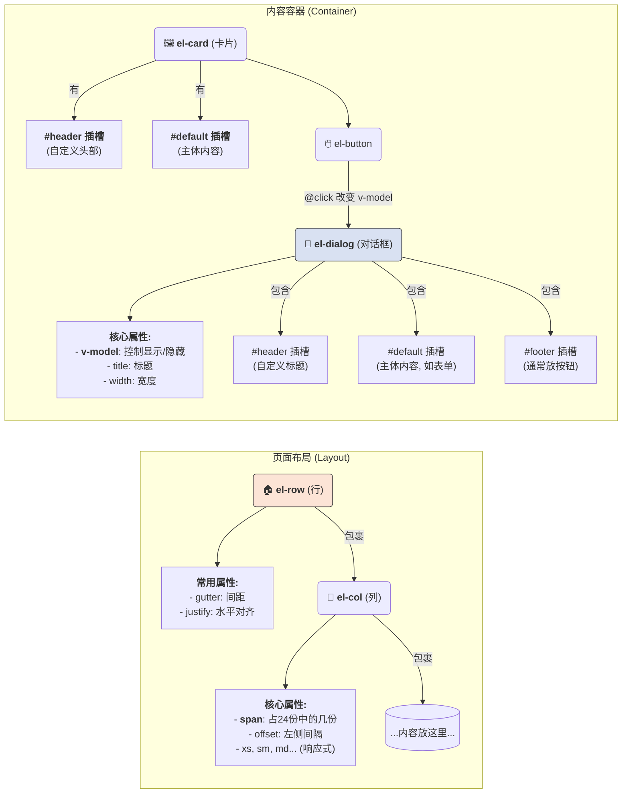
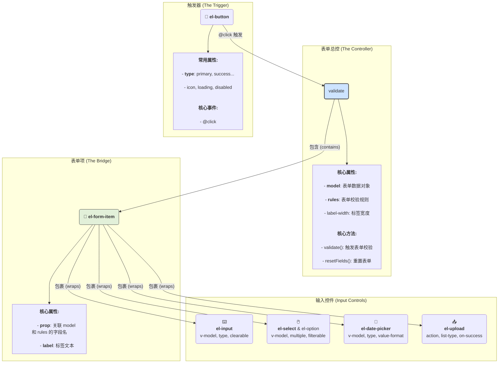
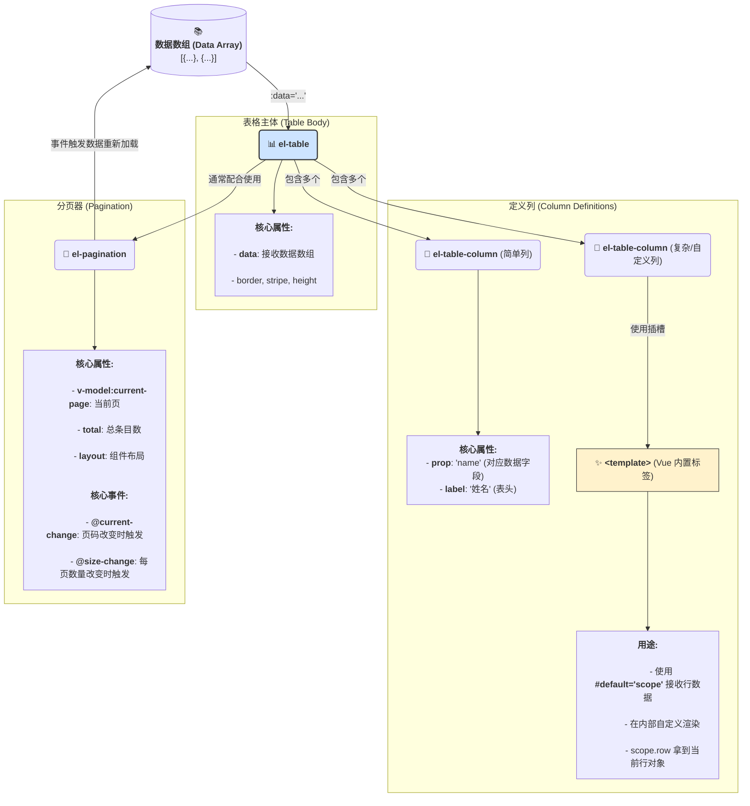

[toc]

---

### 概览

Element Plus 是一套为开发者、设计师和产品经理准备的基于 Vue 3.0 的桌面端组件库。它提供了丰富的基础组件，可以帮助你快速搭建美观、功能强大的用户界面。

下面我们将详细介绍各个组件。

### 一、 布局组件 (Layout)

这类组件用于构建页面的基本结构。




#### 1. `el-row` 和 `el-col`
- **含义与作用**:
  - `el-row`（行）和 `el-col`（列）共同构成了 Element Plus 的 **栅格布局系统**。它基于24列分栏，可以轻松创建灵活、响应式的页面布局。
  - `el-row` 作为行的容器，包裹着 `el-col`。
  - `el-col` 是真正的列，所有内容都应该放置在 `el-col` 内部。

- **`el-row` 常用属性**:
  - `gutter`: `number` 类型，用于设置列与列之间的间隔（单位 px）。
  - `justify`: `string` 类型，Flex 布局下的水平对齐方式。可选值：`start` (默认), `end`, `center`, `space-around`, `space-between`。
  - `align`: `string` 类型，Flex 布局下的垂直对齐方式。可选值：`top` (默认), `middle`, `bottom`。
  - `tag`: `string` 类型，自定义 `el-row` 渲染的 HTML 标签，默认为 `div`。

- **`el-col` 常用属性**:
  - `span`: `number` 类型，**最核心的属性**，表示该列占据的栅格数（总共24）。例如 `span="12"` 表示占据一半宽度。
  - `offset`: `number` 类型，栅格左侧的间隔格数。
  - `push` / `pull`: `number` 类型，向右/向左移动指定的栅格数。
  - **响应式属性**: `xs`, `sm`, `md`, `lg`, `xl`。这些属性允许你为不同屏幕尺寸（<768px, ≥768px, ≥992px, ≥1200px, ≥1920px）设置不同的 `span`、`offset` 等值，实现响应式布局。例如：`:xs="24" :sm="12" :md="8"` 表示在超小屏幕上占满，小屏幕上占一半，中等屏幕上占三分之一。

---

### 二、 容器组件 (Container)

这类组件用于包裹和组织内容。

#### 1. `el-card` (卡片)
- **含义与作用**:
  - 一个带有边框和阴影的容器，用于将相关信息聚合在一起，形成一个视觉上独立的区块。常用于展示摘要、面板、简介等。
- **常用属性**:
  - `header`: `string` 类型，卡片的标题。如果需要更复杂的标题，可以使用 `header` 插槽。
  - `body-style`: `object` 类型，设置卡片主体（body）的 CSS 样式，例如 `{ padding: '10px' }`。
  - `shadow`: `string` 类型，设置阴影的显示时机。可选值：`always` (总是显示), `hover` (鼠标悬浮时显示), `never` (从不显示)。
- **插槽 (Slots)**:
  - `default`: 默认插槽，用于放置卡片的主体内容。
  - `header`: 具名插槽，用于自定义卡片头部。当 `header` 属性无法满足需求时使用。

#### 2. `el-dialog` (对话框)
- **含义与作用**:
  - 在当前页面之上弹出的一个模态窗口，用于承载独立任务、展示信息或需要用户进行操作的场景（如表单填写、确认提示）。它会中断用户的当前操作流程。
- **常用属性**:
  - `v-model`: `boolean` 类型，**核心属性**，用于控制对话框的显示与隐藏。必须使用 `v-model` 或 `:model-value` 和 `@update:modelValue`。
  - `title`: `string` 类型，对话框的标题。
  - `width`: `string` | `number` 类型，对话框的宽度，如 `'50%'` 或 `600`。
  - `modal`: `boolean` 类型，是否需要遮罩层，默认为 `true`。
  - `close-on-click-modal`: `boolean` 类型，是否可以通过点击遮罩层关闭对话框，默认为 `true`。
  - `before-close`: `function(done)` 类型，一个关闭前的回调函数，用于执行异步操作或阻止对话框关闭。你需要手动调用 `done()` 来关闭它。
- **插槽**:
  - `default`: 对话框主体内容。
  - `header`: 自定义标题区域。
  - `footer`: 自定义底部区域，通常用于放置“确认”、“取消”等按钮。
- **事件**:
  - `@open`: 对话框打开时触发。
  - `@close`: 对话框关闭时触发。

---

### 三、 表单组件 (Form)

这是 Element Plus 中最核心、最庞大的一组组件，用于数据采集和校验。




#### 1. `el-form` (表单)
- **含义与作用**:
  - 表单的顶层容器，用于管理其内部所有 `el-form-item` 的状态，如数据模型、校验规则、整体布局等。
- **常用属性**:
  - `model`: `object` 类型，**核心属性**，表单数据对象，双向绑定表单内各个输入组件的值。
  - `rules`: `object` 类型，**核心属性**，表单验证规则。
  - `label-width`: `string` | `number` 类型，表单域标签的宽度，如 `'80px'`。
  - `label-position`: `string` 类型，标签的位置。可选值：`right` (默认), `left`, `top`。
  - `inline`: `boolean` 类型，是否为行内表单模式，默认为 `false`。设为 `true` 后，`el-form-item` 会水平排列。
- **方法 (Methods)**: (通过 `ref` 调用)
  - `validate(callback)`: 对整个表单进行校验。
  - `resetFields()`: 重置该表单项，将其值重置为初始值，并移除校验结果。
  - `clearValidate()`: 清理某个或所有表单项的校验信息。

#### 2. `el-form-item` (表单项)
- **含义与作用**:
  - 表单的基本单元，通常包含一个标签（label）、一个输入控件，以及校验状态和错误信息。它是 `el-form` 和具体输入组件之间的桥梁。
- **常用属性**:
  - `label`: `string` 类型，该表单项的标签文本。
  - `prop`: `string` 类型，**核心属性**，它对应 `el-form` 的 `model` 和 `rules` 对象中的一个字段名。Element Plus 通过 `prop` 来找到对应的数据和校验规则。
  - `required`: `boolean` 类型，是否必填，会在标签前显示一个红色星号。
  - `rules`: `object` | `array` 类型，单独为该表单项设置校验规则。
  - `error`: `string` 类型，手动设置校验错误信息。

#### 3. `el-input` (输入框)
- **含义与作用**: 基础的文本输入控件。
- **常用属性**:
  - `v-model`: `string` | `number` 类型，**核心属性**，绑定的值。
  - `type`: `string` 类型，输入框类型。可选值：`text` (默认), `password`, `textarea` 等。
  - `placeholder`: `string` 类型，输入框的占位文本。
  - `clearable`: `boolean` 类型，是否可清空。
  - `show-password`: `boolean` 类型，当 `type="password"` 时，是否显示切换密码可见性的图标。
  - `disabled`: `boolean` 类型，是否禁用。
  - `prefix-icon` / `suffix-icon`: `string` | `Component` 类型，前置/后置图标。
- **插槽**:
  - `prefix` / `suffix`: 在输入框内部前/后添加内容，如图标。
  - `prepend` / `append`: 在输入框外部前/后添加内容，常用于添加单位或按钮。

#### 4. `el-select` 和 `el-option` (选择器)
- **含义与作用**:
  - `el-select` 提供一个下拉菜单，让用户从多个选项中选择一个或多个值。
  - `el-option` 代表 `el-select` 中的一个具体选项。**`el-option` 必须作为 `el-select` 的子组件**。
- **`el-select` 常用属性**:
  - `v-model`: `string` | `number` | `array` 类型，**核心属性**，绑定的值。
  - `multiple`: `boolean` 类型，是否可多选。
  - `placeholder`: `string` 类型，占位文本。
  - `filterable`: `boolean` 类型，是否可搜索。
  - `clearable`: `boolean` 类型，是否可清空。
  - `disabled`: `boolean` 类型，是否禁用。
- **`el-option` 常用属性**:
  - `value`: `string` | `number` | `object` 类型，**核心属性**，选项的值，是 `el-select` 的 `v-model` 收集到的内容。
  - `label`: `string` | `number` 类型，选项的标签，即用户在下拉列表中看到的文本。
  - `disabled`: `boolean` 类型，是否禁用该选项。

#### 5. `el-date-picker` (日期选择器)
- **含义与作用**: 用于选择单个日期、日期范围、月份、年份等。
- **常用属性**:
  - `v-model`: `Date` | `string` | `number` 类型，**核心属性**，绑定的值。
  - `type`: `string` 类型，显示类型。可选值：`date` (日期), `daterange` (日期范围), `month` (月份), `year` (年份), `datetime` (日期时间) 等。
  - `placeholder`: `string` 类型，占位文本。
  - `format`: `string` 类型，**显示在输入框中的格式**。例如 `YYYY-MM-DD`。
  - `value-format`: `string` 类型，**绑定值的格式**。非常重要，例如可以设置为 `YYYY-MM-DD`，这样 `v-model` 得到的就是字符串而不是 Date 对象。
  - `disabled-date`: `function` 类型，一个函数，用于禁用某些日期，返回 `true` 表示禁用。

#### 6. `el-upload` (上传)
- **含义与作用**:
  - 强大的文件上传组件，支持拖拽上传、文件列表、预览、状态控制等。
- **常用属性**:
  - `action`: `string` 类型，**必填**，文件上传的服务器地址。
  - `headers`: `object` 类型，设置上传的请求头部，例如 `Authorization`。
  - `data`: `object` 类型，上传时附带的额外参数。
  - `list-type`: `string` 类型，文件列表的样式。可选值：`text` (默认), `picture`, `picture-card`。
  - `auto-upload`: `boolean` 类型，是否在选取文件后立即上传，默认为 `true`。
  - `limit`: `number` 类型，最大允许上传个数。
  - `on-preview`: `function(file)` 类型，点击文件列表中已上传的文件时的钩子。
  - `on-success`: `function(response, file, fileList)` 类型，文件上传成功时的钩子。
  - `on-error`: `function(err, file, fileList)` 类型，文件上传失败时的钩子。
- **方法**:
  - `submit()`: 手动上传文件列表（当 `auto-upload` 为 `false` 时使用）。
  - `clearFiles()`: 清空已上传的文件列表。
- **插槽**:
  - `trigger`: 自定义触发上传操作的元素。
  - `tip`: 提示说明文字。

#### 7. `el-button` (按钮)
- **含义与作用**: 用于触发一个操作，如提交表单、打开对话框等。
- **常用属性**:
  - `type`: `string` 类型，按钮类型（颜色）。可选值：`primary`, `success`, `warning`, `danger`, `info`, `text`。
  - `plain`: `boolean` 类型，是否为朴素按钮（镂空背景）。
  - `round`: `boolean` 类型，是否为圆角按钮。
  - `circle`: `boolean` 类型，是否为圆形按钮（通常只放一个图标）。
  - `icon`: `string` | `Component` 类型，设置按钮的图标。
  - `disabled`: `boolean` 类型，是否禁用。
  - `loading`: `boolean` 类型，是否显示加载中状态。
- **事件**:
  - `@click`: 点击按钮时触发。

---

### 四、 数据展示组件 (Data Display)




#### 1. `el-table` 和 `el-table-column` (表格)
- **含义与作用**:
  - `el-table` 是用于展示结构化数据的表格容器。
  - `el-table-column` 定义表格中的每一列。**`el-table-column` 必须作为 `el-table` 的子组件**。
- **`el-table` 常用属性**:
  - `data`: `array` 类型，**核心属性**，表格要显示的数据数组，数组中每个对象代表一行。
  - `border`: `boolean` 类型，是否带有纵向边框。
  - `stripe`: `boolean` 类型，是否为斑马纹表格。
  - `height` / `max-height`: `string` | `number` 类型，表格的高度/最大高度，用于固定表头。
  - `row-key`: `string` | `function` 类型，行数据的 Key，在使用 `selection` 或树形数据时非常重要。
- **`el-table-column` 常用属性**:
  - `prop`: `string` 类型，**核心属性**，对应 `data` 数组中对象的一个键名，该列会显示这个键对应的值。
  - `label`: `string` 类型，该列的表头文本。
  - `width`: `string` | `number` 类型，列的宽度。
  - `fixed`: `boolean` | `string` 类型，列是否固定在左侧或右侧。可选值：`true`, `'left'`, `'right'`。
  - `align`: `string` 类型，对齐方式。可选值：`left`, `center`, `right`。
  - `type`: `string` 类型，特殊的列类型。可选值：`selection` (多选框), `index` (索引), `expand` (可展开行)。
- **`el-table-column` 的插槽**:
  - `default`: **非常重要**，用于自定义列内容的渲染。通过 `v-slot="scope"` 或 `#default="{ row, column, $index }"` 可以获取到当前行数据 `row`、列配置 `column` 和行索引 `$index`，从而实现复杂的单元格渲染，例如添加按钮、格式化数据等。

#### 2. `el-pagination` (分页)
- **含义与作用**:
  - 当数据量过多时，用于对数据进行分页显示。通常与 `el-table` 配合使用。
- **常用属性**:
  - `v-model:current-page`: `number` 类型，当前页码。
  - `v-model:page-size`: `number` 类型，每页显示条目个数。
  - `total`: `number` 类型，**核心属性**，总条目数。
  - `page-sizes`: `number[]` 类型，每页显示个数选择器的选项设置，如 `[10, 20, 50, 100]`。
  - `layout`: `string` 类型，**核心属性**，控制分页组件的布局和显示内容，用逗号分隔。可选值：`total` (总数), `sizes` (每页数量), `prev` (上一页), `pager` (页码列表), `next` (下一页), `jumper` (跳转)。一个常用配置是 `'total, sizes, prev, pager, next, jumper'`。
  - `background`: `boolean` 类型，是否为页码添加背景色。
- **事件**:
  - `@size-change`: `pageSize` 改变时会触发。
  - `@current-change`: `currentPage` 改变时会触发。这两个事件是实现分页数据加载的关键。

#### 3. `el-image` (图片)
- **含义与作用**:
  - 增强版的图片组件，支持懒加载、大图预览、加载失败处理等功能。
- **常用属性**:
  - `src`: `string` 类型，图片源地址。
  - `fit`: `string` 类型，确定图片如何适应容器。类似 CSS 的 `object-fit`。可选值：`fill`, `contain`, `cover`, `none`, `scale-down`。
  - `lazy`: `boolean` 类型，是否开启懒加载。
  - `preview-src-list`: `string[]` 类型，开启图片预览功能，值为一个包含所有可预览图片 URL 的数组。
  - `z-index`: `number` 类型，设置预览图片的 `z-index`。
- **插槽**:
  - `placeholder`: 图片加载中的占位内容。
  - `error`: 图片加载失败的提示内容。

---

### 五、 特殊标签

#### 1. `<template>`
- **含义与作用**:
  - **`template` 并不是 Element Plus 的组件，而是 Vue 的一个内置标签**。它本身不会被渲染成任何 DOM 元素，是一个不可见的包裹元素。
  - **主要作用有两个**:
    1.  **包裹多个元素**: 当你想用 `v-if` 或 `v-for` 控制一组元素，但又不想额外增加一个 `<div>` 包裹层时，可以使用 `<template>`。
        ```html
        <template v-if="isLoggedIn">
          <p>欢迎回来！</p>
          <el-button>退出</el-button>
        </template>
        ```
    2.  **用于插槽 (Slot)**: 这是它在 Element Plus 中最常见的用法。当使用具名插槽或作用域插槽时，必须使用 `<template>` 标签，并通过 `v-slot` 指令（可简写为 `#`）来指定插槽。
        - **示例 (el-table-column)**:
          ```html
          <el-table-column label="操作">
            <template #default="scope">
              <el-button @click="handleEdit(scope.row)">编辑</el-button>
              <el-button type="danger" @click="handleDelete(scope.row)">删除</el-button>
            </template>
          </el-table-column>
          ```
        - **示例 (el-dialog)**:
          ```html
          <el-dialog>
            <!-- 默认插槽内容 -->
            <p>这是对话框主体</p>
            <!-- footer 插槽 -->
            <template #footer>
              <el-button @click="dialogVisible = false">取消</el-button>
              <el-button type="primary" @click="submitForm">确认</el-button>
            </template>
          </el-dialog>
          ```

### 总结

- **布局**: `el-row` 和 `el-col` 搭建页面骨架。
- **容器**: `el-card` 用于信息区块化，`el-dialog` 用于模态交互。
- **表单**: `el-form` 是总控，`el-form-item` 连接数据与校验，`el-input`, `el-select`, `el-date-picker`, `el-upload` 是具体的数据输入控件，`el-button` 用于提交或触发操作。
- **数据展示**: `el-table` 与 `el-table-column` 组合呈现表格数据，`el-pagination` 负责分页，`el-image` 优化图片显示。
- **辅助**: `<template>` 是 Vue 的语法，在 Element Plus 中常用于实现复杂的插槽内容。

希望这份详细的总结能对您有所帮助！如果想了解更详尽的 API，建议随时查阅 [Element Plus 官方文档](https://element-plus.gitee.io/zh-CN/component/button.html)。