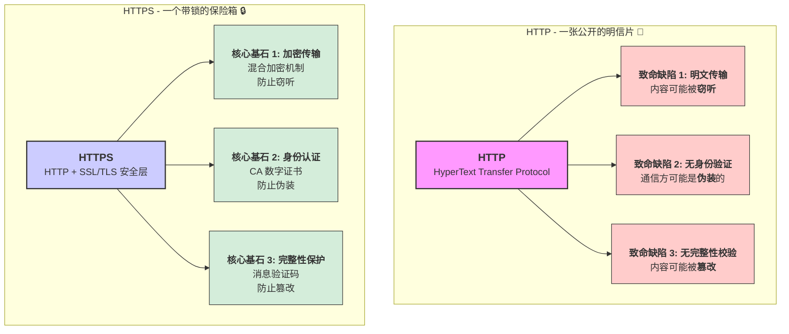
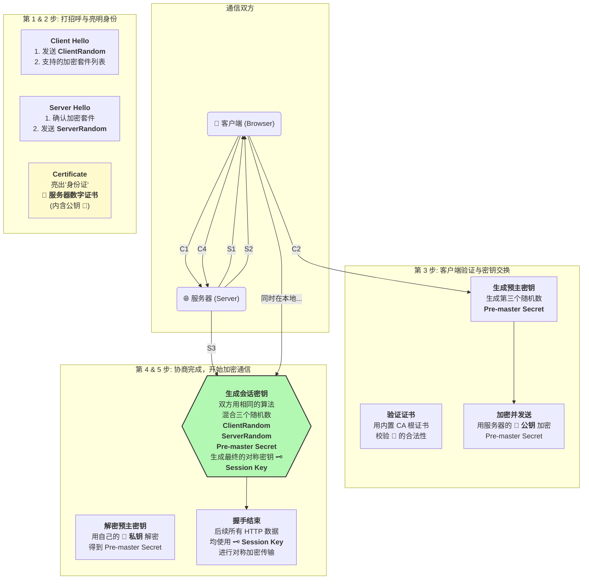
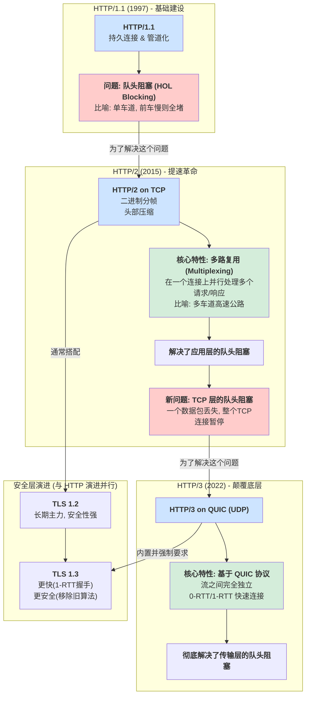

# HTTP演变与总结

[TOC]

### 第一部分：HTTP协议 - 万维网的基石

#### 1. HTTP是什么？

*   **全称**：HyperText Transfer Protocol (超文本传输协议)。
*   **核心定义**：一个用于从万维网服务器传输超媒体文档（如HTML）到浏览器的、基于TCP协议的**应用层协议**。它是客户端-服务器模型中请求和响应的标准。
*   **生动的比喻**：想象HTTP是一张**明信片**。
    *   **内容公开**：你在上面写的内容（请求的网址、发送的数据），邮递员和任何接触到它的人都能看到。
    *   **格式简单**：有固定的格式（收件人地址、发件人地址、正文）。
    *   **无状态**：每张明信片都是独立的，邮递员不会记得你上一张寄给了谁。

#### 2. HTTP的工作流程（请求-响应模型）

整个过程非常直接：

1.  **建立连接**：客户端（通常是浏览器）通过TCP协议与服务器的**80端口**建立一个连接。
2.  **发送请求**：客户端向服务器发送一个HTTP请求报文。
3.  **服务器处理**：服务器接收并解析请求，然后根据请求执行相应的操作（如获取文件、查询数据库）。
4.  **返回响应**：服务器将处理结果打包成一个HTTP响应报文，发送回客户端。
5.  **关闭连接**：服务器发送完响应后，连接被关闭（在HTTP/1.0中是这样，HTTP/1.1有所改进）。

#### 3. HTTP报文结构详解

**请求报文 (Request Message)**

```
GET /index.html HTTP/1.1       <-- 请求行: 方法(Method) + URI + 协议版本
Host: www.example.com          <-- 请求头(Header): 键值对，描述请求的元数据
User-Agent: Mozilla/5.0
Accept-Language: en-US

{ "key": "value" }             <-- 请求体(Body): 可选，通常在POST请求中携带数据
```

**响应报文 (Response Message)**

```
HTTP/1.1 200 OK                <-- 状态行: 协议版本 + 状态码 + 状态描述
Content-Type: text/html        <-- 响应头(Header): 键值对，描述响应的元数据
Content-Length: 1234
Date: Mon, 27 Jul 2023 12:28:53 GMT

<html>...</html>              <-- 响应体(Body): 实际返回的数据
```

#### 4. HTTP的特点及其致命缺陷

*   **优点**：
    *   **简单灵活**：协议文本易于阅读和扩展。
    *   **无状态 (Stateless)**：服务器不需要保存客户端的上下文信息，减轻了服务器负担。但这也意味着需要Cookie等机制来维持会话。
*   **致命缺陷**：
    1.  **明文传输**：所有数据（包括密码、信用卡号）都在网络上以纯文本形式传输，极易被中间人**窃听 (Eavesdropping)**。
    2.  **不验证身份**：无法确认通信双方的真实身份，可能遭遇**伪装 (Masquerading)**。你以为在和银行通信，实际上可能是一个钓鱼网站。
    3.  **无法保证完整性**：无法验证报文在传输过程中是否被**篡改 (Tampering)**。攻击者可以在你的网页中注入广告或恶意脚本。

为了解决这三大安全问题，HTTPS应运而生。

---



### 第二部分：HTTPS协议 - 安全的守护神

#### 1. HTTPS是什么？

*   **全称**：HyperText Transfer Protocol Secure (安全超文本传输协议)。
*   **核心定义**：HTTPS**并不是一个全新的协议**。它是在HTTP协议的基础上，增加了一个**安全层 (SSL/TLS)** 来对通信进行加密和身份验证。简单来说：**HTTPS = HTTP + SSL/TLS**。
*   **生动的比喻**：HTTPS是一个**用加密墨水书写、装在带锁的、由可信机构认证的保险箱里的信件**。
    *   **内容加密**：信件内容（HTTP数据）用特殊墨水（对称加密）书写，只有收信人有解药。
    *   **身份认证**：保险箱上贴着由权威机构（CA）颁发的、无法伪造的身份证明（数字证书）。
    *   **密钥交换安全**：你把打开保险箱的钥匙（对称密钥）放在一个小密码盒（非对称加密）里交给对方，只有对方能打开。

#### 2. HTTPS的核心基石

HTTPS通过三大技术解决了HTTP的缺陷：

1.  **加密 (Encryption)**：使用混合加密机制保证了传输内容的机密性。
    *   **非对称加密 (Asymmetric Encryption)**：
        *   有一对密钥：公钥（公开）和私钥（保密）。
        *   公钥加密的数据，只有对应的私钥才能解密。
        *   **特点**：安全，但计算量大，速度慢。
        *   **用途**：在握手阶段**安全地交换对称加密的密钥**。
    *   **对称加密 (Symmetric Encryption)**：
        *   加密和解密使用同一个密钥。
        *   **特点**：速度快，效率高。
        *   **用途**：在握手完成后，用它来**加密实际传输的HTTP数据**。

2.  **数字证书 (Digital Certificate)**：解决了身份验证问题。
    *   **是什么**：由一个权威的、可信任的第三方机构——**证书颁发机构 (Certificate Authority, CA)** 颁发的一个“数字身份证”。
    *   **包含内容**：
        *   网站的公钥。
        *   网站的域名、所有者信息。
        *   CA机构的数字签名（防伪标志）。
    *   **工作原理**：浏览器内置了所有受信任的CA机构的“根证书”（包含了CA的公钥）。当收到网站发来的证书时，浏览器会用本地的CA根证书来验证该网站证书的签名是否真实有效。如果验证通过，就证明这个网站确实是它所声称的那个网站，并且可以信任它证书里的公钥。

#### 3. HTTPS的灵魂：TLS握手过程全解析（以TLS 1.2为例）



这是HTTPS中最复杂也最关键的部分。目标是：**安全地协商出一个用于后续通信的对称密钥**。

1.  **Client Hello (客户端问好)**
    *   客户端向服务器发送一个随机数 `Client Random`。
    *   告诉服务器自己支持的TLS版本、加密套件（Cipher Suites，即加密算法组合）。

2.  **Server Hello & Certificate (服务器回应与出示证书)**
    *   服务器从客户端支持的加密套件中选择一个，并确定TLS版本。
    *   服务器向客户端发送一个随机数 `Server Random`。
    *   服务器将自己的**数字证书**发送给客户端。

3.  **Client Key Exchange & Verification (客户端验证与密钥交换)**
    *   **验证证书**：客户端用内置的CA根证书验证服务器证书的合法性。如果不合法，会弹出警告。
    *   **生成预主密钥**：验证通过后，客户端再生成一个随机数，称为 `Pre-master Secret`。
    *   **加密预主密钥**：客户端用从服务器证书中获取的**公钥**，对这个 `Pre-master Secret` 进行加密。
    *   客户端将加密后的 `Pre-master Secret` 发送给服务器。

4.  **Server Decryption & Session Key Generation (服务器解密与会话密钥生成)**
    *   服务器收到加密的 `Pre-master Secret` 后，用自己的**私钥**进行解密，得到原始的 `Pre-master Secret`。
    *   **至此，客户端和服务器都拥有了三个相同的关键信息**：`Client Random`, `Server Random`, `Pre-master Secret`。
    *   双方各自使用一个相同的算法，将这三个随机数混合生成一个独一无二的**会话密钥 (Session Key)**。这个密钥就是后续通信要用的**对称密钥**。

5.  **Finished (握手完成)**
    *   双方都向对方发送一个“Finished”消息，该消息用刚刚生成的会话密钥加密。
    *   如果对方能成功解密，说明握手成功。
    *   **从此以后，双方的所有HTTP通信都将使用这个会话密钥进行对称加密。**

---

### 第三部分：协议的演进 - 为了更快、更强




#### HTTP/1.1 (1997)

解决了HTTP/1.0每次请求都要新建TCP连接的低效问题。
*   **持久连接 (Persistent Connection)**：默认开启 `Connection: keep-alive`，一个TCP连接可以复用，承载多次HTTP请求和响应。
*   **管道化 (Pipelining)**：允许客户端在一个TCP连接上连续发送多个请求，而无需等待前一个请求的响应。但服务器必须按顺序响应，如果第一个响应很慢，会阻塞后面的所有响应，这就是**队头阻塞 (Head-of-Line Blocking)**。

#### HTTP/2 (2015)

这是对HTTP协议的一次重大升级，核心目标是性能。
*   **二进制分帧 (Binary Framing)**：将所有传输的信息分割为更小的消息和帧，并采用二进制格式编码。
*   **多路复用 (Multiplexing)**：**革命性特性**。在一个TCP连接上，可以同时并行地发送和接收多个请求和响应，它们可以交错传输而不会相互阻塞。这彻底解决了HTTP/1.1的队头阻塞问题。
    *   **比喻**：HTTP/1.1是单车道，一次只能走一辆车。HTTP/2是多车道高速公路，多辆车可以并行行驶。
*   **头部压缩 (Header Compression)**：使用HPACK算法压缩请求和响应的头部，减少了传输的数据量。
*   **服务器推送 (Server Push)**：服务器可以主动向客户端推送资源，而无需客户端明确请求。

#### HTTP/3 (2022)

HTTP/2虽然解决了应用层的队头阻塞，但它基于的TCP协议本身存在队头阻塞问题（一个数据包丢失，会导致整个TCP连接上的所有流都暂停等待重传）。
*   **基于QUIC协议**：HTTP/3放弃了TCP，改用了一个基于**UDP**的全新协议——**QUIC (Quick UDP Internet Connections)**。
*   **解决了TCP队头阻塞**：QUIC实现了自己的流量控制和可靠性传输。它的多个流之间是完全独立的，一个流的数据包丢失不会影响其他流。
    *   **比喻**：HTTP/2是同一栋大楼里的多个电梯，如果大楼入口（TCP连接）着火了，所有电梯都停运。HTTP/3是多栋独立的大楼，每栋楼有自己的电梯，一栋楼出问题不影响其他楼。
*   **更快的连接建立**：QUIC集成了TLS握手，大大减少了建立安全连接所需的时间（通常只需1-RTT或0-RTT）。

---

### 第四部分：安全层的演进 - TLS版本的更迭

SSL/TLS层本身也在不断进化，以应对新的攻击和提升性能。

*   **SSL 1.0, 2.0, 3.0**：早期版本，存在严重安全漏洞（如POODLE攻击），现已完全弃用。
*   **TLS 1.0, 1.1** (1999, 2006)：修复了SSL的一些问题，但仍存在弱点，也已逐渐被弃用。
*   **TLS 1.2** (2008)：**长期以来的主力**。它引入了更安全的加密算法（如AES-GCM），修复了许多已知漏洞，是过去十年的标准。
*   **TLS 1.3** (2018)：**现代标准，一次重大飞跃**。
    *   **更安全**：移除了所有过时和不安全的加密算法。
    *   **更快**：**握手过程大幅简化**。将原来的2-RTT（两次往返）握手减少到了**1-RTT**，甚至支持**0-RTT**（零往返时间）的会话恢复，极大地加快了连接速度。

---

### 总结：一张图看懂演进之路

```
+--------------------------------------------------------------------------------------------------+
|                                          Application Layer                                       |
+========================================+================================+========================+
|             HTTP/1.1                   |           HTTP/2               |         HTTP/3         |
|   (Text, Pipelining, HOL Blocking)     | (Binary, Multiplexing)         |    (QUIC Streams)      |
+----------------------------------------+--------------------------------+------------------------+
|                                        |                                |                        |
| <------- HTTPS Security Layer -------> | <------- HTTPS Security ------>| <-- QUIC (integrates)--> |
|                                        |                                |                        |
+========================================+================================+========================+
|      SSL/TLS (v1.2, v1.3, etc.)        |   SSL/TLS (v1.2, v1.3, etc.)   |      QUIC + TLS 1.3    |
+========================================+================================+========================+
|                                        |                                |                        |
| <------------ Transport Layer --------------> | <------ Transport Layer ------>|                        |
|                                        |                                |                        |
+========================================+================================+========================+
|                  TCP                   |               TCP              |          UDP           |
+----------------------------------------+--------------------------------+------------------------+
```

**核心 takeaways**：

1.  **HTTP**是裸奔的明信片，**HTTPS**是加了密、带认证的保险箱。
2.  HTTPS的核心在于**TLS/SSL层**，它通过**混合加密**和**数字证书**实现了安全通信。
3.  **TLS握手**是HTTPS建立安全连接的关键，目的是为了安全地协商出一个**对称会话密钥**。
4.  协议的演进始终围绕两大主题：**安全**和**性能**。
    *   **HTTP/2**通过**多路复用**解决了应用层队头阻塞。
    *   **HTTP/3**通过**QUIC (on UDP)** 解决了传输层（TCP）的队头阻塞。
    *   **TLS 1.3**通过**简化握手**，大幅提升了HTTPS的连接速度。