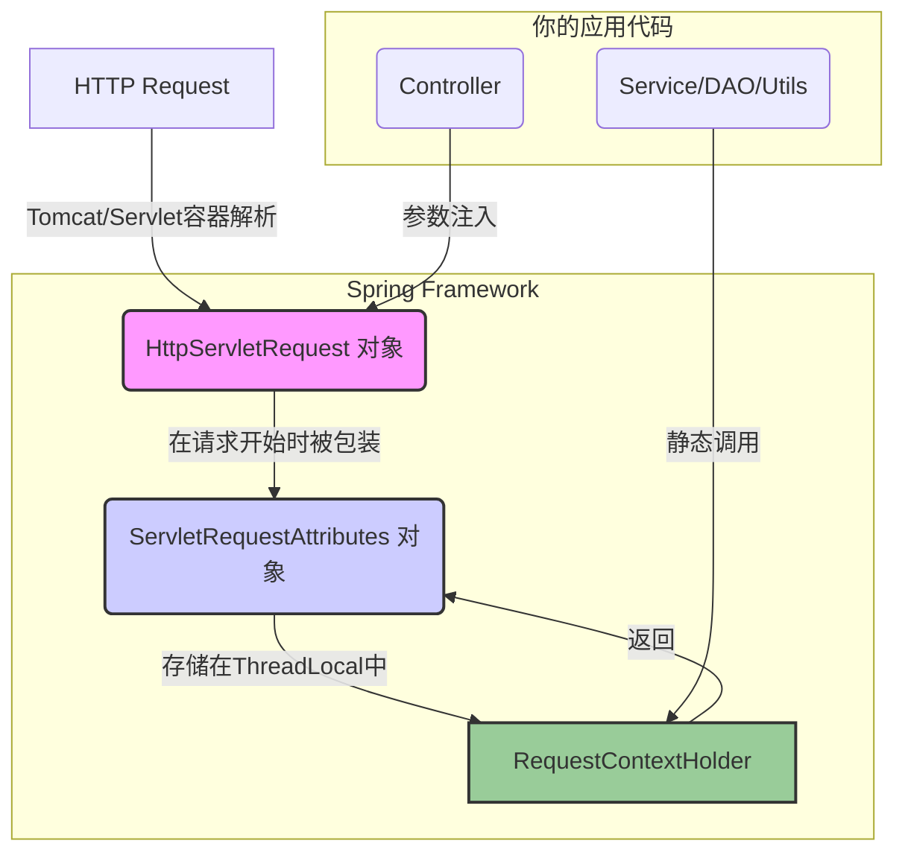

好的，这是一个非常深入且实用的问题。`HttpServletRequest`、`RequestContextHolder` 和 `ServletRequestAttributes` 是 Java Web 开发（尤其是在 Spring 框架中）处理 HTTP 请求上下文的三个关键角色。理解它们各自的职责、关系和使用场景，对于编写出优雅、解耦且健壮的后端代码至关重要。

为了做到“详细”和“长”，我将从以下几个维度来全面剖析它们：

1.  **Servlet 基础：`HttpServletRequest` 的诞生与职责** - 一切的源头。
2.  **Spring 的困境：为什么需要 `RequestContextHolder`？** - 从分层架构看问题。
3.  **解耦的桥梁：`ServletRequestAttributes` 的作用** - 连接 Spring 与 Servlet。
4.  **`RequestContextHolder` 的魔法：`ThreadLocal` 深度解析** - 它是如何工作的。
5.  **实战场景与最佳实践** - 何时、何地、如何正确使用它们。
6.  **总结与对比** - 一张图看懂它们的关系。

---

### **第一部分：Servlet 基础 - `HttpServletRequest` 的诞生与职责**

`HttpServletRequest` 是所有 Java Web 应用的**起点和基石**。它不属于 Spring，而是 **Java Servlet API** 规范的一部分。

#### 1. 它是谁？

*   `HttpServletRequest` 是一个 **接口**，定义了 HTTP 客户端（通常是浏览器）发送给 Web 服务器的请求信息。
*   当一个 HTTP 请求到达你的应用服务器（如 Tomcat、Jetty）时，服务器会解析这个原始的 TCP/IP 数据流，按照 HTTP 协议规范，将其封装成一个实现了 `HttpServletRequest` 接口的**具体对象**。

#### 2. 它的职责：请求信息的“百科全书”

这个对象包含了关于本次请求的**一切信息**。你可以把它想象成一个包含了所有请求细节的、只读的“包裹”。它的核心职责是**提供数据**，让你的代码能够：

*   **获取请求行 (Request Line) 信息**:
    *   `getMethod()`: 获取请求方法 (GET, POST, PUT, etc.)。
    *   `getRequestURI()`: 获取请求的 URI (如 `/users/123`)。
    *   `getRequestURL()`: 获取完整的请求 URL (如 `http://example.com/users/123`)。
    *   `getProtocol()`: 获取协议版本 (如 `HTTP/1.1`)。

*   **获取请求头 (Headers) 信息**:
    *   `getHeader(String name)`: 获取指定名称的头信息。
    *   `getHeaders(String name)`: 获取指定名称的所有头信息（一个头可能对应多个值）。
    *   `getHeaderNames()`: 获取所有头名称的枚举。

*   **获取请求参数 (Parameters)**:
    *   `getParameter(String name)`: 获取请求参数，无论是 URL 中的查询字符串 (`?id=1`) 还是 `application/x-www-form-urlencoded` 格式的表单体。
    *   `getParameterValues(String name)`: 获取同名参数的所有值 (如复选框)。
    *   `getParameterMap()`: 获取所有参数的 Map。

*   **获取请求体 (Body)**:
    *   `getInputStream()`: 以二进制流的形式获取请求体，常用于文件上传或处理 JSON/XML 数据。
    *   `getReader()`: 以字符流的形式获取请求体。

*   **获取客户端与服务器信息**:
    *   `getRemoteAddr()`: 获取客户端的 IP 地址。
    *   `getServerName()`: 获取服务器的主机名。
    *   `getServerPort()`: 获取服务器的端口号。

*   **管理请求作用域属性 (Request Scope Attributes)**:
    *   `setAttribute(String name, Object o)`: 在请求的生命周期内存储一个对象。
    *   `getAttribute(String name)`: 获取之前存储的对象。
    *   `removeAttribute(String name)`: 移除一个对象。
    *   **作用**: 这是在同一次请求的不同处理单元（如 Filter, Servlet, Controller, View）之间传递数据的**核心机制**。

*   **获取会话 (Session) 和 Cookie**:
    *   `getSession()`: 获取或创建一个 `HttpSession` 对象。
    *   `getCookies()`: 获取所有 `Cookie` 对象。

#### 3. 它的生命周期与局限性

*   **生命周期**: `HttpServletRequest` 对象由 Servlet 容器创建，并随着 HTTP 请求的结束而被销毁。它的生命周期非常短暂，严格绑定在**一次请求的处理线程**中。
*   **局限性**: 它的最大局限在于**强耦合**。你只能在能直接接触到它的地方使用它，典型的就是 **Controller 层的方法参数**中。

```java
@RestController
public class MyController {
    // Spring MVC 会自动将 HttpServletRequest 对象注入到方法参数中
    @GetMapping("/user")
    public User getUser(HttpServletRequest request) {
        String userId = request.getParameter("id");
        // ...
        return userService.findById(userId);
    }
}
```
这在 Controller 层是完全没问题的。但问题来了...

---

### **第二部分：Spring 的困境 - 为什么需要 `RequestContextHolder`？**

现代应用都是分层架构（Controller -> Service -> Repository/DAO）。想象一下，如果你的 **Service 层**或**工具类**需要获取当前请求的 IP 地址来记录日志，或者需要从请求头中获取 `tenant-id` 来实现多租户数据隔离。

**糟糕的设计（参数透传）:**

```java
// Controller 层
@GetMapping("/user")
public User getUser(HttpServletRequest request) {
    String userId = request.getParameter("id");
    // 为了让 Service 层能用，只好把它传下去
    return userService.findById(userId, request); 
}

// Service 层
public User findById(String userId, HttpServletRequest request) {
    String ipAddress = request.getRemoteAddr();
    // ... 记录日志
    // ... 
    // 又要把它传给 DAO 层？这简直是灾难！
    return userDao.find(userId, request); 
}
```

这种设计被称为**“参数钻孔 (Parameter Drilling)”** 或 **“参数隧道 (Parameter Tunneling)”**。它有几个致命的缺点：

1.  **严重污染方法签名**: `HttpServletRequest` 是一个与 Web 层强相关的对象，它像病毒一样污染了纯净的业务逻辑层 (Service/DAO)。Service 层的方法被迫接收一个它本身不应该关心的参数。
2.  **降低可测试性**: 在对 `UserService` 进行单元测试时，你不得不去模拟（Mock）一个 `HttpServletRequest` 对象，这非常麻烦且不必要。
3.  **违反分层原则**: 业务层应该对 Web 层无感知。

**Spring 需要一种方法，让任何层、任何组件都能在需要时，随时随地获取到当前请求的上下文信息，而无需层层传递。** 这就是 `RequestContextHolder` 诞生的原因。

---

### **第三部分：`RequestContextHolder` - 全局的请求上下文访问入口**

`RequestContextHolder` 是 **Spring Web 模块**提供的一个工具类。它的设计目标就是解决上述问题。

#### 1. 它是谁？

*   它是一个**持有者 (Holder)** 类，内部使用 `ThreadLocal` 变量来存储与当前线程绑定的请求上下文信息。
*   它提供了一系列**静态方法**，允许你在代码的任何地方访问这些信息。

#### 2. 核心方法

*   `getRequestAttributes()`: 获取当前线程的 `RequestAttributes` 对象。这是最核心的方法。
*   `setRequestAttributes(RequestAttributes attributes)`: 将 `RequestAttributes` 对象与当前线程绑定。
*   `currentRequestAttributes()`: 与 `getRequestAttributes()` 类似，但如果找不到会抛出异常。

#### 3. 它的魔法：`ThreadLocal` 深度解析

`RequestContextHolder` 之所以能实现“随时随地访问”，其背后的魔法就是 `ThreadLocal`。

*   **`ThreadLocal` 是什么？**
    *   `ThreadLocal` 是 Java 提供的一种线程级别的变量。它为每个使用该变量的线程都提供一个**独立的变量副本**。
    *   这意味着，一个线程对 `ThreadLocal` 变量的读写，完全不会影响到其他线程。

*   **Spring 如何利用 `ThreadLocal`？**
    1.  **请求开始时**: 当一个 HTTP 请求进入 Spring 的 `DispatcherServlet` 时，Spring 会在一个非常早期的阶段（通常是在 `FrameworkServlet` 中），将 `HttpServletRequest` 对象包装成一个 `ServletRequestAttributes` 对象。
    2.  **绑定到线程**: 然后，Spring 调用 `RequestContextHolder.setRequestAttributes(...)`，将这个 `ServletRequestAttributes` 对象存入一个 `static final` 的 `ThreadLocal` 变量中。
    3.  **请求处理中**: 在 Controller、Service、DAO 或任何其他组件中，当你调用 `RequestContextHolder.getRequestAttributes()` 时，它实际上是从**当前执行线程**的 `ThreadLocal` 副本中获取之前存入的那个 `ServletRequestAttributes` 对象。因为整个请求处理过程都在同一个线程中完成，所以你总能拿到正确的数据。
    4.  **请求结束时**: 在请求处理完毕，响应即将返回给客户端之前，Spring 会在一个 `finally` 块中调用 `RequestContextHolder.resetRequestAttributes()`，清理当前线程的 `ThreadLocal` 副本。这非常重要，可以防止内存泄漏，并确保线程池中的线程在处理下一个请求时不会拿到上一个请求的脏数据。

---

### **第四部分：解耦的桥梁 - `ServletRequestAttributes` 的作用**

你可能会问，`RequestContextHolder` 里为什么不直接存 `HttpServletRequest`，而是存一个叫 `ServletRequestAttributes` 的东西？

`ServletRequestAttributes` 是 `RequestAttributes` 接口的一个实现。`RequestAttributes` 接口是 Spring 为了**解耦和抽象**而设计的。

#### 1. 为什么要抽象？

Spring 不仅仅是一个 Web 框架。它的设计目标是能在多种环境下工作。除了标准的基于 Servlet 的 Web 环境（如 Web MVC），Spring 还能在其他环境中运行，比如：
*   **Portlet 环境**
*   **响应式 Web 环境 (WebFlux)**，它处理的不是 `HttpServletRequest`，而是 `ServerWebExchange`。

#### 2. `RequestAttributes` 接口

`RequestAttributes` 接口定义了一套**通用的、与具体环境无关**的访问请求属性的方法，比如：
*   `getAttribute(String name, int scope)`
*   `setAttribute(String name, Object value, int scope)`
*   `getSessionId()`

这里的 `scope` 可以是 `SCOPE_REQUEST` 或 `SCOPE_SESSION`。

#### 3. `ServletRequestAttributes` 的角色

*   `ServletRequestAttributes` 就是 `RequestAttributes` 接口在 **Servlet 环境下的具体实现**。
*   它内部**持有**一个 `HttpServletRequest` 对象的引用。
*   它实现了 `RequestAttributes` 接口的通用方法，并将这些调用**委托 (delegate)** 给它持有的 `HttpServletRequest` 对象来完成。例如，它的 `setAttribute("myAttr", myObj, SCOPE_REQUEST)` 方法，内部实际调用的就是 `httpServletRequest.setAttribute("myAttr", myObj)`。
*   同时，它还提供了直接获取原生 Servlet API 对象的方法：
    *   `getRequest()`: 返回 `HttpServletRequest`
    *   `getResponse()`: 返回 `HttpServletResponse`

**总结**: 通过这层抽象，`RequestContextHolder` 可以存储一个通用的 `RequestAttributes` 对象，使得上层代码可以以一种环境无关的方式工作。而在具体的 Servlet 环境中，我们可以将这个通用的 `RequestAttributes` 对象向下转型为 `ServletRequestAttributes`，从而拿到我们需要的原生的 `HttpServletRequest` 对象。

---

### **第五部分：实战场景与最佳实践**

现在，我们把这三者串起来，看看在实际项目中如何正确地使用它们。

#### 场景1：在 Service 层获取 HTTP Header

```java
@Service
public class TenantService {
    public void processData() {
        // 1. 从 Holder 获取通用的 RequestAttributes
        RequestAttributes requestAttributes = RequestContextHolder.getRequestAttributes();

        if (requestAttributes instanceof ServletRequestAttributes) {
            // 2. 向下转型为 ServletRequestAttributes
            HttpServletRequest request = ((ServletRequestAttributes)requestAttributes).getRequest();
            
            // 3. 现在可以为所欲为了
            String tenantId = request.getHeader("X-Tenant-ID");
            
            if (tenantId == null) {
                throw new IllegalStateException("X-Tenant-ID header is missing!");
            }
            
            // ... 使用 tenantId 进行业务处理
            System.out.println("Processing data for tenant: " + tenantId);
        } else {
           // 处理非 Servlet 环境的情况，或者当请求上下文不存在时
           // (例如，在异步线程或定时任务中调用此方法)
        }
    }
}
```

#### 场景2：封装一个工具类

我们可以封装一个工具类来简化上述操作。

```java
public class RequestContextUtils {

    public static HttpServletRequest getCurrentRequest() {
        RequestAttributes requestAttributes = RequestContextHolder.getRequestAttributes();
        if (requestAttributes instanceof ServletRequestAttributes) {
            return ((ServletRequestAttributes) requestAttributes).getRequest();
        }
        // 在非 Web 环境下，可以返回 null 或抛出异常
        return null; 
    }

    public static String getHeader(String headerName) {
        HttpServletRequest request = getCurrentRequest();
        if (request != null) {
            return request.getHeader(headerName);
        }
        return null;
    }
}

// 在 Service 层使用
@Service
public class AnotherService {
    public void doSomething() {
        String userAgent = RequestContextUtils.getHeader("User-Agent");
        // ...
    }
}


```

#### 最佳实践与注意事项

1.  **优先在 Controller 层处理**: 尽可能将与 `HttpServletRequest` 相关的逻辑（如参数绑定、请求体验证）保留在 Controller 层。这是它的天然归宿。
2.  **谨慎在业务层使用**: 只有在**确实需要**（如多租户、审计日志、国际化等横切关注点）时，才在 Service 层通过 `RequestContextHolder` 获取请求信息。滥用会导致业务逻辑与 Web 层的不必要耦合。
3.  **注意异步线程**: `RequestContextHolder` 的 `ThreadLocal` 策略意味着，如果你在主线程中开启了一个**新的子线程**去执行任务，那么在子线程中是**无法**获取到主线程的请求上下文的！
    *   **解决方案**: 如果需要在子线程中使用，你必须在主线程中先获取 `RequestAttributes`，然后手动将其传递给子线程，并在子线程的任务开始前调用 `RequestContextHolder.setRequestAttributes(...)` 进行设置。
4.  **单元测试**: 当你测试使用了 `RequestContextHolder` 的 Service 时，你需要手动模拟上下文。Spring Test 模块提供了 `MockHttpServletRequest` 和 `RequestContextHolder.setRequestAttributes` 来帮助你轻松完成这件事。

---

### **第六部分：总结与对比**

| 特性         | `HttpServletRequest`                 | `ServletRequestAttributes`                               | `RequestContextHolder`                                     |
| :----------- | :----------------------------------- | :------------------------------------------------------- | :--------------------------------------------------------- |
| **来源**     | **Java Servlet API**                 | **Spring Framework**                                     | **Spring Framework**                                       |
| **本质**     | 请求信息的**接口**                   | `RequestAttributes` 的**实现类**                         | 存储请求上下文的**工具类**                                 |
| **核心职责** | **提供**关于HTTP请求的所有数据       | **包装** `HttpServletRequest`，提供**通用访问接口**      | **持有**并提供对**当前线程**请求上下文的**全局静态访问**   |
| **生命周期** | 一次HTTP请求                         | 绑定于 `HttpServletRequest`                              | 绑定于**线程**和**请求**                                   |
| **设计目的** | 遵循 Servlet 规范，封装请求          | Spring 内部的**抽象和解耦**                              | **解决分层架构中的上下文传递**问题                         |
| **典型用法** | 在 **Controller 方法参数**中直接注入 | 通常是 Spring 内部使用，或从 Holder 中获取后**向下转型** | 在**任意层**通过**静态方法** `getRequestAttributes()` 调用 |
| **耦合度**   | **高** (与 Web 层强耦合)             | **中** (作为桥梁)                                        | **低** (提供了全局解耦的访问方式)                          |

**它们之间的关系可以这样描绘：**



希望这个从起源、原理到实践的全面剖析，能让你对这三个重要的对象有一个透彻的理解！