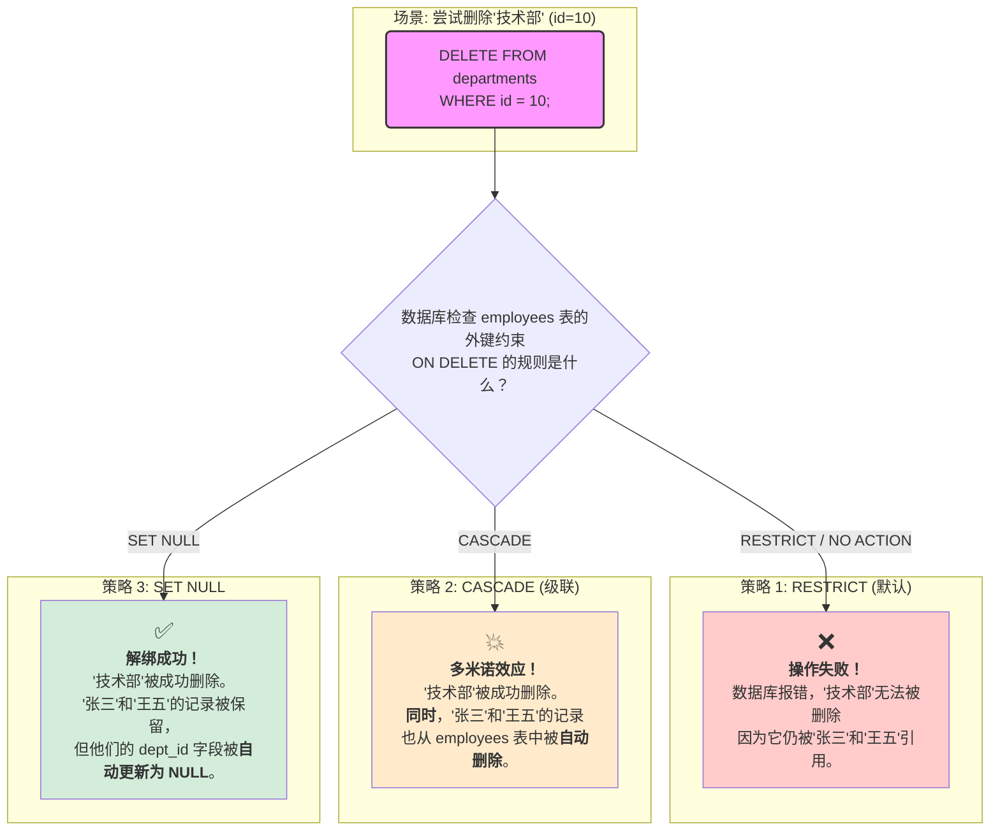
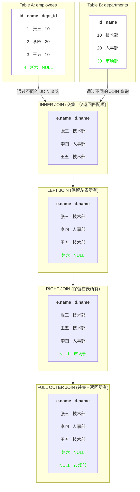
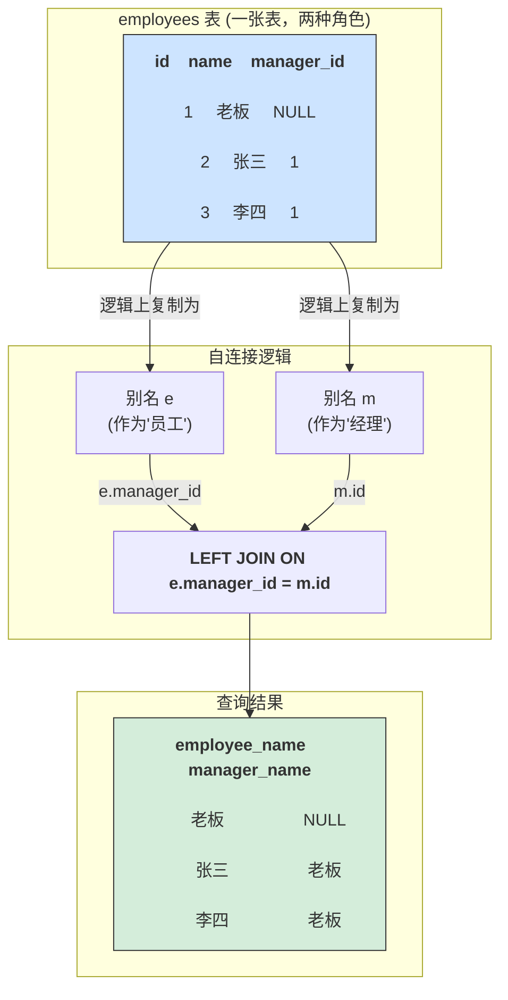

[toc]

---

### 第一部分：外键约束 (Foreign Key Constraint) - 建立表之间的“契约”

外键是用来建立和加强两个表数据之间的链接的一列或多列。你可以把它想象成一个**强制性的“契约”**，规定了一个表中的数据必须在另一个表中真实存在。

#### 1. 核心目的与功能

外键的核心目的是**保证数据的引用完整性 (Referential Integrity)** 和 **一致性 (Consistency)**。

*   **引用完整性**: 确保子表（包含外键的表）中的外键值，必须对应父表（外键所引用的表）中主键的某个值。这意味着你**不能**在员工表里为一个员工指定一个不存在的部门ID。
*   **数据一致性**: 当父表中的数据发生变化时，可以定义一系列连锁反应来保持数据的一致性，防止“孤儿数据”的产生。例如，如果一个部门被解散（从部门表中删除），那么属于该部门的员工该何去何从？

#### 2. 基本语法

外键可以在创建表时定义，也可以在表创建后通过 `ALTER TABLE` 添加。

**A. 在 `CREATE TABLE` 中定义**

```sql
CREATE TABLE departments (
    id INT PRIMARY KEY AUTO_INCREMENT,
    name VARCHAR(100) NOT NULL
);

CREATE TABLE employees (
    id INT PRIMARY KEY AUTO_INCREMENT,
    name VARCHAR(100),
    dept_id INT, -- 这个列将成为外键
    
    -- 定义外键约束
    CONSTRAINT fk_emp_dept -- 给约束起一个名字，方便管理
    FOREIGN KEY (dept_id) -- 指定当前表的哪一列是外键
    REFERENCES departments(id) -- 指定它引用哪个父表的哪个主键列
);
```

**B. 使用 `ALTER TABLE` 添加**

```sql
ALTER TABLE employees
ADD CONSTRAINT fk_emp_dept
FOREIGN KEY (dept_id)
REFERENCES departments(id);
```

#### 3. 关键特性扩展：ON DELETE 和 ON UPDATE 级联操作

这是外键最强大、也最需要小心使用的功能。它定义了当**父表**的记录被删除 (`ON DELETE`) 或其主键被更新 (`ON UPDATE`) 时，**子表**中相关的记录应该发生什么。

*   **`RESTRICT` (或 `NO ACTION`) - 默认行为**
    *   **含义**: 禁止操作。
    *   **场景**: 如果你尝试删除一个部门，而这个部门下还有员工，数据库会**报错并阻止**你删除该部门。同样，你也不能更新一个被引用的部门ID。
    *   **优点**: 这是最安全、最严格的模式，强制你必须先处理完所有子表记录（比如将员工转移到其他部门或删除员工），才能操作父表。

*   **`CASCADE` - 级联操作**
    *   **含义**: 自动同步操作，产生“多米诺骨牌”效应。
    *   **场景**:
        *   `ON DELETE CASCADE`: 如果你删除一个部门，所有属于该部门的员工记录将**自动被删除**。
        *   `ON UPDATE CASCADE`: 如果你更新一个部门的ID（虽然不常见），所有员工记录中的 `dept_id` 将**自动更新**为新的ID。
    *   **优点**: 方便进行批量清理和维护。
    *   **风险**: **极其危险！** 一次错误的 `DELETE` 操作可能会意外地删除大量关联数据。使用前必须三思。

*   **`SET NULL` - 置为空**
    *   **含义**: 将子表中的外键字段设置为 `NULL`。
    *   **前提**: 子表中的外键列**必须允许**为 `NULL` (`dept_id INT NULL`)。
    *   **场景**: 如果你删除一个部门，所有属于该部门的员工的 `dept_id` 字段会**自动变为 `NULL`**。这些员工就成了“未分配部门”的员工，但员工记录本身得以保留。
    *   **优点**: 在保留子表记录的同时，解除了与父表的关联，非常灵活。

*   **`SET DEFAULT` - 设置为默认值**
    *   **含义**: 将子表中的外键字段设置为其预定义的默认值。
    *   **前提**: 子表中的外键列必须有一个 `DEFAULT` 值定义。
    *   **场景**: 比较少用。例如，删除一个部门后，该部门的员工自动归属到ID为 `1` 的“默认部门”。

---

### 第二部分：数据连接 (JOINs) - 查询跨表数据

如果说外键是建立关系的“契约”，那么 JOIN 就是利用这个“契约”来**组合和查询多个表数据**的工具。

为了更好地解释，我们先创建两个示例表和数据：

```sql
-- 员工表
CREATE TABLE employees (
    id INT,
    name VARCHAR(20),
    dept_id INT
);

-- 部门表
CREATE TABLE departments (
    id INT,
    name VARCHAR(20)
);

INSERT INTO employees VALUES (1, '张三', 10), (2, '李四', 20), (3, '王五', 10), (4, '赵六', NULL);
INSERT INTO departments VALUES (10, '技术部'), (20, '人事部'), (30, '市场部');
```

*   `赵六` 没有部门。
*   `市场部` 没有任何员工。




#### 1. INNER JOIN (内连接)

*   **核心思想**: 只返回两个表中**能够匹配上**的记录。可以想象成两个集合的**交集**。

*   **语法**: `FROM tableA INNER JOIN tableB ON tableA.column = tableB.column`

*   **示例**: 查询所有有明确部门的员工及其部门名称。

    ```sql
    SELECT e.name, d.name
    FROM employees e
    INNER JOIN departments d ON e.dept_id = d.id;
    ```

*   **结果**:

    | name | name   |
    | :--- | :----- |
    | 张三 | 技术部 |
    | 李四 | 人事部 |
    | 王五 | 技术部 |

*   **分析**: `赵六` 因为 `dept_id` 是 `NULL`，无法在 `departments` 表中找到匹配，所以被排除。`市场部` 因为没有员工与之关联，也被排除。

#### 2. LEFT JOIN (左连接，也叫 LEFT OUTER JOIN)

*   **核心思想**: 以**左边**的表 (`employees`) 为基础，返回其**所有**记录，并附上右边表 (`departments`) 中能匹配上的数据。如果右表没有匹配项，则用 `NULL` 填充。

*   **语法**: `FROM tableA LEFT JOIN tableB ON ...`

*   **示例**: 查询所有员工，无论他们是否有部门。

    ```sql
    SELECT e.name, d.name
    FROM employees e
    LEFT JOIN departments d ON e.dept_id = d.id;
    ```

*   **结果**:

    | name | name   |
    | :--- | :----- |
    | 张三 | 技术部 |
    | 李四 | 人事部 |
    | 王五 | 技术部 |
    | 赵六 | NULL   |

*   **分析**: `employees` 表的所有记录都被保留了。`赵六` 因为没有匹配的部门，所以其部门名称显示为 `NULL`。

#### 3. RIGHT JOIN (右连接，也叫 RIGHT OUTER JOIN)

*   **核心思想**: 与 `LEFT JOIN` 相反，以**右边**的表 (`departments`) 为基础，返回其**所有**记录，并附上左边表 (`employees`) 中能匹配上的数据。

*   **语法**: `FROM tableA RIGHT JOIN tableB ON ...`

*   **示例**: 查询所有部门，以及这些部门下的员工（即使部门没有员工）。

    ```sql
    SELECT e.name, d.name
    FROM employees e
    RIGHT JOIN departments d ON e.dept_id = d.id;
    ```

*   **结果**:

    | name | name   |
    | :--- | :----- |
    | 张三 | 技术部 |
    | 王五 | 技术部 |
    | 李四 | 人事部 |
    | NULL | 市场部 |

*   **分析**: `departments` 表的所有记录都被保留了。`市场部` 因为没有员工，所以其员工姓名显示为 `NULL`。

*   **扩展**: 实际上，`RIGHT JOIN` 使用得较少，因为任何 `RIGHT JOIN` 都可以通过调换表的位置写成一个更符合阅读习惯的 `LEFT JOIN`。

#### 4. FULL OUTER JOIN (全外连接)

*   **核心思想**: 返回左表和右表的**所有**记录。对于无法匹配的记录，用 `NULL` 填充。可以想象成两个集合的**并集**。

*   **语法**: `FROM tableA FULL OUTER JOIN tableB ON ...`

*   **注意**: **MySQL 不直接支持 `FULL OUTER JOIN` 语法**。但可以通过 `LEFT JOIN` 和 `RIGHT JOIN` 的 `UNION` 来模拟实现。

*   **模拟实现**:

    ```sql
    -- 先做左连接
    SELECT e.name, d.name
    FROM employees e
    LEFT JOIN departments d ON e.dept_id = d.id
    
    UNION -- 合并结果并去重
    
    -- 再做右连接
    SELECT e.name, d.name
    FROM employees e
    RIGHT JOIN departments d ON e.dept_id = d.id;
    ```

*   **结果**:

    | name | name   |
    | :--- | :----- |
    | 张三 | 技术部 |
    | 李四 | 人事部 |
    | 王五 | 技术部 |
    | 赵六 | NULL   |
    | NULL | 市场部 |

*   **分析**: 结果包含了没有部门的 `赵六` 和没有员工的 `市场部`，是 `LEFT` 和 `RIGHT` JOIN 结果的集合。




#### 5. CROSS JOIN (交叉连接，笛卡尔积)

*   **核心思想**: 返回左表的**每一行**与右表的**每一行**的所有可能组合。结果行数 = 左表行数 × 右表行数。
*   **语法**: `FROM tableA CROSS JOIN tableB` (通常不带 `ON` 子句)
*   **场景**: 很少用于业务查询，多用于生成测试数据或需要所有组合的特定场景。
*   **结果**: 会产生 4 (employees) * 3 (departments) = 12 行记录。

#### 6. SELF JOIN (自连接)

*   **核心思想**: 一张表与它**自己**进行连接。

*   **场景**: 通常用于处理表内具有层级关系的数据，比如员工与其经理（经理本身也是员工）。

*   **示例**: 假设 `employees` 表增加一列 `manager_id`。

    ```sql
    -- e 代表员工, m 代表经理
    SELECT e.name AS employee_name, m.name AS manager_name
    FROM employees e
    LEFT JOIN employees m ON e.manager_id = m.id; -- 使用LEFT JOIN可以查出没有经理的顶级老板
    ```




### 总结与扩展

*   **外键是规则，JOIN是工具**: 外键在数据库层面强制了数据的关系和完整性，是一种“静态”的结构定义。JOIN 是在查询时利用这些关系来动态地组合数据的“动态”操作。
*   **性能**: 在用于 JOIN 的列（尤其是外键列）上**创建索引**是提升查询性能的**最关键**步骤。没有索引，JOIN 操作会导致全表扫描，数据量大时会极其缓慢。
*   **`USING` 关键字**: 如果两个表用于连接的列名完全相同（例如都是 `dept_id`），你可以使用 `USING(dept_id)` 来替代 `ON e.dept_id = d.dept_id`，使语法更简洁。