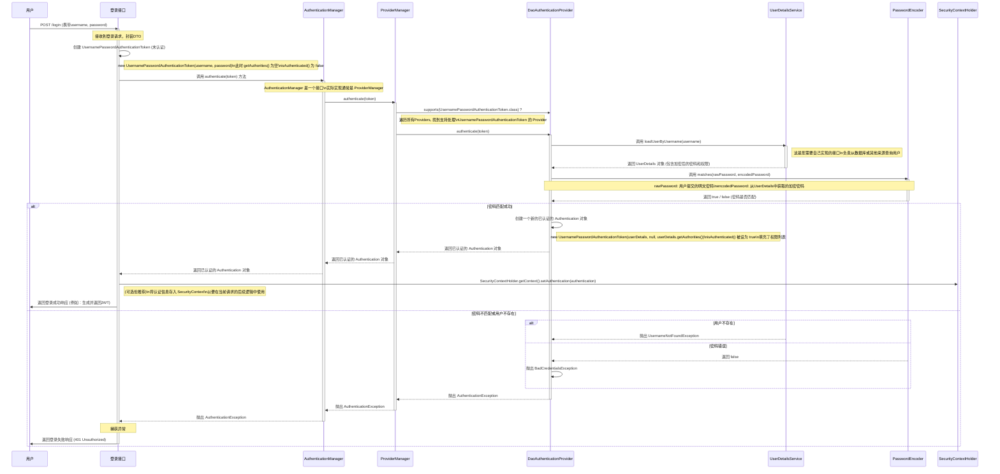
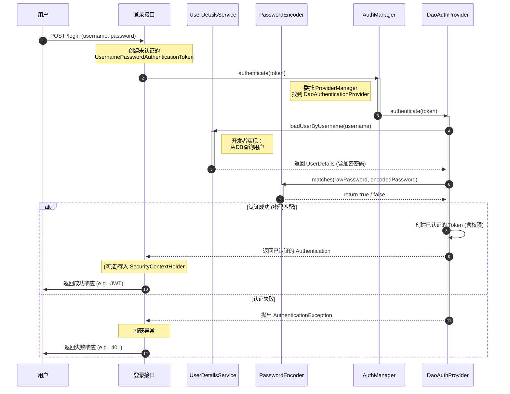

[toc]

## Spring Security 登录校验详解：流程、安全保障及与JWT的关系

Spring Security 是一个功能强大且高度可定制的身份验证和访问控制框架，在Java Web应用程序中保障安全性方面发挥着至关重要的作用。其核心是通过一系列过滤器链来处理HTTP请求，实现对用户登录、权限校验等功能。本文将详细介绍Spring Security实现登录校验的完整流程、保障用户名和密码安全的方式，以及它与JWT令牌过滤器的关系。

### Spring Security 登录校验的详细实现流程

Spring Security 的登录校验功能是基于其精心设计的过滤器链（Filter Chain）实现的。当用户提交登录请求时，该请求会经过一系列的过滤器，每个过滤器都承担着特定的职责。

**核心流程概述：**

1.  **用户发起登录请求**：用户在登录页面输入用户名和密码，点击登录按钮，向后端发起一个HTTP POST请求，通常是提交到一个特定的URL，例如 `/login`。

2.  **过滤器链介入**：Spring Security 的核心是一个名为 `FilterChainProxy` 的Servlet过滤器，它本身不执行任何安全逻辑，而是将请求代理给一个内部的过滤器链。 这个过滤器链包含了一系列有序的过滤器，用于处理不同的安全任务。

3.  **`UsernamePasswordAuthenticationFilter` 捕获请求**：在默认的表单登录配置中，`UsernamePasswordAuthenticationFilter` 会拦截指向特定URL（默认为`/login`）的POST请求。 它的主要职责是从HTTP请求中提取用户名和密码。

4.  **封装 `Authentication` 对象**：`UsernamePasswordAuthenticationFilter` 将获取到的用户名和密码封装成一个 `UsernamePasswordAuthenticationToken` 对象。 这个对象是一个 `Authentication` 接口的实现，它包含了用户的身份信息（principal，即用户名）和凭证信息（credentials，即密码），此时该对象的认证状态为“未认证”。

5.  **委托 `AuthenticationManager` 进行认证**：`UsernamePasswordAuthenticationFilter` 随即将这个 `UsernamePasswordAuthenticationToken` 对象传递给 `AuthenticationManager` 进行身份验证。 `AuthenticationManager` 是认证的核心接口，它通常有一个默认的实现 `ProviderManager`。

6.  **`ProviderManager` 和 `AuthenticationProvider`**：`ProviderManager` 会遍历其配置的所有 `AuthenticationProvider`，并选择一个支持处理 `UsernamePasswordAuthenticationToken` 的 `AuthenticationProvider` 进行认证。 对于基于数据库的用户名密码认证，通常使用的是 `DaoAuthenticationProvider`。

7.  **`UserDetailsService` 加载用户信息**：`DaoAuthenticationProvider` 会调用 `UserDetailsService` 的 `loadUserByUsername()` 方法。 开发者需要实现 `UserDetailsService` 接口，在该方法中根据用户名从数据库或其他数据源中查询用户信息，并返回一个 `UserDetails` 对象。`UserDetails` 对象包含了用户的正确密码、权限信息以及账户状态（是否锁定、是否过期等）。

8.  **密码比对**：`DaoAuthenticationProvider` 会使用配置的 `PasswordEncoder`（密码编码器）来比较用户提交的密码和从 `UserDetails` 中获取的加密密码是否匹配。

9.  **认证成功与失败处理**：
    *   **认证成功**：如果密码匹配，`DaoAuthenticationProvider` 会返回一个完全填充的、已认证的 `Authentication` 对象，其中包含了用户信息、权限等。 `UsernamePasswordAuthenticationFilter` 接收到这个已认证的 `Authentication` 对象后，会将其存入 `SecurityContextHolder` 中。`SecurityContextHolder` 默认使用 `ThreadLocal` 策略，确保在同一个线程的后续处理中都能获取到当前用户的认证信息。 之后，会调用 `AuthenticationSuccessHandler` 进行后续处理，例如重定向到成功页面或返回成功的JSON响应。
    *   **认证失败**：如果密码不匹配，或者 `UserDetailsService` 抛出异常（例如用户不存在），`AuthenticationManager` 会抛出一个 `AuthenticationException`。 `UsernamePasswordAuthenticationFilter` 会捕获这个异常，并调用 `AuthenticationFailureHandler` 进行处理，例如重定向到登录失败页面并提示错误信息。

10. **请求继续或重定向**：认证成功后，请求会继续沿着过滤器链向下传递，最终到达目标资源。如果配置了重定向，浏览器将被重定向到指定的页面。

### 保障用户名和密码安全的方式

Spring Security 提供了多种机制来确保用户登录时用户名和密码的安全：

*   **密码加密**：Spring Security 强烈建议不要以明文形式存储密码。 它提供了 `PasswordEncoder` 接口，用于对密码进行单向加密。 最常用且推荐的实现是 `BCryptPasswordEncoder`，它使用了Bcrypt强哈希算法，该算法会自动生成盐（salt）并将其与哈希后的密码存储在一起，有效防止彩虹表攻击。 在认证过程中，框架会使用相同的算法对用户输入的密码进行加密，然后与数据库中存储的加密密码进行比较。

*   **HTTPS/TLS 加密传输**：为了防止在数据传输过程中用户名和密码被窃听，必须在生产环境中使用HTTPS/TLS对通信进行加密。Spring Security 可以配置强制使用HTTPS，确保所有敏感信息在客户端和服务器之间安全传输。

*   **防止跨站请求伪造（CSRF）**：Spring Security 默认启用CSRF保护。 它会为每个用户会话生成一个唯一的CSRF令牌，并要求所有修改状态的请求（如POST、PUT、DELETE）都必须携带这个令牌。这可以有效防止攻击者诱导用户在不知情的情况下执行恶意操作。

*   **防止会话固定攻击**：在用户成功登录后，Spring Security 会创建一个新的会话或更改现有会话的ID，这有助于防止会话固定攻击。

*   **安全的HTTP头部**：Spring Security 可以配置添加一系列安全的HTTP响应头，例如 `Content-Security-Policy`、`X-Frame-Options` 和 `X-XSS-Protection`，以增强对点击劫持、跨站脚本等攻击的防御能力。

### 与JWT令牌过滤器的关系及会话跟踪

在现代前后端分离的应用架构中，基于Session的传统认证方式不再适用。取而代之的是使用JSON Web Token (JWT) 进行无状态认证。

**Spring Security 与 JWT 令牌过滤器的关系：**

Spring Security 本身不直接提供JWT的实现，但它提供了灵活的扩展机制，允许我们轻松集成JWT。 这种集成通常通过自定义一个过滤器来实现，这个过滤器我们称之为JWT令牌过滤器（例如 `JwtAuthenticationFilter`）。

其关系和流程如下：

1.  **登录并生成JWT**：用户的登录流程与之前描述的基本一致。当认证成功后，`AuthenticationSuccessHandler` 不再是重定向，而是生成一个JWT。这个JWT包含了用户的身份信息（如用户ID、用户名）、权限信息以及过期时间等，并使用密钥进行签名。然后将这个JWT返回给客户端。

2.  **客户端存储JWT**：客户端（通常是浏览器）在接收到JWT后，会将其存储起来，例如存储在 `localStorage` 或 `sessionStorage` 中。

3.  **后续请求携带JWT**：在后续的每次请求中，客户端都需要在请求头（通常是 `Authorization` 头部，并使用 `Bearer ` 前缀）中携带这个JWT。

4.  **自定义JWT过滤器进行校验**：我们自定义的JWT过滤器（例如 `JwtAuthenticationFilter`）会被添加到Spring Security的过滤器链中，通常放在 `UsernamePasswordAuthenticationFilter` 之前。 这个过滤器的职责是：
    *   从请求头中解析出JWT。
    *   验证JWT的签名是否有效，以及是否过期。
    *   如果验证通过，从JWT中解析出用户信息和权限，并构建一个已认证的 `Authentication` 对象。
    *   将这个 `Authentication` 对象设置到 `SecurityContextHolder` 中，以便后续的授权检查能够获取到当前用户信息。
    *   然后调用 `chain.doFilter(request, response)`，将请求放行到下一个过滤器。

**JWT令牌技术与访问拦截规则的独立性：**

**是的，用于会话跟踪的JWT令牌技术和Spring Security的访问拦截规则（授权）是相对独立的，但又协同工作。**

*   **独立性**：
    *   **JWT负责认证和信息传递**：JWT的核心作用是生成一个包含用户信息的令牌，并在后续请求中验证该令牌的有效性，从而确认用户的身份。它是一种无状态的认证机制。
    *   **Spring Security负责授权**：Spring Security的访问拦截规则（通过 `http.authorizeRequests()` 或注解如 `@PreAuthorize` 配置）负责判断已认证的用户是否有权限访问特定的URL或执行某个方法。 它的决策依据是 `SecurityContextHolder` 中存储的 `Authentication` 对象里的权限信息。

*   **协同工作**：
    *   JWT过滤器是连接两者的桥梁。它通过解析JWT来重建用户的认证信息（`Authentication` 对象）并放入 `SecurityContextHolder`。
    *   一旦 `SecurityContextHolder` 中有了已认证的 `Authentication` 对象，Spring Security的授权机制就可以像处理传统Session认证一样，根据用户的角色和权限来决定是否允许访问受保护的资源。

总结来说，JWT令牌过滤器扩展了Spring Security的认证能力，使其能够处理无状态的API请求。而Spring Security强大的授权功能则依然可以无缝地与JWT认证后的用户信息协同工作，实现对资源的精细化访问控制。这种解耦的设计使得Spring Security能够灵活适应不同的认证场景，无论是传统的基于Session的应用，还是现代的无状态微服务架构。

[![](https://mermaid.ink/img/pako:eNqtWG1PGkkc_yqTTZpAQqkUUbsvernWXi6X67VJbS658GbDTnFzsOsti31KE7DFohWkV6Ta2lpb9bg2it61ilD1y-wMy6v7CjfDLLDsLp625wsj85__0-_3fxi8z0UUEXI8l4C_JaEcgaOSEFWFeFgG5GdCUDUpIk0IsgZuJqAKhARoFMs4u-eU_6hEJfmyImuqEouZV5fq6GAB59fR_DunwrdJbfyqIAtRdpl-hDKRCpqkyKbAqXVdVSYlEaoWTduRU2dUUKj19j2qYx51HbaF7omPQk2QYokbUJ2UIpAacJ66xCokErcVVbwiU5BZrL1HTp0bMJJUJe0uRRLe0b5XYq1r7OKZMyDgNxnA8wW9tsYg1o9WcbrC7tDAzl68aKODB9ev3RgD52L0GHhwoYaqG0lyVRbi0EciYGF5mQ0hokmTggbtpLbj-EkhMmWSpORwQ9jGxV2U3WaRGZU9vDP1z-c5tJ023mVGx65ZcjnvB3q1jmbLaP6p8WnP2FozKmkmtdl1SwhlX6J6rZUvTaKNbC-tY8qvkOa7_J5Z91oSUKXouAaUW84kZHj7JHY9LgACvLmGn--CKNSohkK4lGDC4yWZ1hp_1sJhWUpYTEGRicAtIZaAbWyc2VuahQfG9kNSA0CwmPFoNCDivbSP_16wsWhRdjLYY9m1CQFerOjVlF59b7ZyWEZbr5tLGfK7kd9upl6gapXccTZih-mg39G46I8inlls1JdQIdtMTTVePALHdaQlTAKHzRjvhoUNhD7B2Y6Jbdu04EEiOTGhqFrCc4KS8EdiROgF37jVmSPqZjqH8tN4JoWXZ9rChA_gmUPSQLhYwXNptPaoUZgmkJ-kzimIvbCdIL3_hs6mYuF10N9_kgL8poqOHrK-w5_SjfITpmczR2JyDtNOkccUQaTiS3fbAHS6zh5mv5HcS4Krr6MlUr94qtxcThkbaePxe7S3w6qbQNqpeuPjivHxnV7P44VtnNtCtWc4W0KZXb1ewq_Wca2AV9aNylvrhnR6O-vGgXFURC9fW28DVNk3dlaBB81lUOEDmn2DKtOokCfxkD8ab9Lo9zn86mFzqWDCIMJjgegHvW0hdXCPC1pknAwuVbjdvuIDsHVJvN5nW7gut-6ksTn3OVxbfPG9W46QsJjHpccsdUKFLRIeEFYsaevVTSO_h-ZLFC4GHdNkTdHr-DhGNDUJwTk2nQkXLSOkVFBhA83tNzM5J_gOEEyQYhowiWsp4mwBza4wmdlMIT8wm8Umc7LmCJctQ3NKl2jVor2_mDXnZDVrq-ugt0Mcxk-zDk0CfEBOxmI-YDny21ei13UZGm8_GFuHdCVS7OmuWf2AMhm9Ns3KHWWfG6vl_uC4bQdG5mkQIXRYOHUMwPY1-3h1bOqvdOz6tLWvQ7fH0dc6dnkyuD9MXN-rvPszllaAeeDx-hOsHLoheYSej95-9elI1oPmK83UjH4wjfNlI1fwArQ9zRJnL2O0uYgy6_agSG3p9XX98Agtl9HBMzSTY69V2jxk0NY3m6m6cfiUzBL94IiMo-OBoA3Sxt384tNqY_Qsh2pF4NEPn6AN8hJ-0SiuUMn-Lrv7w89j3n4s9Hl-QzqM2DDRq7n2PCmxiUlPSLrL5R6jQ-3ZgtZ2jI_rXRmdS30VT7HB8OxL9Lj7GieMfackZfHKnQicoGx2jVqibxaXjEql198phrP5ZrZqn2BUmpFeEsTLKhRpvREzbnHK4ummjGm4t6hdDP8fg-ULfH3xLPkCX33Gx3HfG3MLdGN_niLfJU7XZqyi2202OBAAN2WB7Zl7UPS6xudorA7hnI-LqpLI8XT7-Lg4VOMC_cjdp5fCHMEgDsMcT_4U4S0hGdPCXFh-QNTI1_dfFCXe1lSVZHSc41s16uOSEyLxa_5zpXOqEpdQvUwaReP40OD5lhGOv8_d4fizgUDIPzIyMBQKDAyHgsGRISK-S8-D_guhocHgcGjkwsBIcCQUeODj7rU8n_dfGA4MDg6EQsEhojc0MPzgX12Pccs?type=png)](https://mermaid-live.nodejs.cn/edit#pako:eNqtWG1PGkkc_yqTTZpAQqkUUbsvernWXi6X67VJbS658GbDTnFzsOsti31KE7DFohWkV6Ta2lpb9bg2it61ilD1y-wMy6v7CjfDLLDsLp625wsj85__0-_3fxi8z0UUEXI8l4C_JaEcgaOSEFWFeFgG5GdCUDUpIk0IsgZuJqAKhARoFMs4u-eU_6hEJfmyImuqEouZV5fq6GAB59fR_DunwrdJbfyqIAtRdpl-hDKRCpqkyKbAqXVdVSYlEaoWTduRU2dUUKj19j2qYx51HbaF7omPQk2QYokbUJ2UIpAacJ66xCokErcVVbwiU5BZrL1HTp0bMJJUJe0uRRLe0b5XYq1r7OKZMyDgNxnA8wW9tsYg1o9WcbrC7tDAzl68aKODB9ev3RgD52L0GHhwoYaqG0lyVRbi0EciYGF5mQ0hokmTggbtpLbj-EkhMmWSpORwQ9jGxV2U3WaRGZU9vDP1z-c5tJ023mVGx65ZcjnvB3q1jmbLaP6p8WnP2FozKmkmtdl1SwhlX6J6rZUvTaKNbC-tY8qvkOa7_J5Z91oSUKXouAaUW84kZHj7JHY9LgACvLmGn--CKNSohkK4lGDC4yWZ1hp_1sJhWUpYTEGRicAtIZaAbWyc2VuahQfG9kNSA0CwmPFoNCDivbSP_16wsWhRdjLYY9m1CQFerOjVlF59b7ZyWEZbr5tLGfK7kd9upl6gapXccTZih-mg39G46I8inlls1JdQIdtMTTVePALHdaQlTAKHzRjvhoUNhD7B2Y6Jbdu04EEiOTGhqFrCc4KS8EdiROgF37jVmSPqZjqH8tN4JoWXZ9rChA_gmUPSQLhYwXNptPaoUZgmkJ-kzimIvbCdIL3_hs6mYuF10N9_kgL8poqOHrK-w5_SjfITpmczR2JyDtNOkccUQaTiS3fbAHS6zh5mv5HcS4Krr6MlUr94qtxcThkbaePxe7S3w6qbQNqpeuPjivHxnV7P44VtnNtCtWc4W0KZXb1ewq_Wca2AV9aNylvrhnR6O-vGgXFURC9fW28DVNk3dlaBB81lUOEDmn2DKtOokCfxkD8ab9Lo9zn86mFzqWDCIMJjgegHvW0hdXCPC1pknAwuVbjdvuIDsHVJvN5nW7gut-6ksTn3OVxbfPG9W46QsJjHpccsdUKFLRIeEFYsaevVTSO_h-ZLFC4GHdNkTdHr-DhGNDUJwTk2nQkXLSOkVFBhA83tNzM5J_gOEEyQYhowiWsp4mwBza4wmdlMIT8wm8Umc7LmCJctQ3NKl2jVor2_mDXnZDVrq-ugt0Mcxk-zDk0CfEBOxmI-YDny21ei13UZGm8_GFuHdCVS7OmuWf2AMhm9Ns3KHWWfG6vl_uC4bQdG5mkQIXRYOHUMwPY1-3h1bOqvdOz6tLWvQ7fH0dc6dnkyuD9MXN-rvPszllaAeeDx-hOsHLoheYSej95-9elI1oPmK83UjH4wjfNlI1fwArQ9zRJnL2O0uYgy6_agSG3p9XX98Agtl9HBMzSTY69V2jxk0NY3m6m6cfiUzBL94IiMo-OBoA3Sxt384tNqY_Qsh2pF4NEPn6AN8hJ-0SiuUMn-Lrv7w89j3n4s9Hl-QzqM2DDRq7n2PCmxiUlPSLrL5R6jQ-3ZgtZ2jI_rXRmdS30VT7HB8OxL9Lj7GieMfackZfHKnQicoGx2jVqibxaXjEql198phrP5ZrZqn2BUmpFeEsTLKhRpvREzbnHK4ummjGm4t6hdDP8fg-ULfH3xLPkCX33Gx3HfG3MLdGN_niLfJU7XZqyi2202OBAAN2WB7Zl7UPS6xudorA7hnI-LqpLI8XT7-Lg4VOMC_cjdp5fCHMEgDsMcT_4U4S0hGdPCXFh-QNTI1_dfFCXe1lSVZHSc41s16uOSEyLxa_5zpXOqEpdQvUwaReP40OD5lhGOv8_d4fizgUDIPzIyMBQKDAyHgsGRISK-S8-D_guhocHgcGjkwsBIcCQUeODj7rU8n_dfGA4MDg6EQsEhojc0MPzgX12Pccs)

