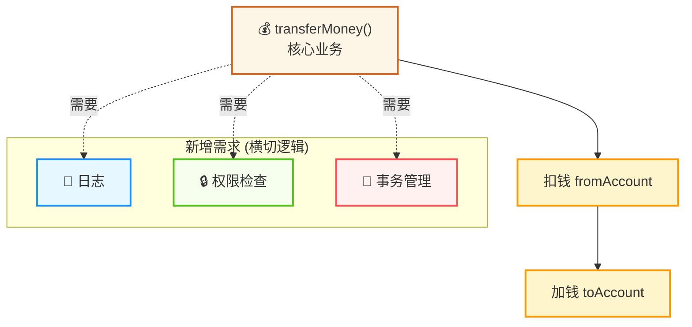
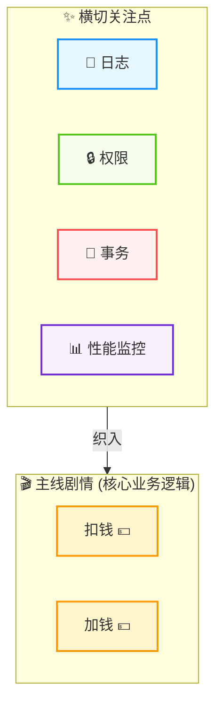
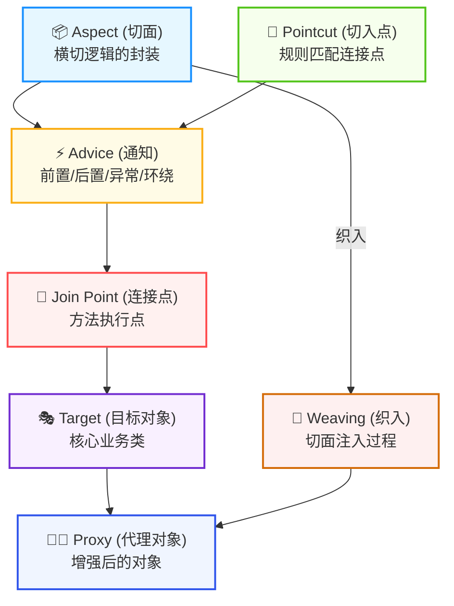
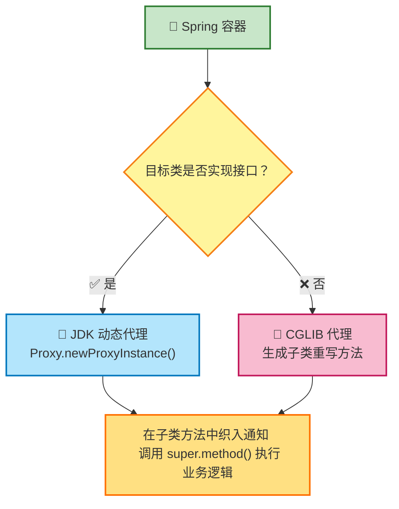
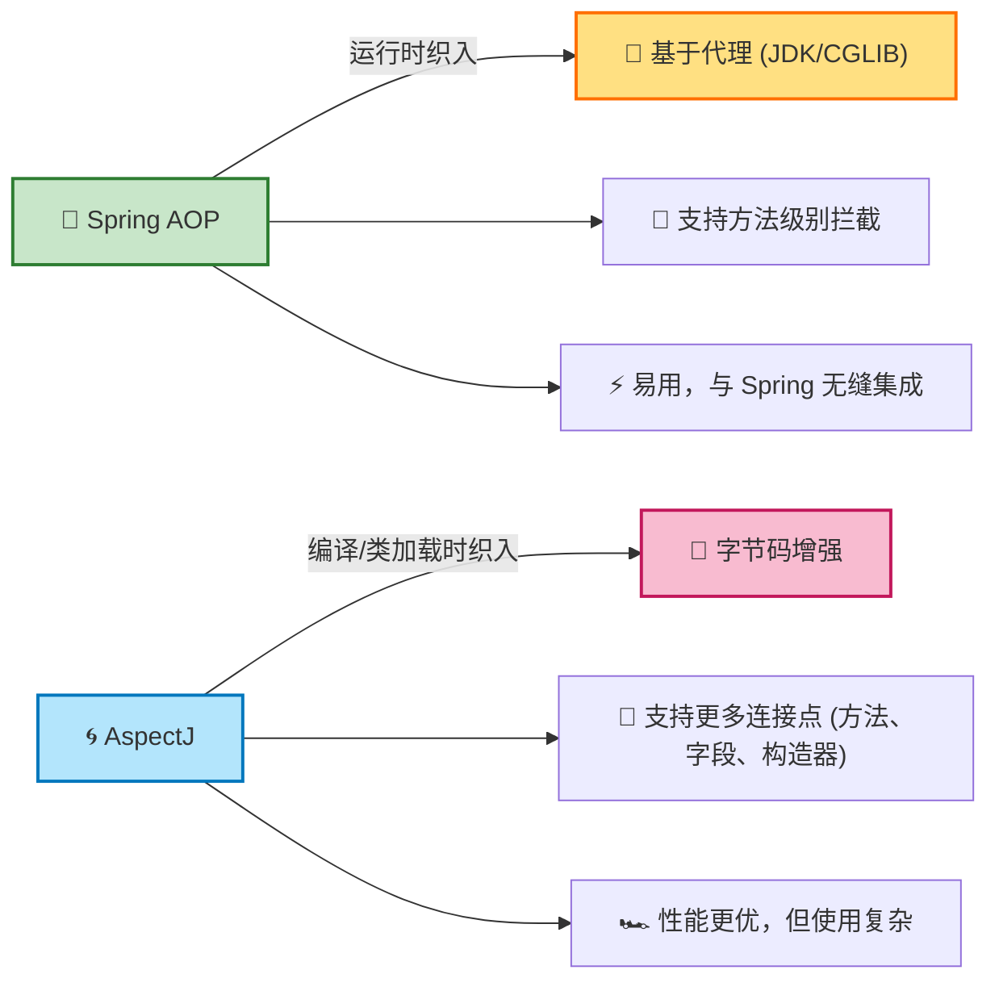

[toc]

---

### **引言：为什么需要 AOP？—— 从一个“混乱”的业务方法谈起**



想象一下，你正在编写一个核心的银行业务方法：`transferMoney()`（转账）。它的核心职责非常清晰：

1.  从账户 A 扣钱。
2.  给账户 B 加钱。

```java
public class AccountServiceImpl implements AccountService {
    public void transferMoney(String fromAccount, String toAccount, double amount) {
        // 核心业务逻辑
        accountDao.withdraw(fromAccount, amount);
        accountDao.deposit(toAccount, amount);
    }
}
```

这个实现看起来很完美。但很快，新的需求来了：
*   **需求 1：** 在转账前后需要记录详细的日志。
*   **需求 2：** 整个转账操作必须在一个数据库事务中完成，要么都成功，要么都失败。
*   **需求 3：** 在执行转账前，需要检查当前操作员是否有权限。

于是，你的代码变成了这样：

```java
public class AccountServiceImpl implements AccountService {
    public void transferMoney(String fromAccount, String toAccount, double amount) {
        // --- 非核心业务：日志 ---
        System.out.println("[Log] Starting transfer...");
        
        // --- 非核心业务：权限检查 ---
        SecurityUtil.checkPermission();
        
        // --- 非核心业务：事务管理 ---
        TransactionManager.beginTransaction();
        
        try {
            // === 核心业务逻辑 ===
            accountDao.withdraw(fromAccount, amount);
            // 模拟一个异常
            if (true) { throw new RuntimeException("数据库连接中断！"); }
            accountDao.deposit(toAccount, amount);
            // === 核心业务逻辑结束 ===
            
            // --- 非核心业务：事务管理 ---
            TransactionManager.commit();
            // --- 非核心业务：日志 ---
            System.out.println("[Log] Transfer successful.");
        } catch (Exception e) {
            // --- 非核心业务：事务管理 ---
            TransactionManager.rollback();
            // --- 非核心业务：日志 ---
            System.out.println("[Log] Transfer failed. Reason: " + e.getMessage());
            throw e; // 抛出异常
        }
    }
}
```

**问题出现了：**

1.  **代码混乱（Code Tangling）**: 核心的业务逻辑（扣钱、加钱）被大量的非核心但必要的逻辑（日志、事务、安全）所包围。方法变得臃肿、难以阅读和维护。
2.  **代码分散（Code Scattering）**: 想象一下，你还有 `createAccount()`, `closeAccount()` 等几十个方法，它们每一个都需要几乎完全相同的日志、事务和安全代码。这些重复的代码散落在系统的各个角落，一旦需要修改（比如更换日志框架），就成了一场噩梦。

**AOP（Aspect-Oriented Programming，面向切面编程）正是为了解决这个问题而诞生的。**

---

### **第一部分：AOP 思想的本质 —— 关注点的分离**



AOP 的核心思想是 **关注点的分离 (Separation of Concerns, SoC)**。它提出，像日志、事务、安全、缓存、性能监控这些功能，它们虽然是系统必需的，但并不属于任何一个核心业务模块。它们横跨于多个业务模块之上，像一张网一样“切入”到系统的各个层面。因此，这些功能被称为 **横切关注点 (Cross-Cutting Concerns)**。

AOP 的目标就是将这些 **横切关注点** 从 **核心业务逻辑** 中剥离出来，使它们成为独立的、可重用的模块。这样，我们的业务代码就可以回归纯粹，而横切功能则由 AOP 框架在需要的时候动态地“织入”到业务代码中。

**一个绝佳的比喻：**
*   **核心业务逻辑** 就像电影中的 **主线剧情**。
*   **横切关注点** 就像电影的 **特效、配乐和灯光**。
*   **AOP** 就像 **电影导演和后期制作团队**。

导演不会让演员在表演主线剧情时，自己去操心“这里需要一个爆炸特效”、“那里需要一段悲伤的背景音乐”。演员只需专注于表演。后期团队会在电影拍完后，根据导演的指示（“在第 5 分 32 秒，主角跳崖时，加入慢动作和激昂的音乐”），将这些非剧情元素精准地“织入”到电影中。

---

### **第二部分：AOP 的核心术语 —— 掌握 AOP 的“行话”**

要理解 AOP，必须先掌握它的一套专业术语。




1.  **Aspect (切面)**
    *   **定义**: 对横切关注点（如日志、事务）的模块化封装。一个切面可以包含多个通知。
    *   **比喻**: 整个“后期制作团队”，比如“特效团队”或“配乐团队”。在代码中，通常是一个带有 `@Aspect` 注解的类。

2.  **Join Point (连接点)**
    *   **定义**: 程序执行过程中的一个 **明确的点**，可以被 AOP 框架 **拦截**。在 Spring AOP 中，连接点 **总是方法的执行**。
    *   **比喻**: 电影剧本中 **每一个可以被打断的时刻**，比如“演员说的每一句台词”、“演员做的每一个动作”。理论上，连接点可以有很多，如方法调用、字段访问、异常抛出等。

    在 Spring 中用 Join Point 抽象了连接点，用它可以获得目标方法执行时的相关信息，如目标类名、方法名、方法参数等。
    
    
    
3.  **Pointcut (切点)**
    *   **定义**: 一个 **查询表达式**，用于匹配一个或多个连接点。它定义了切面将在 **何处** 应用。
    *   **比喻**: 导演给后期团队的 **具体指令**：“在所有主角打斗的场景中（这就是一个查询条件）”。切点决定了 Advice 将会织入到哪些 Join Point。

    **切入点表达式-executon**
    
    -   execution 主要根据方法的返回值、包名、类名、方法名、方法参数等信息来匹配，语法为：
    
    `execution(访问修饰符? 返回值 包名.类名.?方法名(方法参数) throws 异常?)`
    
    -   ?表示参数可选，可以省略
        1.  访问修饰符：可省略，比如 public、protected
        2.  包名.类名：可省略
        3.  throws 异常：可省略（注意是方法上声明抛出的异常，不是实际抛出的异常）
    
4.  **Advice (通知 / 增强)**
    
    *   **定义**: 在切点所匹配的连接点上 **执行的具体操作**。这是切面的实际工作内容。
    *   **比喻**: 后期团队要做的 **具体工作**，比如“添加爆炸特效”或“播放悲伤音乐”。
    *   **五种类型**:
        *   **前置通知 (Before Advice)**: 在目标方法执行 **之前** 运行。(`@Before`)
        *   **后置通知 (After Advice)**: 在目标方法执行 **之后** 运行，无论方法是正常返回还是抛出异常都会执行。(`@After`)
        *   **返回通知 (After Returning Advice)**: 仅在目标方法 **成功执行并返回** 后运行。可以访问到方法的返回值。(`@AfterReturning`)
        *   **异常通知 (After Throwing Advice)**: 仅在目标方法 **抛出异常** 后运行。可以访问到抛出的异常。(`@AfterThrowing`)
        *   **环绕通知 (Around Advice)**: **最强大** 的通知类型。它可以完全控制目标方法的执行，就像一个“全权代理”。你可以在方法执行前后添加自定义逻辑，甚至可以决定是否执行目标方法、修改返回值或抛出异常。(`@Around`)，原始方法如果执行时有异常，环绕通知中的后置代码不会在执行了
    
    ```java
    @Slf4j
    @Component
    @Aspect
    public class MyAspect1 {
        //前置通知
        @Before("execution(* com.itheima.service.*.*(..))")
        public void before(JoinPoint joinPoint){
            log.info("before ...");
    
        }
    
        //环绕通知
        @Around("execution(* com.itheima.service.*.*(..))")
        public Object around(ProceedingJoinPoint proceedingJoinPoint) throws Throwable {
            log.info("around before ...");
    
            //调用目标对象的原始方法执行
            Object result = proceedingJoinPoint.proceed();
            
            //原始方法如果执行时有异常，环绕通知中的后置代码不会在执行了
            
            log.info("around after ...");
            return result;
        }
    
        //后置通知，在目标方法执行之后运行（无论目标方法正常执行还是出现异常都会运行）
        @After("execution(* com.itheima.service.*.*(..))")
        public void after(JoinPoint joinPoint){
            log.info("after ...");
        }
    
        //返回后通知（程序在正常执行的情况下，会执行的后置通知）
        @AfterReturning("execution(* com.itheima.service.*.*(..))")
        public void afterReturning(JoinPoint joinPoint){
            log.info("afterReturning ...");
        }
    
        //异常通知（程序在出现异常的情况下，执行的后置通知）
        @AfterThrowing("execution(* com.itheima.service.*.*(..))")
        public void afterThrowing(JoinPoint joinPoint){
            log.info("afterThrowing ...");
        }
    }
    
    
    ```
    
    #### **通知顺序**
    
    -   当有多个切面的切入点都匹配到了目标方法，目标方法运行时，多个通知方法都会被执行。
    -   执行顺序如下：
        -   不同切面类中，默认 **按照切面类的类名字母排序**：
            -   目标方法前的通知方法（前置通知）：字母排名靠前的先执行；
            -   目标方法后的通知方法（后置通知）：字母排名靠后的先执行。
        -   可以用@Order(数字)加在切面类上来控制顺序（优先级更高）
            -   目标方法前的通知方法（前置通知）：数字小的先执行；
            -   目标方法后的通知方法（后置通知）：数字大的先执行。


#### **切入点表达式-execution**

```java
@Before("execution(public void com.itheima.service.impl.DeptServiceImpl.delete(java.lang.Integer))")
public void before(JoinPoint joinPoint){
```

- execution 主要根据方法的返回值、包名、类名、方法名、方法参数等信息来匹配，语法为：

`execution(访问修饰符? 返回值 包名.类名.?方法名(方法参数) throws 异常?)`

- 其中带 ? 的表示可以省略的部分
  1. 访问修饰符：可省略（比如：public、protected）
  2. 包名.类名：可省略（但不建议省略）
  3. throws 异常：可省略（注意是方法上声明抛出的异常，不是实际抛出的异常）

- 可以使用通配符描述切入点
  1. `*`：单个独立的任意符号，可以通配 **任意返回值、包名、类名、方法名、任意类型的一个参数**，也可以通配包、类、方法名的 **一部分**

  ```java
  execution(* com.*.service.*.update*(*))
  ```

  2. `..`：多个连续的任意符号，可以通配任意层级的 **包**，或任意类型、任意个数的 **参数**

  ```java
  execution(* com.itheima.DeptService.*(..))
  ```

​	基于注解实现切入点

#### @annotation

已经学习了 execution 切入点表达式的语法。那么如果我们要匹配多个无规则的方法，比如：list()和 delete()这两个方法。这个时候我们基于 execution 这种切入点表达式来描述就不是很方便了。而在之前我们是将两个切入点表达式组合在了一起完成的需求，这个是比较繁琐的。

我们可以借助于另一种切入点表达式 `@annotation` 来描述这一类的切入点，从而来简化切入点表达式的书写。

实现步骤：

1.  编写自定义注解
2.  在业务类要做为连接点的方法上添加自定义注解

**自定义注解**：`LogOperation`

```Java
@Target(ElementType.METHOD)
@Retention(RetentionPolicy.RUNTIME)
public @interface LogOperation{
}
```

**业务类**：`DeptServiceImpl`

```Java
@Slf4j
@Service
public class DeptServiceImpl implements DeptService {
    @Autowired
    private DeptMapper deptMapper;

    @Override
    @LogOperation //自定义注解（表示：当前方法属于目标方法）
    public List<Dept> list() {
        List<Dept> deptList = deptMapper.list();
        //模拟异常
        //int num = 10/0;
        return deptList;
    }

    @Override
    @LogOperation //自定义注解（表示：当前方法属于目标方法）
    public void delete(Integer id) {
        //1. 删除部门
        deptMapper.delete(id);
    }


    @Override
    public void save(Dept dept) {
        dept.setCreateTime(LocalDateTime.now());
        dept.setUpdateTime(LocalDateTime.now());
        deptMapper.save(dept);
    }

    @Override
    public Dept getById(Integer id) {
        return deptMapper.getById(id);
    }

    @Override
    public void update(Dept dept) {
        dept.setUpdateTime(LocalDateTime.now());
        deptMapper.update(dept);
    }
}
```

**切面类**

```Java
@Slf4j
@Component
@Aspect
public class MyAspect6 {
    //针对list方法、delete方法进行前置通知和后置通知

    //前置通知
    @Before("@annotation(com.itheima.anno.LogOperation)")
    public void before(){
        log.info("MyAspect6 -> before ...");
    }
    
    //后置通知
    @After("@annotation(com.itheima.anno.LogOperation)")
    public void after(){
        log.info("MyAspect6 -> after ...");
    }
}
```

1.  **Target Object (目标对象)**

    *   **定义**: 被一个或多个切面所通知的原始对象。也就是包含我们核心业务逻辑的那个类的实例。
    *   **比喻**: 电影中专注于表演的“演员本人”。
2.  **Proxy (代理)**

    *   **定义**: AOP 框架创建的对象，它包装了目标对象，并将切面的逻辑织入其中。客户端代码实际上与之交互的是这个代理对象，而不是目标对象本身。
    *   **比喻**: 演员的“特技替身”。这个替身不仅会完成演员的核心动作，还会在动作前后完成导演要求的额外任务（比如检查安全绳、摆好爆炸姿势）。
3.  **Weaving (织入)**
    *   **定义**: 将切面应用到目标对象上，从而创建出代理对象的 **过程**。
    *   **织入时机**:
        *   **编译时织入 (Compile-time weaving)**: 需要特殊的编译器（如 AspectJ 的 `ajc`），在编译时就将切面代码直接编译进目标类的 `.class` 文件中。性能最高。
        *   **类加载时织入 (Load-time weaving)**: 在 JVM 加载类时，通过特殊的类加载器动态地修改类的字节码。
        *   **运行时织入 (Runtime weaving)**: 在程序运行时，为目标对象动态地创建一个代理对象。**Spring AOP 采用的就是这种方式**。性能相对前两者略低，但最灵活，无需特殊编译器或类加载器。

---

### **第三部分：Spring AOP 的实现原理 —— 动态代理的魔力**



Spring AOP 的核心是 **基于代理模式** 和 **运行时织入**。当 Spring 容器为一个 Bean 创建实例时，如果发现有切面需要应用到这个 Bean 上，Spring 不会返回原始的 Bean 实例，而是返回一个代理对象。

这个代理对象是如何创建的呢？Spring AOP 会根据目标对象的情况，自动选择两种动态代理技术：

#### 1. JDK 动态代理 (JDK Dynamic Proxy)

*   **使用条件**: 目标对象 **必须实现** 至少一个接口。
*   **工作原理**:
    1.  Spring AOP 使用 JDK 内置的 `java.lang.reflect.Proxy` 类，在运行时动态地创建一个新的类。
    2.  这个新类会实现目标对象所实现的所有接口。
    3.  在这个新类的方法实现中，Spring AOP 嵌入了调用各种通知（Advice）的逻辑。
    4.  当客户端通过接口调用代理对象的方法时，实际上是进入了这个动态生成的代理类的方法。这个方法会先执行切面逻辑（如 `@Before` 通知），然后通过 **反射** 调用原始目标对象的对应方法，最后再执行后续的切面逻辑（如 `@After` 通知）。
*   **优点**: JDK 原生支持，无需额外依赖。
*   **缺点**: 只能代理接口，如果一个类没有实现任何接口，JDK 动态代理就无能为力。

#### 2. CGLIB 代理 (Code Generation Library)

*   **使用条件**: 目标对象 **没有实现** 任何接口。
*   **工作原理**:
    1.  CGLIB 是一个第三方代码生成库。Spring AOP 使用它在运行时动态地为目标对象创建一个 **子类**。
    2.  这个子类会 **重写** 目标对象中所有非 `final` 的方法。
    3.  在重写的子类方法中，嵌入了调用切面通知的逻辑，然后通过调用 `super.method()` 来执行原始父类（也就是目标对象）的方法。
*   **优点**: 即使没有接口也能代理，适用范围更广。
*   **缺点**:
    *   它无法代理被 `final` 修饰的类（因为无法继承）和被 `final` 修饰的方法（因为无法重写）。
    *   因为是生成子类，所以在创建代理对象时，性能上比 JDK 动态代理略慢一些。

**总结**: Spring Boot 2.x 以后，默认优先使用 CGLIB，无论目标类是否实现接口，这简化了配置。但其底层原理依然是这两种技术的结合。

---

### **第四部分：Spring AOP 的实际应用（附代码示例）**

让我们用 Spring AOP 来重构最开始的转账案例。

**1. 添加 AOP 依赖**
在 `pom.xml` 中确保有 `spring-boot-starter-aop`。

**2. 定义一个日志切面**
```java
@Aspect // 声明这是一个切面
@Component // 把它交给 Spring 容器管理
public class LoggingAspect {

    /**
     * 定义一个切点，匹配 com.example.service 包下所有类的所有方法
     */
    @Pointcut("execution(* com.example.service..*.*(..))")
    public void serviceLayerPointcut() {}

    @Before("serviceLayerPointcut()")
    public void logBefore(JoinPoint joinPoint) {
        // joinPoint 包含了目标方法的信息
        String methodName = joinPoint.getSignature().getName();
        Object[] args = joinPoint.getArgs();
        System.out.println("[Log] Method " + methodName + " is about to execute with arguments: " + Arrays.toString(args));
    }

    @AfterReturning(pointcut = "serviceLayerPointcut()", returning = "result")
    public void logAfterReturning(JoinPoint joinPoint, Object result) {
        String methodName = joinPoint.getSignature().getName();
        System.out.println("[Log] Method " + methodName + " executed successfully with result: " + result);
    }

    @AfterThrowing(pointcut = "serviceLayerPointcut()", throwing = "exception")
    public void logAfterThrowing(JoinPoint joinPoint, Throwable exception) {
        String methodName = joinPoint.getSignature().getName();
        System.out.println("[Log] Method " + methodName + " threw an exception: " + exception.getMessage());
    }
    
    // 环绕通知示例
    @Around("serviceLayerPointcut()")
    public Object logAround(ProceedingJoinPoint proceedingJoinPoint) throws Throwable {
        String methodName = proceedingJoinPoint.getSignature().getName();
        long startTime = System.currentTimeMillis();
        
        System.out.println("[Around Log] Entering method: " + methodName);
        
        // 调用目标方法
        Object result = proceedingJoinPoint.proceed();
        
        long endTime = System.currentTimeMillis();
        System.out.println("[Around Log] Exiting method: " + methodName + ". Execution time: " + (endTime - startTime) + "ms");
        
        return result;
    }
}
```

**3. 业务代码回归纯粹**
现在，我们的 `AccountServiceImpl` 只需要关注核心业务。Spring 的 `@Transactional` 注解本身就是通过 AOP 实现的。

```java
@Service
public class AccountServiceImpl implements AccountService {

    @Transactional // 通过 AOP 实现事务管理
    public void transferMoney(String fromAccount, String toAccount, double amount) {
        // 只有纯粹的核心业务逻辑
        accountDao.withdraw(fromAccount, amount);
        accountDao.deposit(toAccount, amount);
    }
}
```

当你调用 `transferMoney` 方法时，Spring 会返回一个代理对象。调用代理对象的方法时，日志切面和事务切面的逻辑会自动被织入，而业务代码本身干净清爽。

---

### **第五部分：Spring AOP 的优缺点与注意事项**

**优点:**
1.  **高度解耦**: 将横切关注点与业务逻辑分离，降低了模块间的耦合度。
2.  **代码复用**: 可以将通用的功能（如日志）封装在切面中，在多个地方复用。
3.  **可维护性增强**: 业务逻辑更纯粹，代码更易于理解和维护。
4.  **无侵入性**: 无需修改现有业务代码，即可为其添加新功能。

**缺点与注意事项:**
1.  **性能开销**: 因为是基于运行时代理，每次方法调用都会有额外的代理和反射开销。虽然现代 JVM 优化得很好，但在极高性能要求的场景下仍需考虑。
2.  **调试困难**: 调用栈会变得更深，因为包含了代理类的调用，给调试带来了一定的复杂性。
3.  **“自调用失效”问题 (Self-Invocation Failure)**: 这是 Spring AOP 最常见的一个“坑”。**在一个对象内部，一个普通方法调用另一个被 AOP 增强的方法，AOP 不会生效！**
    *   **原因**: `this.anotherMethod()` 这种调用是直接通过目标对象的引用进行的，它 **绕过** 了 Spring 创建的代理对象。AOP 的所有魔法都在代理对象上，绕过了代理，自然就失效了。
    *   **解决方案**:
        *   将自调用方法拆分到另一个 Bean 中，通过注入的 Bean 来调用。
        *   通过 `AopContext.currentProxy()` 获取当前代理对象，再用代理对象来调用方法。

---

### **第六部分：Spring AOP vs. AspectJ —— 务实派与学院派**




| 特性         | Spring AOP                                 | AspectJ                                           |
| :----------- | :----------------------------------------- | :------------------------------------------------ |
| **本质**     | 纯 Java 实现的 AOP 框架                    | AOP 思想的完整实现，一个 Java 语言的扩展          |
| **织入方式** | **运行时织入** (基于代理)                  | **编译时、编译后、类加载时织入** (字节码增强)     |
| **性能**     | 略低 (有代理开销)                          | 更高 (代码在编译期已织入)                         |
| **功能**     | **只支持方法执行连接点**                   | **支持所有连接点** (方法调用、字段访问、构造器等) |
| **易用性**   | 非常简单，与 Spring 无缝集成，无需额外工具 | 相对复杂，需要专门的编译器 (ajc) 或加载时织入代理 |
| **侵入性**   | 无侵入，标准 Java                          | 有一定侵入性 (需要特殊构建过程)                   |

**结论**:
*   **Spring AOP** 就像一把“瑞士军刀”，它不追求实现 AOP 的所有功能，但它提供的功能（方法拦截）已经足够满足企业级应用中 99% 的场景（如事务、日志、安全），并且使用起来极其方便。
*   **AspectJ** 就像一套“专业的手术器械”，功能强大到可以修改字节码的每一个细节，性能更优。当你需要对字段访问、构造函数等进行拦截，或者对性能有极致要求时，可以考虑使用它（Spring 也支持集成 AspectJ）。

对于绝大多数 Spring 用户来说，**Spring AOP 就是最佳选择**。


---

Spring AOP 和 Python 装饰器在表面上看起来非常相似——它们都允许你在不修改原始函数代码的情况下，为其添加额外的功能。然而，它们的 **设计哲学、实现机制、应用范围和解耦程度** 有着本质的区别。

简单来说，可以这样概括：
*   **Python 装饰器** 是一种 **语言级别** 的 **语法糖**，其核心是 **函数式编程** 中的“高阶函数”，用于 **显式地** 包装和增强 **单个** 函数或方法。
*   **Spring AOP** 是一个 **框架级别** 的 **编程范式**，其核心是 **代理模式** 和“切点表达式”，用于 **隐式地** 将通用逻辑（横切关注点）应用到 **多个** 匹配规则的方法上。

下面，我们将从各个维度进行一场深入的、全方位的对比。

---

### **第一部分：Python 装饰器 (Decorator) - 精准的手术刀**

#### 1. 核心概念：函数是“一等公民”

Python 装饰器的根基在于 Python 将函数视为“一等公民”，这意味着函数可以：
*   被赋值给一个变量。
*   作为参数传递给另一个函数。
*   作为另一个函数的返回值。

装饰器本质上就是一个 **高阶函数**：一个接收函数作为参数并返回一个新函数的函数。`@` 符号仅仅是一个语法糖。

#### 2. 实现机制：函数包装

让我们来看一个最经典的计时装饰器。

```python
import time

# 1. 定义一个装饰器函数 (decorator)
def timer_decorator(original_function):
    # 2. 定义一个包装函数 (wrapper)
    def wrapper(*args, **kwargs):
        start_time = time.time()
        # 3. 调用原始函数
        result = original_function(*args, **kwargs)
        end_time = time.time()
        print(f"Function '{original_function.__name__}' executed in {end_time - start_time:.4f} seconds.")
        # 4. 返回原始函数的结果
        return result
    # 5. 返回包装函数
    return wrapper

# 6. 使用 @ 语法糖应用装饰器
@timer_decorator
def slow_operation(duration):
    """一个需要执行一段时间的函数"""
    print("Performing a slow operation...")
    time.sleep(duration)
    return "Operation complete"

# 调用函数
slow_operation(2)	# 这里的函数调用等同于下面的函数调用
```

上面的 `@timer_decorator` 写法，**完全等同** 于下面这行代码：

```python
# 这就是 @ 语法糖的本质
slow_operation = timer_decorator(slow_operation)
```

它做的事情就是：把 `slow_operation` 函数本身作为参数传给了 `timer_decorator` 函数，然后 `timer_decorator` 返回了一个新的函数 `wrapper`，最后再将这个新函数重新赋值给 `slow_operation` 这个名字。**所以，之后你调用的 `slow_operation(2)`，实际上执行的是 `wrapper(2)`。**

#### 3. 关键特性总结

*   **应用范围**: **单个、具体** 的函数或方法。
*   **耦合方式**: **显式、紧密**。装饰器 `@decorator_name` 直接写在函数定义的上方，它成为了函数定义的一部分。任何人读代码都能立刻知道这个函数被增强了。
*   **实现方式**: 语言原生的 **函数包装** 机制。
*   **粒度**: **函数级别**。它的全部目标就是修改一个特定函数的行为。
*   **复杂度**: 概念简单，易于理解和编写。

---

### **第二部分：Spring AOP - 全局的策略指令**

#### 1. 核心概念：关注点分离

Spring AOP 的目标不是增强单个函数，而是将 **横切关注点**（如日志、事务、安全）从业务逻辑中 **分离** 出去，并根据预设的规则（切点）动态地应用到应用中的 **一批** 方法上。

#### 2. 实现机制：动态代理

Spring AOP 不会改变你原始类的代码。相反，当 Spring 容器初始化时，它会为你需要被增强的类（目标对象）创建一个 **代理对象**。你从容器中获取并调用的，实际上是这个代理对象。

让我们回顾一下 AOP 的日志切面示例：

```java
@Aspect
@Component
public class LoggingAspect {

    // 1. 定义一个切点 (Pointcut) - 这是一个查询/规则
    // 匹配 service 包下所有类的所有公共方法
    @Pointcut("execution(public * com.example.service..*.*(..))")
    public void serviceLayerMethods() {}

    // 2. 定义一个通知 (Advice) - 这是要执行的逻辑
    @Before("serviceLayerMethods()")
    public void logBeforeExecution(JoinPoint joinPoint) {
        System.out.println("Executing method: " + joinPoint.getSignature().getName());
    }
}
```

```java
@Service
public class MyBusinessService {
    // 3. 目标方法 - 它完全不知道 AOP 的存在
    public void performBusinessLogic() {
        System.out.println("Executing core business logic...");
    }
}
```

当你调用 `myBusinessService.performBusinessLogic()` 时：
1.  你拿到的 `myBusinessService` 实例其实是一个 **代理**。
2.  代理对象的方法被调用，它会检查是否有切面与这个方法匹配。
3.  它发现 `LoggingAspect` 的 `serviceLayerMethods()` 切点表达式匹配上了当前方法。
4.  于是，代理对象先执行 `logBeforeExecution` 这个 **通知**。
5.  然后，代理对象再通过反射或其他方式，调用 **原始** 的 `MyBusinessService` 实例的 `performBusinessLogic` 方法。

#### 3. 关键特性总结

*   **应用范围**: **多个、符合规则** 的方法集合。
*   **耦合方式**: **隐式、松散**。切面和业务逻辑是完全分离的。`MyBusinessService` 类完全不知道自己被增强了。你可以在不修改任何业务代码的情况下，通过修改切点表达式来改变增强的范围。
*   **实现方式**: 框架提供的 **运行时动态代理**（JDK 或 CGLIB）。
*   **粒度**: **横切级别**。它的目标是解决系统层面的通用问题。
*   **复杂度**: 概念更丰富（切面、切点、通知、连接点等），需要理解框架的运行原理。

---

### **第三部分：终极对决 - 全方位对比**

| 特性         | Python 装饰器                                    | Spring AOP                                                   |
| :----------- | :----------------------------------------------- | :----------------------------------------------------------- |
| **核心思想** | **函数包装 (Function Wrapping)**                 | **关注点分离 (Separation of Concerns)**                      |
| **应用目标** | 增强 **单个**、特定的函数/方法                    | 应用于 **一批**、符合规则的方法                               |
| **耦合度**   | **紧耦合**、**显式声明** (`@` 直接在函数上)       | **松耦合**、**隐式应用** (业务代码无感知)                    |
| **实现机制** | **语言特性** (高阶函数、语法糖)                  | **框架能力** (运行时动态代理)                                |
| **定义位置** | 与被装饰的函数 **紧邻**                           | 在一个 **独立的切面类** 中集中定义                             |
| **影响范围** | **局部 (Local)**                                 | **全局或横切 (Cross-cutting)**                               |
| **灵活性**   | 修改需找到函数定义                               | 修改只需调整切点表达式，影响一批方法                         |
| **复杂度**   | 非常简单直观                                     | 概念较多，更强大但也更复杂                                   |
| **适用场景** | 缓存、认证、日志等需要应用到 **特定** 函数上的功能 | 事务管理、安全检查、全局日志、性能监控等需要 **统一** 应用到整个应用 **分层** 的功能 |

### **一个生动的比喻**

*   **Python 装饰器** 就像给一个特定的 **员工（函数）** 发了一张 **便签（装饰器）**，上面写着：“你在开始工作前，必须先打卡”。这张便签只对这个员工有效。
*   **Spring AOP** 就像公司的 **HR 部门（切面）** 颁布了一条 **公司规定（切点+通知）**：“所有研发部门的员工（切点表达式），在进入办公室时，都必须通过门口的安检”。这个规定对一个部门的所有人自动生效，员工们甚至不需要知道这个规定的具体条文，只需正常上下班即可。

### **结论**

**Python 装饰器和 Spring AOP 并非竞争关系，它们是两种在不同抽象层次上解决问题的工具。**

*   **选择 Python 装饰器**：当你需要为一个或几个 **特定** 的函数添加可重用的、紧密相关的额外逻辑时。它清晰、直接，是 Pythonic 的做法。

*   **选择 Spring AOP**：当你需要为一个 **系统性的、横切性的** 问题（如事务、安全）提供一个统一的、非侵入式的解决方案时。它能让你保持业务逻辑的纯粹性，是构建大型、分层企业级应用的关键技术。

在本质上，你可以用 AOP 的思想来实现一个装饰器，但你很难用装饰器的模式去构建一个像 Spring AOP 那样强大、解耦和动态的系统级解决方案。
