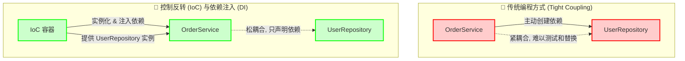

好的，我们来详细、全面、深入地总结和解释 Spring Boot 中关于 Bean 管理和 IoC 容器的核心知识。这部分是理解整个 Spring 生态的基石。

### 引言：控制反转 (IoC) 与依赖注入 (DI) —— Spring 的核心思想



在理解 Spring Boot 的 Bean 管理之前，我们必须先理解其背后的核心设计原则：**控制反转 (Inversion of Control, IoC)** 和 **依赖注入 (Dependency Injection, DI)**。

*   **传统编程方式**：在一个对象（例如 `OrderService`）内部，如果需要使用另一个对象（例如 `UserRepository`），我们通常会通过 `new` 关键字来主动创建它：
    ```java
    public class OrderService {
        private UserRepository userRepository = new UserRepository(); // 主动创建依赖
    
        public void createOrder(...) {
            // ...
            userRepository.findUser(...);
        }
    }
    ```
    在这种模式下，`OrderService` **控制**着 `UserRepository` 对象的创建和生命周期。这导致了**紧耦合**，`OrderService` 严重依赖 `UserRepository` 的具体实现，难以测试和替换。

*   **控制反转 (IoC)**：IoC 是一种设计思想，它将对象创建和管理的**控制权**从应用程序代码**反转**给一个外部的容器或框架。我们不再说“我需要你，所以我来创建你”，而是说“我需要你，请你（容器）把它给我”。

*   **依赖注入 (DI)**：DI 是实现 IoC 的最主要、最具体的方式。容器（在 Spring 中就是 **IoC 容器**）会主动将一个对象所依赖的其他对象（即**依赖**）**注入**到该对象中。
    ```java
    public class OrderService {
        private final UserRepository userRepository; // 不再主动创建
    
        // 通过构造器接收依赖
        public OrderService(UserRepository userRepository) {
            this.userRepository = userRepository;
        }
    
        public void createOrder(...) {
            // ...
            userRepository.findUser(...);
        }
    }
    ```
    现在，`OrderService` 只声明了它需要一个 `UserRepository`，但它自己不负责创建。创建和“注入” `UserRepository` 实例的工作交给了 Spring IoC 容器。

**核心作用与优势**：
1.  **解耦 (Decoupling)**：对象只关注自己的业务逻辑，不关心其依赖的创建过程，使得组件之间耦合度大大降低。
2.  **易于测试**：在单元测试中，我们可以轻松地注入一个模拟（Mock）的依赖对象，而不是真实的依赖，从而实现对业务逻辑的隔离测试。
3.  **集中管理与配置**：所有对象的创建、配置和生命周期都由容器统一管理，使得配置更加集中和清晰。
4.  **提高可重用性**：组件因为解耦而变得更加独立，更容易在不同的场景中被重用。

---

### 一、Spring IoC 容器：`ApplicationContext`

Spring IoC 容器是 Spring 框架的核心，它负责实例化、配置和组装我们接下来要讲的 **Bean**。

*   **核心接口**：`org.springframework.context.ApplicationContext` 是 IoC 容器的主要接口。它继承自一个更底层的接口 `BeanFactory`，并提供了更多企业级的功能，如 AOP 集成、事件发布、国际化消息支持等。在 Spring Boot 应用中，我们打交道的几乎都是 `ApplicationContext` 的某个实现类。
*   **Spring Boot 的自动化**：在启动一个 Spring Boot 应用时（执行 `SpringApplication.run()`），Boot 会根据当前的应用类型（例如，Web 应用、批处理应用）自动创建并配置一个合适的 `ApplicationContext` 实例（如 `AnnotationConfigServletWebServerApplicationContext`）。我们开发者通常不需要手动创建它。

---

### 二、什么是 Spring Bean？

简单来说，**一个 Spring Bean 就是一个由 Spring IoC 容器实例化、组装、管理和维护的 Java 对象**。

*   **Bean 的本质**：它们是构成应用程序主干的普通 Java 对象 (POJO)，但它们的整个**生命周期**，从创建到销毁，都由容器掌控。
*   **Bean 的定义**：容器需要知道要创建哪些 Bean，以及如何创建和配置它们。这些信息被称为 **Bean 定义 (Bean Definition)**，它就像是创建 Bean 的“蓝图”或“配方”。

---

### 三、Bean 的定义与注册：如何告诉容器创建 Bean？

在现代 Spring Boot 应用中，主要有以下两种方式来定义和注册 Bean。

#### 1. 组件扫描 (Component Scanning) - 自动化方式

这是最常用、最便捷的方式，遵循“约定优于配置”的原则。

*   **核心注解**：
    *   `@Component`: 一个通用的构造型注解，用于标记一个类，表示它是一个应由 Spring 容器管理的组件。
    *   `@Service`: 通常用于标记业务逻辑层的组件。
    *   `@Repository`: 通常用于标记数据访问层（DAO）的组件，它还能将特定的数据访问异常转译为 Spring 的统一数据访问异常。
    *   `@Controller` / `@RestController`: 用于标记 Web 层的控制器组件。
    这些注解在功能上与 `@Component` 等效，但提供了更明确的语义分层。

*   **扫描机制**：
    *   `@ComponentScan`: 这个注解告诉 Spring 在哪些包路径下扫描带有上述构造型注解的类，并自动将它们注册为 Bean。
    *   **Spring Boot 的魔法**：`@SpringBootApplication` 注解是一个复合注解，它本身就包含了 `@ComponentScan`。默认情况下，它会扫描**主启动类所在的包及其所有子包**。这就是为什么我们通常把主类放在项目根包下的原因。

**底层原理**：
1.  启动时，`@ComponentScan` 指定的扫描路径会被解析。
2.  Spring 使用类路径扫描器（`ClassPathBeanDefinitionScanner`）遍历这些路径下的所有 `.class` 文件。
3.  检查每个类是否被 `@Component` 或其派生注解所标记。
4.  如果找到了，Spring 就会为这个类生成一个 `BeanDefinition` 对象，并将其注册到容器的 `BeanDefinitionRegistry` 中。这个 `BeanDefinition` 包含了类的元数据、Bean 的名称（默认为类名首字母小写）、作用域等信息。
5.  后续，容器会根据这些 `BeanDefinition` 来实例化 Bean。

#### 2. Java 配置 (Java-based Configuration) - 显式化方式

当需要更精细的控制，或者需要将第三方库中的类注册为 Bean 时，我们使用基于 Java 的配置。

*   **核心注解**：
    *   `@Configuration`: 标记一个类为配置类。Spring 容器会处理这个类，并将其中的 Bean 定义注册进去。
    *   `@Bean`: 用于注解配置类中的一个方法。该方法的**返回值**将被注册为一个 Bean，**方法名**默认作为 Bean 的名称（ID）。

**示例**：
```java
@Configuration
public class AppConfig {

    @Bean // 将 RestTemplate 对象注册为 Bean
    public RestTemplate restTemplate() {
        return new RestTemplate();
    }

    @Bean
    public MyService myService(RestTemplate restTemplate) { // 依赖注入
        // 这里的 restTemplate 参数会被 Spring 自动从容器中注入
        return new MyServiceImpl(restTemplate);
    }
}
```

**底层原理（`@Configuration` 的代理机制）**：
`@Configuration` 类有一个非常重要的特性。Spring 在启动时会使用 CGLIB 库为这个配置类创建一个**动态代理子类**。当你调用配置类中的 `@Bean` 方法时（例如在 `myService` 方法中调用 `restTemplate()`），实际上调用的是代理对象的方法。这个代理方法会检查容器中是否已经存在一个名为 "restTemplate" 的 Bean。
*   如果存在（对于单例作用域），它会直接返回容器中的那个实例。
*   如果不存在，它才会执行原始方法体来创建新的实例，注册到容器，然后返回。

这个代理机制保证了**Bean 之间的依赖关系能够正确地引用到容器中唯一的单例实例**，而不是每次调用都创建一个新对象。

---

### 四、Bean 的生命周期：从诞生到消亡

一旦 Bean 定义被注册，容器就会在适当的时候（如启动时或首次被请求时）根据定义来创建和管理 Bean 实例。这个过程非常复杂，但可以简化为以下关键阶段：

1.  **实例化 (Instantiation)**：容器通过反射调用 Bean 的构造函数，创建出一个对象实例。
2.  **属性填充 (Populate Properties)**：这是**依赖注入**发生的地方。容器会查找 Bean 所依赖的其他 Bean，并通过以下方式之一进行注入：
    *   **构造器注入 (Constructor Injection)**：`@Autowired` 标记在构造器上。这是**官方推荐**的方式，因为它可以保证依赖在对象构造完成时就已完全就绪，并且可以方便地将字段声明为 `final`，确保不变性。
    *   **Setter 注入 (Setter Injection)**：`@Autowired` 标记在 setter 方法上。适用于可选依赖，或者解决循环依赖问题。
    *   **字段注入 (Field Injection)**：`@Autowired` 标记在成员变量上。代码简洁，但**不推荐**，因为它使得类与 IoC 容器过度耦合，在单元测试中不注入依赖就无法实例化对象，且容易隐藏循环依赖。
3.  **Aware 接口回调**：如果 Bean 实现了 `BeanNameAware`、`BeanFactoryAware`、`ApplicationContextAware` 等接口，Spring 会调用相应的方法，让 Bean 能“感知”到自己在容器中的 ID、所属的工厂和上下文。
4.  **前置处理器 (`BeanPostProcessor`)**：在 Bean 的初始化方法调用**之前**，容器会调用所有注册的 `BeanPostProcessor` 的 `postProcessBeforeInitialization` 方法。这是一个强大的扩展点，Spring AOP 的动态代理就是在这个阶段附近创建的。
5.  **初始化 (Initialization)**：
    *   如果 Bean 类中定义了用 `@PostConstruct` 注解的方法，该方法会被调用。
    *   如果 Bean 实现了 `InitializingBean` 接口，其 `afterPropertiesSet()` 方法会被调用。
    *   如果在 `@Bean` 注解中指定了 `initMethod`，对应的方法会被调用。
    （推荐使用 `@PostConstruct`，因为它与 Spring 框架解耦）。
6.  **后置处理器 (`BeanPostProcessor`)**：在 Bean 的初始化方法调用**之后**，容器会再次调用 `BeanPostProcessor` 的 `postProcessAfterInitialization` 方法。
7.  **Bean 可用**：此时，Bean 已完全准备就绪，可以被应用程序使用了。
8.  **销毁 (Destruction)**：当容器关闭时（例如应用停止），会进入销毁阶段。
    *   如果 Bean 类中定义了用 `@PreDestroy` 注解的方法，该方法会被调用。
    *   如果 Bean 实现了 `DisposableBean` 接口，其 `destroy()` 方法会被调用。
    *   如果在 `@Bean` 注解中指定了 `destroyMethod`，对应的方法会被调用。
    （推荐使用 `@PreDestroy`）。

---

### 五、Bean 的作用域 (Scope)

作用域定义了一个 Bean 实例的生命周期和可见范围。

*   **`singleton` (单例)**：**默认作用域**。在整个 IoC 容器中，一个 Bean 定义只对应**一个**实例。每次请求该 Bean，都会返回同一个共享的实例。绝大多数业务对象都是单例的。
*   **`prototype` (原型)**：每次从容器请求该 Bean（例如通过 `getBean()` 或依赖注入），**都会创建一个全新的实例**。容器创建并配置好原型 Bean 后，就将其交给请求方，**不再管理其后续的生命周期**（即不会调用销毁回调）。
*   **`request`**：每次 HTTP 请求都会创建一个新的 Bean 实例，该实例仅在当前请求内有效。
*   **`session`**：每个 HTTP Session 会创建一个新的 Bean 实例，该实例在整个 Session 期间有效。
*   **`application`**：在整个 `ServletContext` 的生命周期内，只创建一个 Bean 实例。
*   **`websocket`**：在 WebSocket 的生命周期内，只创建一个 Bean 实例。

使用 `@Scope("prototype")` 或 `@RequestScope` 等注解来指定作用域。

---

### 六、Spring Boot 的角色：自动配置 (Auto-Configuration)

Spring Boot 在 Spring IoC 的基础上，通过**自动配置**机制，极大地简化了开发。

*   **核心注解**：`@EnableAutoConfiguration` (已包含在 `@SpringBootApplication` 中)。
*   **工作原理**：
    1.  Spring Boot 启动时，会从 `spring-boot-autoconfigure.jar` 包（以及其他 starter 依赖包）的 `META-INF/spring.factories` 文件（新版本中是 `...AutoConfiguration.imports` 文件）中加载大量的自动配置类（`xxxAutoConfiguration`）。
    2.  这些自动配置类本身都是 `@Configuration` 类，它们定义了大量的 `@Bean`。
    3.  关键在于，这些 `@Bean` 的定义都使用了**条件注解**（`@ConditionalOn...`），例如：
        *   `@ConditionalOnClass`：当类路径下存在某个类时，此配置才生效。
        *   `@ConditionalOnMissingBean`：当容器中不存在指定类型的 Bean 时，才创建这个默认 Bean。
        *   `@ConditionalOnProperty`：当配置文件中某个属性有特定值时，此配置才生效。

**举例说明**：`DataSourceAutoConfiguration`
它会检查类路径下是否有 `DataSource.class` 和 `JdbcTemplate.class`。如果有，它会尝试创建一个 `DataSource` Bean。但在创建之前，它会用 `@ConditionalOnMissingBean(DataSource.class)` 检查，确保用户**没有自己定义**一个 `DataSource` Bean。如果用户自己定义了，那么自动配置就会**自动退让 (back off)**，使用用户的定义。

**作用总结**：自动配置是 IoC 思想的延伸。它不仅管理你定义的 Bean，还会根据你的项目依赖和配置，智能地“猜测”你可能需要的 Bean（如数据库连接池、消息队列客户端、Web 服务器等），并帮你创建和配置好。这使得开发者可以“开箱即用”，极大地提高了开发效率。

### 总结

Spring Boot 的 Bean 管理和 IoC 容器是一个强大而精密的系统，其核心可以概括为：

1.  **IoC 容器 (`ApplicationContext`)** 是中心枢纽，负责管理所有 **Bean** 的完整生命周期。
2.  通过**组件扫描**（`@Component` 等）和 **Java 配置**（`@Configuration`+`@Bean`）两种主要方式来**定义 Bean**，为容器提供“生产蓝图”。
3.  容器通过**依赖注入**（`@Autowired`）自动解决 Bean 之间的依赖关系，实现松耦合。
4.  Bean 的生命周期包括实例化、属性填充、初始化、使用和销毁等多个阶段，并提供了丰富的**回调接口**和**处理器**进行扩展。
5.  **Bean 的作用域**决定了其实例的数量和存活时间。
6.  **Spring Boot 的自动配置**在此基础上，通过条件化配置，智能地预先定义和装配了大量常用框架的 Bean，实现了“约定大于配置”，让开发者能更专注于业务逻辑。


**事件发布、国际化消息支持**

在 Spring 框架中，“事件发布”指的是一种系统消息机制，允许不同组件之间进行通信。这种机制基于发布-订阅模式，组件可以在发生特定事件时向容器发布消息，而其他组件可以订阅这些事件以执行相应的处理。这种方式有助于降低组件之间的耦合度，提高了系统的灵活性和可维护性。

**事件发布的优点**：
1. **解耦**：不同组件之间不需要直接进行交互，减少了它们之间的依赖关系。
2. **异步处理**：事件可以异步处理，提高系统的响应能力。
3. **扩展性强**：可以轻松地增加新的事件监听器，不影响已有的功能。

在 Spring 中，事件通常由 `ApplicationEvent` 类表示，而事件监听器通过实现 `ApplicationListener` 接口或者使用 `@EventListener` 注解来定义。当一个事件被发布时，所有注册的监听器都会收到通知，从而允许它们执行特定的逻辑。

**国际化消息支持**涉及到将应用程序中的消息翻译成多种语言，这在面向全球用户的应用中至关重要。Spring 框架提供了强大的支持，以便开发人员可以轻松实现国际化（i18n）。使用消息资源文件，开发者可以为不同语言提供不同的消息字符串。

**国际化支持的优点**：
1. **用户友好**：提供本地语言的支持，可以提升用户体验。
2. **灵活性**：通过简单的资源文件修改，可以快速支持新的语言或地区。
3. **集中管理**：所有的消息都集中在资源文件中，便于管理和维护。

在 Spring 中，实现国际化消息支持通常涉及使用 `MessageSource` 接口来加载和解析消息文件，开发者可以通过 `@Autowired` 注入 `MessageSource`，然后使用 `getMessage` 方法获取本地化的消息。

总而言之，“事件发布”和“国际化消息支持”是 Spring 框架中的两个重要特性，前者增强了组件之间的灵活性和耦合度，后者使得应用能够更好地适应不同语言环境的用户需求，提升了整体的用户体验。

在选中的文本中，"POJO" 是一个重要的概念，尤其是在 Spring 生态系统中。POJO 是 “Plain Old Java Object”（普通老式 Java 对象）的缩写，指的是没有任何特定于框架或容器的依赖关系的Java类。它是一个简单的对象，只包含属性和其访问方法（getters 和 setters），通常不涉及业务逻辑或复杂的行为。

### 详细解释和分析：

1. **POJO 的意义**：
   - POJO 的设计理念是使 Java 对象更加灵活与易于使用。它们不需要继承特定的类，也不需要实现特定的接口，因此在不同的应用程序和框架中都能轻松使用。

2. **使用 POJO 的好处**：
   - **简单性**：POJO 使得代码更加简洁清晰，因为它们不依赖于特定的框架。
   - **可测试性**：由于 POJO 不与任何特定的框架紧密耦合，因此可以轻松地进行单元测试。
   - **重用性**：可以在不同项目或不同环境中复用 POJO 类，因为它们没有绑定到特定的上下文中。

3. **与 Spring 的关系**：
   - 在 Spring 框架中，POJO 是构建应用程序的核心部分。Spring 强调使用 POJO 来创建 Bean，使得应用程序的组件可以轻松实现依赖注入 (DI)，而保持松耦合。
   - Spring IoC 容器通过管理 POJO 的生命周期和依赖关系来支持控制反转 (IoC)，实现有效的资源管理。

综上所述，POJO 是理解 Spring 及其 Bean 管理的关键组成部分。它的出现使得开发人员可以以更加灵活和可维护的方式构建应用程序，增强了代码的重用性和可测试性。在 Spring Boot 开发中，POJO 作为模型和服务层对象的基础，在实现复杂的业务逻辑时，提供了一种简单而有效的方式。


