Mermaid 是一款功能强大的开源工具，它允许你使用类似 Markdown 的文本和代码来创建各种图表和可视化内容。 这种代码化的方式使得图表的创建、编辑和版本控制变得异常简单高效，尤其适合在技术文档和软件开发中使用。

以下是常用 Mermaid 绘图语法的总结和详细示例。

### **1. 流程图 (Flowchart/Graph)**

流程图由节点（几何形状）和边（箭头或线条）组成，用于表示 **工作流程或决策路径**。

**基本语法:**

*   **方向定义**: 使用 `graph` 或 `flowchart` 关键字，后跟方向标识。
    *   `TD` 或 `TB`: 从上到下 (Top to Bottom)
    *   `BT`: 从下到上 (Bottom to Top)
    *   `LR`: 从左到右 (Left to Right)
    *   `RL`: 从右到左 (Right to Left)
*   **节点定义**:
    *   `id[文本]`：矩形节点
    *   `id(文本)`：圆角矩形节点
    *   `id((文本))`：圆形节点
    *   `id{文本}`：菱形节点 (常用于判断)
    *   `id>文本]`：不对称矩形节点
*   **连线定义**:
    *   `-->`：带箭头的实线
    *   `---`：不带箭头的实线
    *   `-- text -->`：带文本的实线
    *   `-.->`：带箭头的虚线
    *   `==>`：粗箭头实线

**详细示例:**

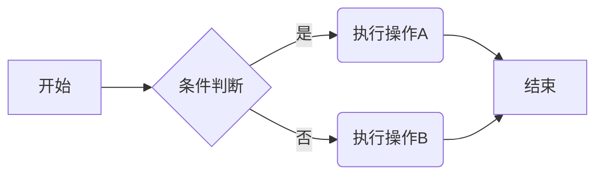

**子图 (Subgraph) 示例:**

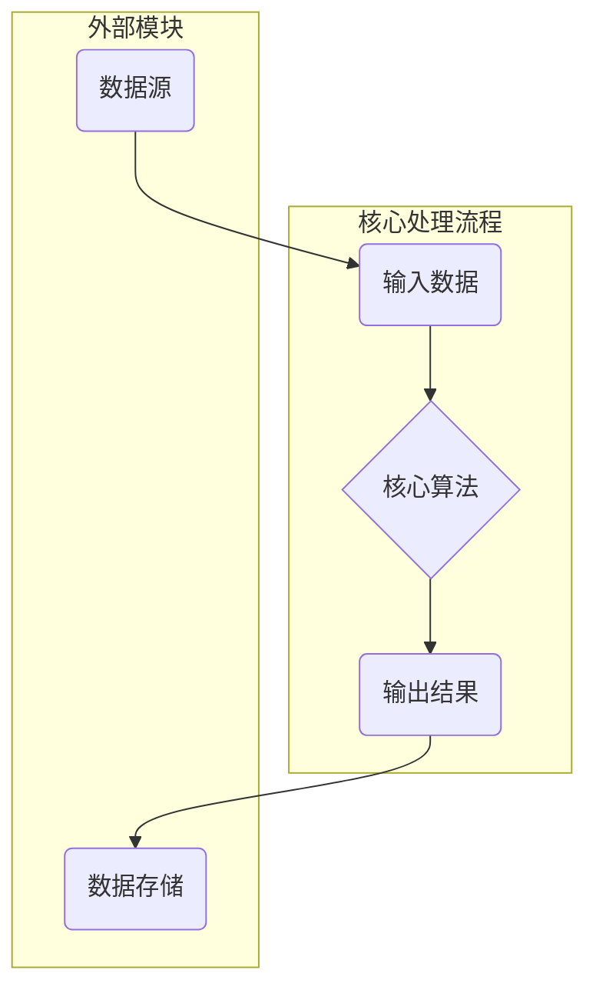

### **2. 时序图 (Sequence Diagram)**

时序图用于描述对象之间交互的时间顺序。

**基本语法:**

*   **参与者 (Participant)**: `participant` 关键字，可以设置别名 `as`。
*   **角色 (Actor)**: `actor` 关键字，以人形图标表示外部实体。
*   **消息传递**:
    *   `->>`: 同步消息 (实线箭头)
    *   `-->>`: 异步消息 (虚线箭头)
    *   `-x`: 表示消息丢失或终止
    *   `+)` 和 `-)`: 激活和取消激活生命线，表示对象处理消息的开始和结束。

**详细示例:**

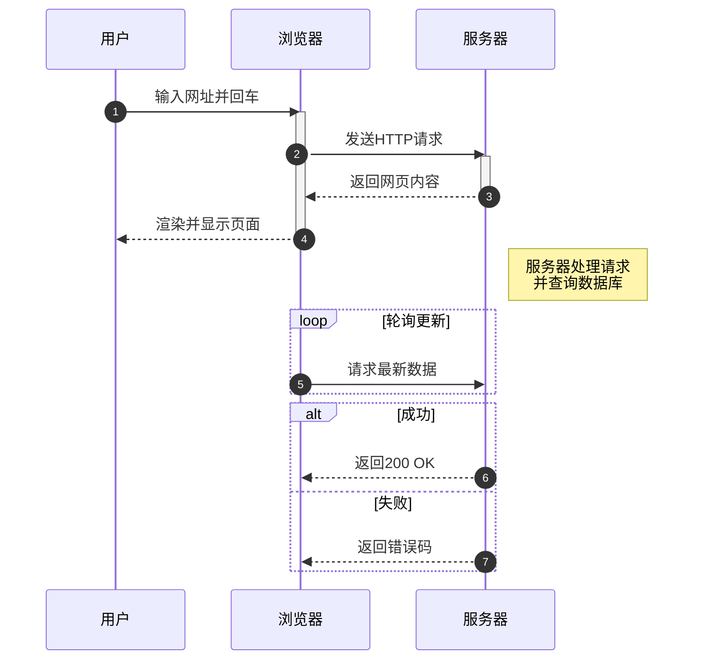

### **3. 甘特图 (Gantt Chart)**

甘特图是一种条形图，用于说明项目进度、任务和时间安排。

**基本语法:**

*   `gantt`: 声明图表类型。
*   `title`: 设置图表标题。
*   `dateFormat`: 定义日期格式，如 `YYYY-MM-DD`。
*   `section`: 定义任务分组。
*   **任务定义**: `任务名称 :done/active/crit, id, 开始时间, 持续时间/结束日期`
    *   状态可以是 `done` (已完成), `active` (进行中), `crit` (关键路径)。
    *   任务依赖可以使用 `after id`。

**详细示例:**

```mermaid
gantt
    title 项目开发计划
    dateFormat  YYYY-MM-DD
    axisFormat %m-%d
    section 需求分析
    需求调研     :done, des1, 2025-09-20, 7d
    文档撰写     :active, des2, after des1, 5d

    section 开发阶段
    前端开发     :crit, dev1, after des2, 20d
    后端开发     :crit, dev2, after des2, 25d

    section 测试与部署
    功能测试     : test1, after dev1, after dev2, 10d
    上线发布     : milestone, m1, 2025-11-15, 1d
```

### **4. 类图 (Class Diagram)**

类图是 UML 的一种，用于显示系统的类、接口、协作以及它们之间的静态结构和关系。

**基本语法:**

*   `classDiagram`: 声明图表类型。
*   **定义类**: `class 类名 { ... }`。
*   **成员**:
    *   `+` public
    *   `-` private
    *   `#` protected
    *   `$` static
    *   `*` abstract
*   **关系**:
    *   `<|--` : 继承
    *   `*--` : 组合
    *   `o--` : 聚合
    *   `-->` : 关联
    *   `..>` : 依赖
*   **基数 (Multiplicity)**: 在关系的两端用引号标注数量关系，如 `"1"`, `"0..*"`。

**详细示例:**

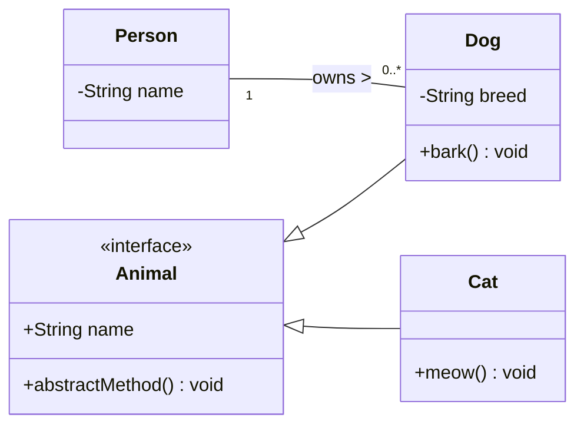

### **5. 状态图 (State Diagram)**

状态图用于描述一个对象在其生命周期内响应事件所经历的状态序列。

**基本语法:**

*   `stateDiagram-v2`: 声明图表类型 (v2 是推荐版本)。
*   `[*]`: 表示开始或结束状态。
*   **状态转换**: `状态1 --> 状态2 : 转换事件`。
*   **复合状态**: 使用 `state 状态名 { ... }` 来定义嵌套状态。

**详细示例:**

```mermaid
stateDiagram-v2
    [*] --> 关闭

    state 关闭 {
        [*] --> 空闲
        空闲 --> 运行中 : 开机
    }

    state 运行中 {
        [*] --> 播放
        播放 --> 暂停 : 暂停按钮
        暂停 --> 播放 : 播放按钮
        播放 --> 关闭 : 关机
        暂停 --> 关闭 : 关机
    }
```

### **6. 饼图 (Pie Chart)**

饼图用于显示数据的分类占比。

**基本语法:**

*   `pie`: 声明图表类型。
*   `title`: 设置图表标题。
*   **数据定义**: `"数据项名称" : 数值`。

**详细示例:**

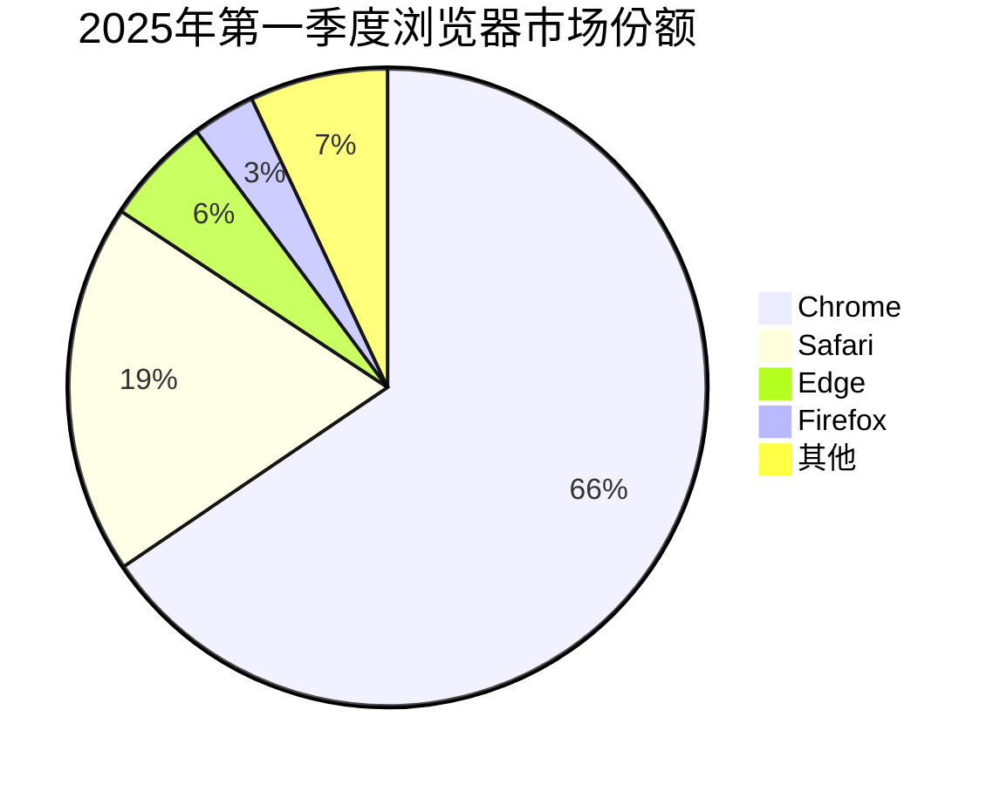

### **7. 用户旅程图 (User Journey Diagram)**

用户旅程图用于描述用户为完成特定任务所采取的步骤和体验。

**基本语法:**

*   `journey`: 声明图表类型。
*   `title`: 图表标题。
*   `section`: 定义一个阶段或区块。
*   **任务定义**: `任务名称: 评分: 参与者列表`。

**详细示例:**

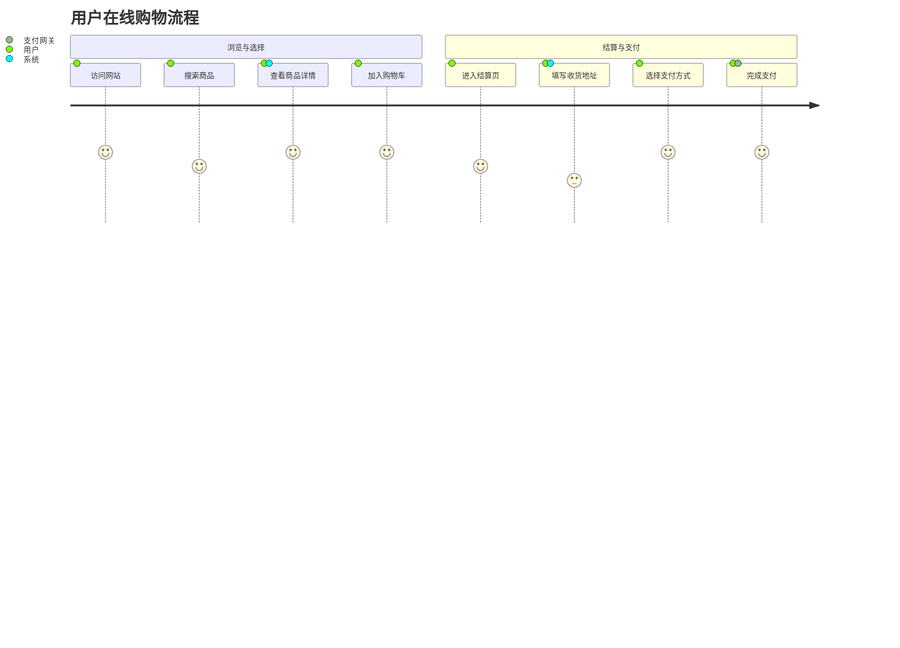

### **8. 实体关系图 (ER Diagram)**

ER 图用于数据库设计，展示实体、属性以及实体之间的关系。

**基本语法:**

*   `erDiagram`: 声明图表类型。
*   **实体定义**: `实体名 { 属性类型 属性名 "注释" }`。
*   **关系定义**: `实体1 ||--o{ 实体2 : 关系描述`。
    *   `|o--||`: 一对一
    *   `|o--o{`: 一对多
    *   `}o--o{`: 多对多

**详细示例:**

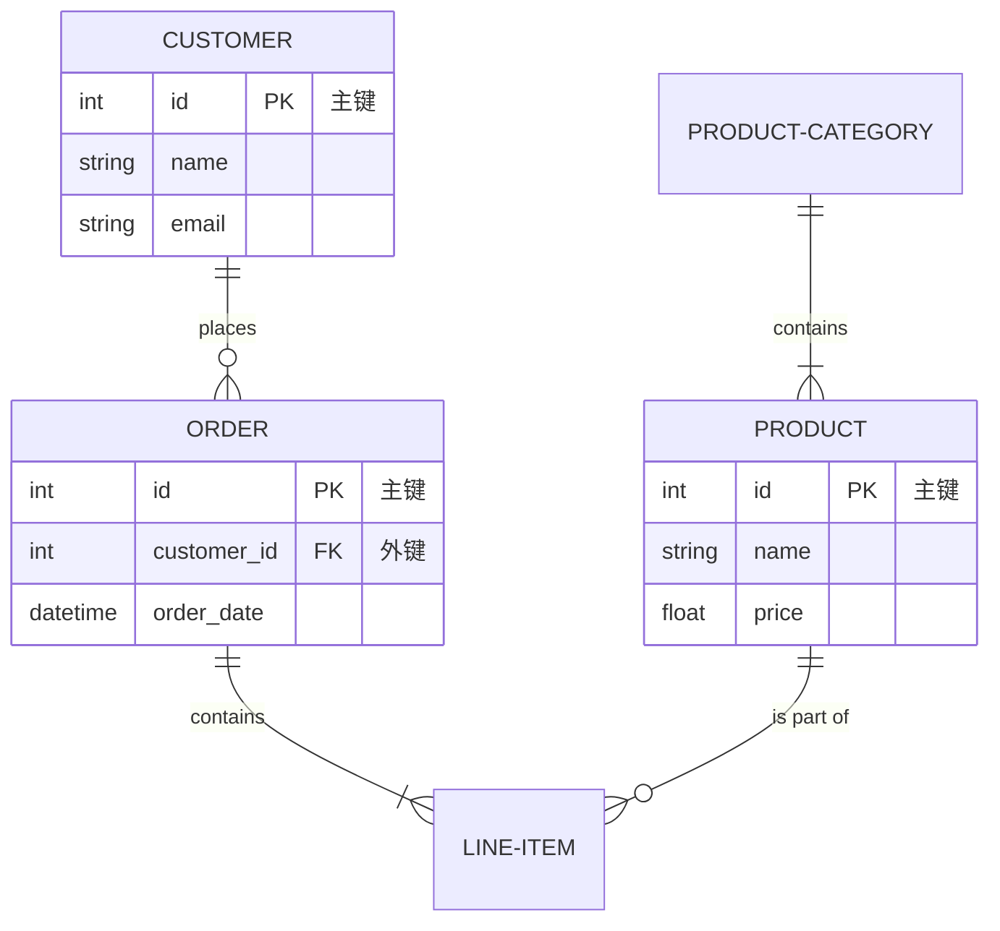


通过掌握以上这些常用的图表语法，你可以轻松地在文档中创建清晰、美观且易于维护的图表。


# Mermaid 速查 + 详解（面向 Typora / Mermaid 11.9.x 用户）

下面把常用的 Mermaid 图类型、语法要点、常见坑、以及**可直接粘进 Typora（`mermaid`）运行**的示例都给你列全 — 每个部分都带说明、语法和至少一个可运行示例。为了避免你之前遇到的 `Lexical error / NODE_ID` 等问题，我会强调那些容易出错的细节（比如 `subgraph`、节点 id 与标签的区别、`end` 关键字等）。如果你想，我之后可以把你现有的所有图批量修正为这些安全写法。

>   重要来源（可查证）：Mermaid 官方 Flowchart / Sequence / Gantt / ER / Mindmap 文档与样例。([Mermaid Chart](https://docs.mermaidchart.com/mermaid/flowchart/shapes?utm_source=chatgpt.com))

------

# 目录（快速导航）

1.  快速入门（最小可运行示例）
2.  Flowchart（流程图）—— 形状、连接、子图、样式
3.  Sequence diagram（时序图）—— participant、消息、控制结构、注释
4.  Class / State / ER / GitGraph / Mindmap / Gantt / Pie —— 每种图的语法要点与示例
5.  全局配置、注释、转义与常见坑（含 Typora 兼容性提示）
6.  速查看表（常用语法一览）

------

# 1. 快速入门（最小可运行）

把下面完整的代码块直接粘进 Typora 的 mermaid 代码块里（```mermaid ）即可渲染：

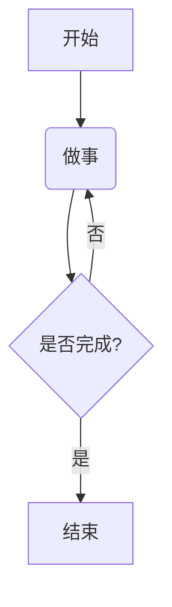

解释：`flowchart TD` 指 Top→Down（从上到下布局）。节点的写法是 `ID[label]`，ID 用作内部引用（**必须是 ASCII 风格的标识符**，不要含空格/中文）。标签（方括号内）可以是任意文本（中文 / emoji / 空格都可以）。([Mermaid Chart](https://docs.mermaidchart.com/mermaid/flowchart/shapes?utm_source=chatgpt.com))

------

# 2. Flowchart（流程图） — 深入

## 2.1 基本构成

-   定义：`flowchart TD` / `flowchart LR` / `flowchart RL` / `flowchart TB`（有时也见 `graph`）
-   节点语法：`ID[label]`（方括号表示矩形）
    -   ID：一个简短唯一的标识符（建议用字母、数字、下划线）
    -   label：显示文本（可为中文、emoji、换行）

## 2.2 常见形状（写法 → 含义）

（下列样例均来自官方/cheatsheet，常用且兼容 11.x）([Mermaid Chart](https://docs.mermaidchart.com/mermaid/flowchart/shapes?utm_source=chatgpt.com))

-   矩形（默认流程）
     `A[这是矩形]`
-   圆角矩形（圆角）
     `B(这是圆角矩形)`
-   体育场（stadium）
     `C([这是体育场形状])`
-   子程序（subroutine）
     `D[[子程序]]`
-   圆柱（数据库/圆柱）
     `E[(数据库)]`
-   圆形
     `F((这是圆形))`
-   决策（菱形）
     `G{是否通过?}`
-   平行四边形（输入/输出）
     `H[/输入输出/]`
-   六边形（hexagon）
     `I{{六边形}}`

示例（组合演示）：

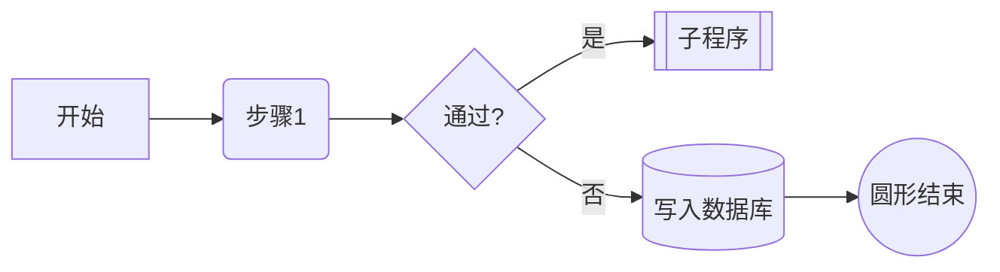

## 2.3 连接与连线文字

-   无箭头线： `A --- B`（实线）
-   有箭头： `A --> B`
-   虚线： `A -.-> B` 或 `A -. text .-> B`（带文本）
-   粗线： `A ==> B`
-   给连线加文字：两种写法
    -   `A-->|文本|B`（常用）
    -   `A-- 文本 -->B`（也可）
         示例：

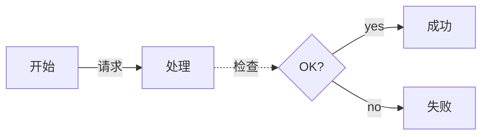

（连线文字与不同箭头类型是常见组合）([jojozhuang.github.io](https://jojozhuang.github.io/tutorial/mermaid-cheat-sheet/?utm_source=chatgpt.com))

## 2.4 子图（subgraph） — **易错点**

-   **正确写法**：`subgraph id[显示标题]` 或 `subgraph id`（然后 `end`）
    -   `id` 必须是 ASCII 标识符（不能直接把中文或 emoji 写成 id）
    -   若想显示中文/emoji 标题，把显示文本放在方括号里：`subgraph stage1[第一阶段 🔥]`。
-   **错误写法**（会导致 Lexical error）：`subgraph "中文标题"` 或直接写 `subgraph 第一阶段 数据预热 🔥`（这会把中文作为 id，词法器不能识别）。
     示例（正确）：

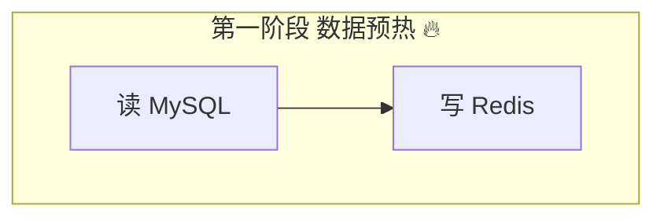

（这个是你之前遇到报错的关键原因之一：把中文/emoji 当作 id 写在 `subgraph` 后面会导致解析失败）。([Stack Overflow](https://stackoverflow.com/questions/72578214/how-to-style-a-mermaid-subgraphs-title?utm_source=chatgpt.com))

## 2.5 样式与着色

两种常见方式：`style`（直接写 CSS）与 `classDef`/`class`（定义 class 然后赋给节点）。

-   `style`（单节点，内联 CSS）：

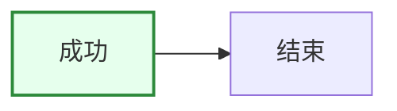

-   `classDef` + `class`（定义样式 class）：

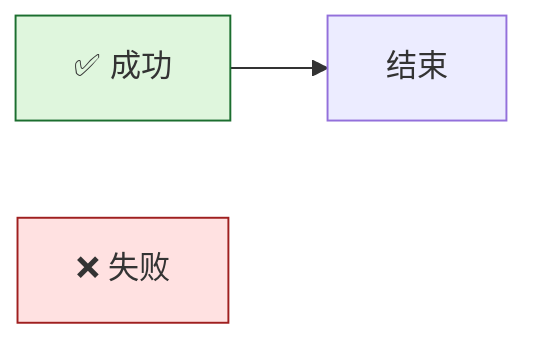

>   注意：`classDef`/`class` 更适合复用样式；`style` 用于单个节点快速覆盖。([Stack Overflow](https://stackoverflow.com/questions/74894540/mermaid-js-flow-chart-full-list-of-available-options-to-style-a-node?utm_source=chatgpt.com))

------

# 3. Sequence diagram（时序图）

**用途**：展示对象/服务之间随时间的消息交互（常用于接口/微服务调用流程）。

## 3.1 基本语法要点

-   声明：`sequenceDiagram`
-   定义参与者：`participant Alice as A` 或 `Alice->>Bob: 消息`
-   箭头类型：`->`（同步），`->>` / `-->>`（带实线或双箭头），`--x`（交叉/阻断）
-   控制结构：`loop ... end`、`alt ... else ... end`、`opt ... end`、`par ... and ... end`
-   注释：`Note left of Alice: 注释内容` 或 `Note right of Bob: ...`

示例（常用结构）：

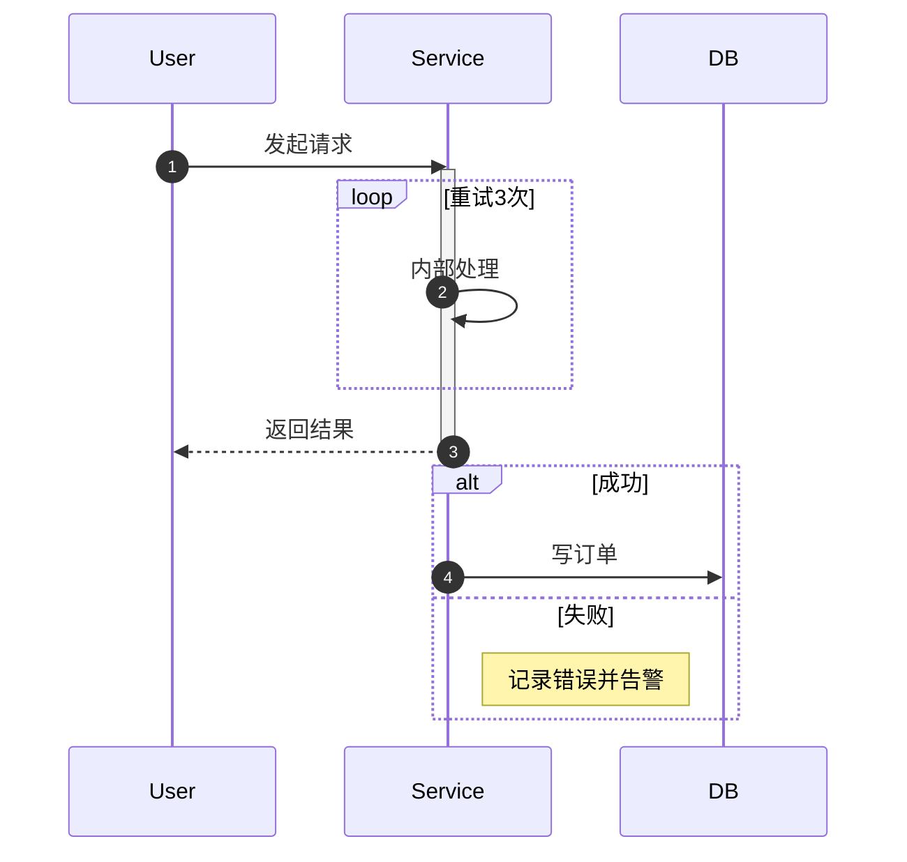

提示：如果你的标签使用了单词 `end`（作为节点 label），它可能影响解析 —— 在这种情况下把 `end` 用括号/方括号包起来 `(end)` / `[end]`。([Mermaid Chart](https://docs.mermaidchart.com/mermaid-oss/syntax/sequenceDiagram.html?utm_source=chatgpt.com))

------

# 4. 其他常见图类型（每种给要点 + 示例）

## 4.1 Class diagram（类图）

-   语法：`classDiagram`，定义类 `class Person { +name; +age() }`，关系 `A <|-- B`、`A *-- B` 等。

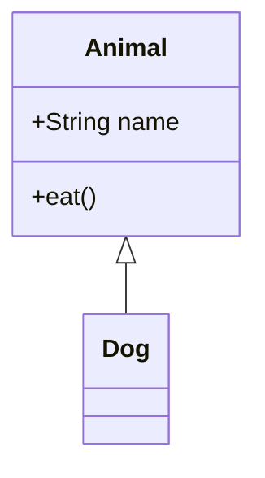

（用于面向对象结构表达）。([美人鱼](https://mermaid.js.org/syntax/classDiagram.html?utm_source=chatgpt.com))

## 4.2 State diagram（状态机）

-   语法：`stateDiagram-v2` 或 `stateDiagram`（常用箭头 `-->`），支持复合状态、分叉(join/fork)、注释与 `[*]`（开始/结束）。

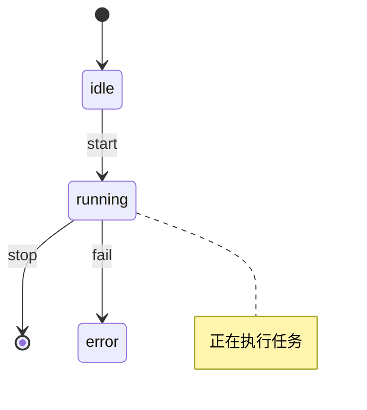

（适合建模状态迁移）。([美人鱼](https://mermaid.js.org/syntax/stateDiagram.html?utm_source=chatgpt.com))

## 4.3 ER diagram（实体关系图）

-   语法：`erDiagram`，类似 PlantUML 风格：`CUSTOMER ||--o{ ORDER : places`。也可用 `A [<relationship> B : label]` 形式。([Mermaid Chart](https://docs.mermaidchart.com/mermaid-oss/syntax/entityRelationshipDiagram.html?utm_source=chatgpt.com))

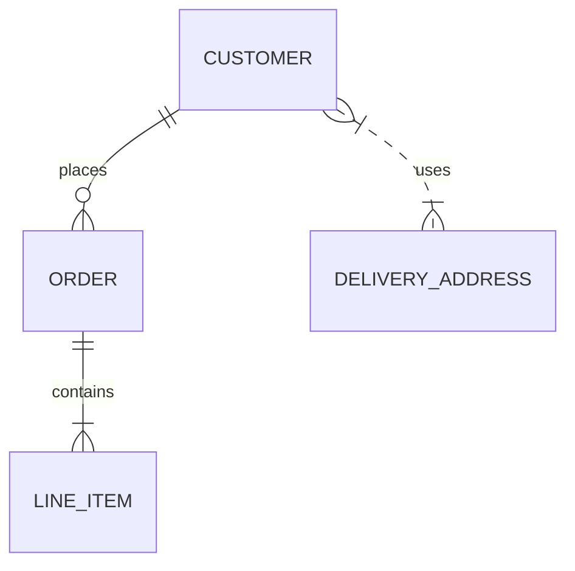

## 4.4 Gantt（甘特图）

-   语法：`gantt` + `dateFormat` + `section` + 任务（`task :id, start, duration` 或 `:after id, 5d`），支持 `:done`、`:active`、`:crit` 等。

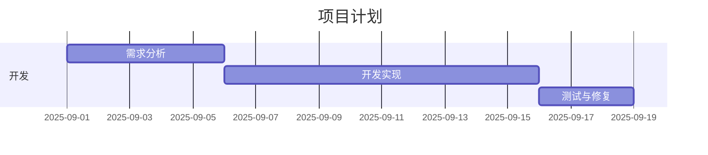

（在项目管理与时间线展示非常实用）([Mermaid Chart](https://docs.mermaidchart.com/mermaid-oss/syntax/gantt.html?utm_source=chatgpt.com))

## 4.5 Pie（饼图）

```mermaid
pie title 浏览器分布
  "Chrome" : 60
  "Firefox" : 20
  "Edge" : 15
  "Others" : 5
```

## 4.6 GitGraph（git 提交图）

```mermaid
gitGraph
  commit id: "init"
  branch feature
  commit id: "feat1"
  checkout main
  merge feature
```

## 4.7 Mindmap（思维导图）

-   语法：`mindmap`，最顶点必须是 `root((...))` 形式，子节点通过缩进表示。节点可以用类似 flowchart 的形状语法。([美人鱼](https://mermaid.js.org/syntax/mindmap.html?utm_source=chatgpt.com))

```mermaid
mindmap
  root((🧭 项目))
    策划
      目标
      范围
    实施
      设计
      开发
```

------

# 5. 全局技巧 / 常见坑 & Typora 注意事项（实战修复指南）

-   **ID vs Label**：ID（比如 `A`、`Check_Redis`）用作连接/样式引用，**必须** 是无空格的 ASCII 标识（推荐字母/下划线）。Label（`[显示文本]`）可写中文/emoji。把中文写成 ID（例如 `subgraph 第一阶段`）会导致语法错误。([Stack Overflow](https://stackoverflow.com/questions/72578214/how-to-style-a-mermaid-subgraphs-title?utm_source=chatgpt.com))
-   **subgraph** 写法：`subgraph id[标题]`（推荐）**不要** 直接把中文或 emoji 放在 `subgraph` 后面当 id。([Stack Overflow](https://stackoverflow.com/questions/72578214/how-to-style-a-mermaid-subgraphs-title?utm_source=chatgpt.com))
-   **`end` 关键字**：在一些图（尤其 sequence）中，裸写 `end` 可能被误解析，若有冲突可把标签写成 `(end)` / `[end]`。([Mermaid Chart](https://docs.mermaidchart.com/mermaid-oss/syntax/sequenceDiagram.html?utm_source=chatgpt.com))
-   **注释**：用 `%% 注释`（行内注释），不会影响解析。
-   **字体/图标**：Mermaid 自带渲染，不包含 FontAwesome 等图标库。你可以用 emoji 替代图标（兼容性最好）；如果一定要用 fa，需要页面预先加载图标库并注册（复杂，且在 Typora 中不稳定）。
-   **样式冲突**：Typora 或主题 CSS 可能影响 Mermaid 渲染（尤其导出 PDF 时），如遇怪异样式先检查是否有外部 CSS 干扰。
-   **确保代码块语言是 `mermaid`**：Typora 要识别 Mermaid 必须把代码块开头写成 ```mermaid。
-   **大图调试方法**：先把图减小到最小可运行示例（去掉注释 / 子图 / 复杂样式），确认能渲染后再逐步加回内容（逐行调试法）。

------

# 6. 速查表（随手查）

-   图头：`flowchart TD` / `flowchart LR` / `sequenceDiagram` / `classDiagram` / `stateDiagram-v2` / `gantt` / `mindmap` / `gitGraph` / `erDiagram`
-   节点基本写法：`ID[文本]`（矩形） `ID(文本)`（圆角） `ID{文本}`（决策） `ID((文本))`（圆） `ID[[子程序]]`（子程序） `ID[(数据库)]`（圆柱）
-   连接：`A --> B`、`A --- B`、`A -.-> B`、`A ==> B`、`A-->|text|B`、`A-- text -->B`
-   样式：`style ID fill:#f9f,stroke:#333`；`classDef name fill:#...; class ID name`
-   子图：`subgraph id[显示标题] ... end`（id 必须是 ASCII）
-   注释：`%% 注释`；sequence 中 `Note left of X: 文本`
-   转义：如果 label 中包含可能混淆的关键字（如 `end`），可用 `[end]` 或 `(end)` 包裹。

------

如果你愿意，我可以：

-   把你之前贴出的所有 mermaid 段（那几张截图里的源码）**一键修复成兼容** 11.9.0 的版本（我会把 `subgraph`、ID、样式、`<br>` 等都替换成安全写法，并保留 emoji）。
-   或者把上面的速查制作成可打印的 PDF / Markdown 便签，便于你随手查阅。

你想先把哪一部分我来帮你处理？我建议先把你当前文档里有问题的一段（直接粘文本）发给我，我立刻修好并返回可直接在 Typora 渲染的代码块。


!!! note    

今天风和日丽。


