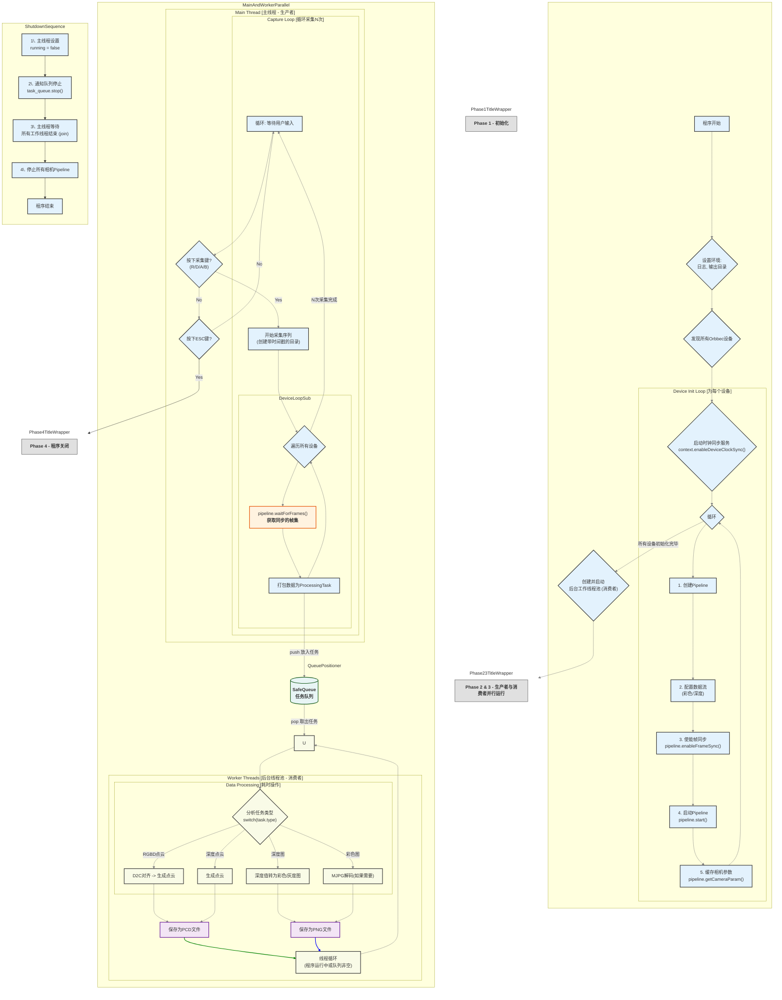

[同步校准](https://www.orbbec.com.cn/index/Sdkdoc/info.html?cate=117&id=61)

[工作模式](https://www.orbbec.com.cn/index/Sdkdoc/info.html?cate=117&id=60)


数据移动模型

数据帧指针首先在相机内部SDK缓存，代码调用Orbbec SDK，获取数据帧指针，然后解析数据；

但是在多设备和频繁处理的情况下，相机内部SDK为了提高效率和节约内存，会复用指针，也就是相机默认外部会快速处理好每一帧的数据，相机获取新的数据后，会覆盖掉前面产生的新的指针，导致前面还没有来得及被处理的数据被覆盖掉，从而出现丢失或者重复现象。

深度帧的处理通常需要更多时间，比如和彩色帧对齐；且通常占用更大带宽，因为为了保持深度值的精度，深度帧不会压缩传输，而彩色帧通常是压缩后传输的，所以虽然彩色图片比深度图片更大，但实际上需要的带宽更小；


代码执行逻辑流程：

首先设置日志级别为错误，只显示错误信息，其他info、warning等都不显示；创建全局变量，如`ob::Context context`，这是与所有Orbbec设备通信的入口，通过这个变量来获取当前连接到的相机设备，从而进一步对相机设备进行设置；也就是

```cpp
// 查询所有连接的设备
auto deviceList = context.queryDeviceList();
int deviceCount = deviceList->deviceCount();
```

进行一些零散操作，比如创建输出目录；

设置相机参数，实现了手动设置彩色相机曝光、增益等参数的功能；

然后是配置相机硬件同步的关键，在`configMultiDeviceSync()`函数中，读取配置文件`MultiDeviceSyncConfig.json`，在配置文件中指定相机的一些参数，关键参数是相机的同步模式，然后读取这些同步模式，写入到相机的闪存芯片中，这样，在开启相机数据流时，相机就会相应的根据同步模式来工作，搭配多机同步集线器实现多设备同步；设置为主设备的相机，背后的同步端口就会被设置为可用发出脉冲信号，设置为从设备的相机，背后的同步端口就会被设置为只能接收外部脉冲信号，同时从设备关闭自身内部时钟信号，只接受外部的脉冲信号来触发拍照逻辑。

在数据保存上，尤其是点云和彩色点云，这两种数据格式的计算比较复杂，保存比较耗时，为了让数据的保存和


代码通过 Orbbec SDK 提供的两个关键功能，实现了从硬件底层到软件上层的多相机同步：

1.  **硬件时钟同步 (Hardware Clock Sync):** `context.enableDeviceClockSync(3600000);`
2.  **软件帧同步 (Software Frame Sync):** `deviceInfo.pipeline->enableFrameSync();`

下面我们详细解释这两个机制是如何协同工作的。

---

### 1. 硬件时钟同步：`context.enableDeviceClockSync()`

这是实现**“同时拍照”**的物理基础。

*   **原理：**
    当您将多个奥比中光相机连接到同一台主机时，每个相机内部都有自己的晶振和时钟，用于为捕获的每一帧图像打上时间戳。默认情况下，这些时钟是各自独立的，存在微小的频率差异，长时间运行后会产生越来越大的时间漂移。

    `context.enableDeviceClockSync()` 函数的作用是启动一个基于主机（电脑）的统一时钟同步机制。主机会成为“时间服务器”（Master Clock），定期向所有连接的相机广播一个精确的时间信号。相机的固件接收到这个信号后，会校准自己内部的硬件时钟，使其与主机时间以及其他所有相机的时钟保持高度一致。

*   **在您代码中的体现：**
    ```cpp
    // 启动多设备时钟同步
    context.enableDeviceClockSync(3600000);  // 每小时更新并同步一次
    ```
    您在程序初始化阶段调用了这个函数。这意味着，在后续的所有操作中，任何一台相机捕获图像帧并为其打上硬件时间戳时，这个时间戳的基准都是那个被同步过的、统一的时钟。

    **所以，当两个不同相机生成的图像帧拥有几乎相同的时间戳时，我们可以确信它们确实是在物理世界的同一时刻被捕获的。**

---

### 2. 软件帧同步：`deviceInfo.pipeline->enableFrameSync()`

这是确保您在**软件层面能拿到“同一时刻”数据**的保障机制。

*   **原理：**
    即使硬件时钟同步了，数据从相机传输到电脑内存也需要时间，并且可能因为 USB 带宽、系统调度等原因，不同相机的数据到达时间会有微小的先后差异。

    `pipeline->enableFrameSync()` 的作用是在 `Pipeline` 内部为每个数据流（如深度流、彩色流）创建一个小缓冲区。当您调用 `pipeline->waitForFrames()` 时，`Pipeline` 不会立即返回最新到达的一帧，而是会查看缓冲区，**寻找一组时间戳最接近的帧（a set of frames）**，然后将这一组帧打包成一个 `FrameSet` 返回给您。它起到了一个“帧匹配器”的作用。

*   **在您代码中的体现：**
    ```cpp
    
    // 5.3 启用对齐和帧同步
    //config->setAlignMode(ALIGN_D2C_HW_MODE); // 优先硬件对齐
    deviceInfo.pipeline->enableFrameSync();
    std::cout << "  已启用D2C对齐和帧同步。" << std::endl;
    ```
    您为每个设备的 `Pipeline` 都启用了这个功能。这意味着，当您后续调用 `waitForFrames()` 时，您得到的 `frameset` 内部的 `colorFrame` 和 `depthFrame` 的时间戳是经过匹配的，尽可能地接近。

---

### 3. 主循环中的采集逻辑分析

现在我们来看您的主循环（生产者逻辑）是如何利用上述机制的：

```cpp
// 为每个设备抓取一帧并打包成任务
for (auto& device : devices) {
    // 减少超时时间，让采集更灵敏
    auto frameset = device.pipeline->waitForFrames(100000);
    if (frameset) {
        // ... 打包任务 ...
        task_queue.push(task);
    }
    // ...
}
```

*   **循环抓取：** 您的代码在一个 `for` 循环里依次调用每个设备的 `waitForFrames()`。这里确实存在一个微秒级的程序执行延迟（调用完第一个设备的 `waitForFrames` 再去调用第二个的）。
*   **为何依然是同步的？** 关键在于 `waitForFrames()` **取出的数据是已经带有精确硬件时间戳的**。
    *   假设相机A和相机B都在 `T=1000ms` 这个时刻同步捕获了一帧。
    *   由于传输延迟，可能相机A的数据在 `T=1010ms` 到达主机，相机B的数据在 `T=1012ms` 到达主机。
    *   您的 `for` 循环在 `T=1015ms


核心代码位于 `src/getdata/getdata.cpp`中，相关辅助函数位于 `src/utils/`目录内，主要在 `getdata_utils.cpp`中，这里面实现了各种辅助函数，比如读取相机配置文件、配置多相机硬件同步（通过设置相机工作模式为 `OB_MULTI_DEVICE_SYNC_MODE_PRIMARY`还是 `OB_MULTI_DEVICE_SYNC_MODE_SECONDARY`来实现，`PRIMARY`表示主设备，只有它的内部时钟起作用，`SECONDARY`表示从设备，它们的内部时钟暂时失效，听从主设备时钟号令来获取数据）、根据主线程生产者线程创建的任务生成消费者线程，处理保存逻辑，如彩色图像保存函数、深度图保存函数、深度点云保存函数、彩色点云保存函数等；

## 🚀 1. 概述：这是一个什么系统？

这是一个高度优化的、用于 **多台 Orbbec 相机** 的 **同步数据采集系统**。

它的核心目标是：在用户按下采集键时，能够 **同时** 从所有连接的相机（例如3台 Femto Bolt）中抓取一帧数据，并将这些数据（彩色图像、深度图像、彩色点云、深度点云）以极高的效率保存到硬盘中，同时提供实时的视频预览。

为了实现这个目标，它采用了现代 C++ 中非常高效的 **“生产者-消费者”设计模式**。

------

## 🧠 2. 整体设计思路 (核心架构)

这套系统的灵魂在于它将 **“CPU密集型任务”、“I/O密集型任务”和“实时显示任务”**彻底分离开，让它们在不同的线程中各司其职，互不干扰。

### 2.1 生产者-消费者模型 (Producer-Consumer)

您可以把整个系统想象成一个高度协同的工厂流水线：

1.  **生产者 (主线程):**

-   **角色:** `getdata.cpp` 中的 `main()` 函数。
-   **任务:** 这是最“劳累”的工人。当用户按下采集键（比如 'A'）时，它会迅速从所有相机抓取原始数据帧 (FrameSet)。
-   **工作内容 (CPU密集型):** 它不只是抓取，还负责所有繁重的 **数据处理**：

1.  **解码:** 将MJPG格式的彩色图解码为 `cv::Mat` 图像。
2.  **对齐:** 将深度图对齐到彩色相机坐标系（使用Orbbec SDK自带函数实现）。
3.  **转换:** 将16位的原始深度图转换为8位的灰度图 (用于预览)。
4.  **生成点云:** 调用 `PointCloudFilter` 生成 PCL 格式的深度点云 (`PointXYZ`) 和彩色点云 (`PointXYZRGB`)。

-   **产出:** 处理好的、可直接保存的数据（如 `cv::Mat`, `pcl::PointCloud`），这样将数据预处理都在主线程中完成，数据保存线程就可以减少运算，只专注于数据保存，减少保存耗时，避免超时导致帧丢失。

1.  **消费者 (后台I/O线程):**

-   **角色:** `getdata_utils.cpp` 中的 `io_worker` 函数。
-   **任务:** 这是专门负责**“装箱并运走”**的工人。`main` 函数会启动多个（例如CPU核心数的一半）这样的工人，它们负责将 **主线程采集和预处理好的数据** 保存到磁盘中。
-   **工作内容 (I/O密集型):**

1.  **等待:** 这些工人在 `g_save_queue` (一个线程安全的队列) 旁待命。
2.  **获取任务:** 一旦“生产者”将处理好的数据（`SaveTask`）放入队列，一个空闲的 `io_worker` 就会领走这个任务。
3.  **保存:** 它只做一件事：调用 `cv::imwrite` 或 `pcl::io::savePCDFileBinary` 把数据写入硬盘。

-   **优势:** **写硬盘(I/O)是一个很慢的操作**。通过将这个慢操作分离，“生产者”(主线程)在推送完任务后**无需等待**，可以立即返回去准备下一次采集，从而实现了**极高的采集效率**。

1.  **消费者 (实时显示线程):（目前无法实时显示采集画面，只能显示采集那一瞬间的画面）**

-   **角色:** `getdata_utils.cpp` 中的 `displayColorStreamThread` 函数。
-   **任务:** 这是专门负责 **“品控监视”**的工人，每个相机都有一个专属的监视器。
-   **工作内容 (显示):**

1.  “生产者”(主线程)在解码完彩色图像后，会顺手把图像（`cv::Mat`）放到一个专用的显示缓冲区 `g_display_buffers` 中。
2.  这个显示线程 **独立运行**，它只管从自己的缓冲区里拿出 **最新** 的图像，然后用 `cv::imshow` 显示出来。

-   **优势:** `cv::imshow` 和 `cv::waitKey` 也会阻塞线程。将它分离后，主线程（生产者）再也不会因为要显示图像而被卡住，**可视化完全不影响采集性能**。

### 2.2 核心组件：数据解耦

-   `SafeQueue<SaveTask> g_save_queue`**:** 这是连接“生产者”和“I/O消费者”的 **核心数据通道**。它是一个线程安全的队列，保证了多线程读写的安全。
-   `std::map<int, std::unique_ptr<DisplayBuffer>> g_display_buffers`**:** 这是连接“生产者”和“显示消费者”的通道。它使用 `std::map` 来索引（key为设备ID），每个设备一个独立的 `DisplayBuffer`，互不干扰。

### 2.3 核心技术：硬件同步

-   本系统不仅仅是软件上快，它还通过 `MultiDeviceSyncConfig.json` 配置文件实现了**硬件同步**。
-   **原理:** 您需要用数据线将一台“主”相机 (Primary) 的 `Trig Out` 口连接到所有“从”相机 (Secondary) 的 `Trig In` 口。
-   **流程:**

1.  `configMultiDeviceSync()` 函数在启动时读取 `json` 文件。
2.  它配置相机：一台为 `OB_MULTI_DEVICE_SYNC_MODE_PRIMARY`，其余为 `OB_MULTI_DEVICE_SYNC_MODE_SECONDARY`。
3.  `main` 函数会 **先启动所有从设备** (它们会进入等待信号的状态)，**再启动主设备**。
4.  当主设备开始采集时，它会通过同步线发送一个物理电信号，所有从设备 **在同一时刻** 被触发，从而实现纳秒级的帧采集同步。

------

## 📂 3. 文件结构与作用

您的项目由4个关键文件组成：

### 1. `getdata.cpp` (主程序入口)

-   **作用:** 这是程序的**“总指挥部”**。它包含了 `main` 函数。
-   **职责:**

1.  **初始化:** 设置日志、创建输出目录、查询设备。
2.  **配置:** 加载硬件同步配置 (`configMultiDeviceSync`) 和自定义相机参数 (曝光、增益等)。
3.  **启动设备:** 按照 "先从后主" 的顺序启动所有相机 `Pipeline`。
4.  **启动消费者:** 创建并启动 `io_worker` 线程池和 `displayColorStreamThread` 线程。
5.  **运行主循环 (生产者):** 监听键盘（'A', 'ESC'），并在触发时执行“CPU密集型”的数据处理和推送任务。
6.  **清理:** 在退出时，安全地停止所有线程和相机。

### 2. `getdata_utils.hpp` (核心头文件)

-   **作用:** 这是所有文件共享的 **“蓝图”和“契约”**。
-   **职责:**

1.  **包含依赖:** 包含所有必需的库 (OpenCV, PCL, Orbbec SDK, C++标准库)。
2.  **定义常量:** 如 `DESIRED_DEPTH_WIDTH` (1024), `DESIRED_COLOR_WIDTH` (1280) 等，设置相机彩色流和深度流分辨率、帧率等参数，方便统一修改。
3.  **定义数据结构:**

-   [`SaveTask`](#SaveTask): 定义了一个I/O任务（要保存什么类型、什么文件名、数据在哪里）。
-   `DeviceInfo`: 封装了与一个相机相关的所有对象 (Pipeline, 序列号, 相机内参)。
-   `DisplayBuffer`: 封装了显示线程所需的数据（一个`cv::Mat`和一个`mutex`锁）。
-   `DeviceConfig`：定义了相机序列号和对应的相机参数，可以自定义修改相机诸如曝光、亮度、增益、饱和度、对比度等参数；

1.  **声明全局变量:** 使用 `extern` 关键字声明全局变量，如 `extern SafeQueue<SaveTask> g_save_queue;`，表示“这个变量存在，但定义在别的 `.cpp` 文件里”。
2.  **声明函数原型:** 列出所有在 `getdata_utils.cpp` 中实现的工具函数，以便 `getdata.cpp` 可以调用它们。

### 3. `getdata_utils.cpp` (工具函数实现)

**作用:** 这是 **“工具箱”**，包含了所有辅助功能的具体实现。

**职责:**

-   **定义全局变量:** 真正“创建”在 `.hpp` 中声明的全局变量 (例如 `SafeQueue<SaveTask> g_save_queue;`)。
-   **实现I/O消费者:** `io_worker()` 函数的完整逻辑。
-   **实现显示消费者:** `displayColorStreamThread()` 函数的完整逻辑。
-   **实现CPU辅助函数:**
-   -   `decodeColorFrame`: 将MJPG或RGB888转为 `cv::Mat`。
    -   `convertDepthToGray`: 将16位深度转为8位灰度图。
    -   `convertOBFrameToPCL`: 将Orbbec的Frame转为PCL点云。
-   **实现硬件配置:** `configMultiDeviceSync`, `loadConfigFile` 等函数，用于解析 `json` 并配置相机。
-   **实现其他工具:** `createDirectory`, `generateTimestampString` 等文件和字符串工具。

### 4. `MultiDeviceSyncConfig.json` (配置文件)

-   **作用:** 外部**硬件同步配置文件**。
-   **职责:**

-   **解耦配置:** 允许用户在**不重新编译代码**的情况下，更改相机的同步模式（主/从）和序列号。
-   `sn`**:** 必须填入您相机的物理序列号。
-   `syncMode`**:** 必须有 **一个** 设备设为 `OB_MULTI_DEVICE_SYNC_MODE_PRIMARY`，其他所有参与同步的设备设为 `OB_MULTI_DEVICE_SYNC_MODE_SECONDARY`。

------

## 🌊 4. 核心执行流程 (分步详解)

这是程序从启动到退出的完整生命周期：

### 阶段一：初始化 (在 `main` 函数中)

1.  **环境设置:**

-   设置Orbbec日志级别为 `ERROR` (减少控制台垃圾信息)。
-   `setupOutputDirectory()`: 检查并创建 `./result` 目录。

1.  **设备发现:**

-   `context.queryDeviceList()`: 扫描USB，获取连接的设备列表。

1.  **加载配置:**

-   `DeviceConfigManager`: 在内存中注册自定义参数 (如 "CL8NB43003W" 的曝光设为150)。
-   `configMultiDeviceSync()`: **(关键)** 读取 `MultiDeviceSyncConfig.json`，通过序列号找到对应设备，并将其硬件模式设为 "Primary" 或 "Secondary"。

1.  **设备启动 (按顺序):**

-   程序遍历所有设备，根据同步模式分为 `primary_devices` 和 `secondary_devices` 两个列表。
-   **先启动从设备:** 循环 `secondary_devices` 列表，逐个调用 `initialize_and_start_device`。

-   `initialize_and_start_device` (lambda函数) 内部：

-   创建 `ob::Pipeline`。
-   配置数据流 (1024x1024@15fps 深度, 1280x720@15fps MJPG 彩色)。**(注意：彩色使用MJPG是为了降低USB带宽占用)**。
-   启用 `pipeline->enableFrameSync()` (确保*单个*相机内的彩色和深度帧对齐)。
-   应用自定义参数 (曝光、增益)。
-   `pipeline->start()`: 启动相机！(从设备此时会等待硬件触发信号)。
-   `g_display_buffers[index] = ...`: 为该设备创建专属的显示缓冲区。

-   **等待5秒:** `std::this_thread::sleep_for(5000)`，确保所有从设备都已完全启动并处于“待命”状态。
-   **再启动主设备:** 循环 `primary_devices` 列表，执行与上面相同的 `initialize_and_start_device` 流程。(当主设备 `start` 时，它会开始发送触发信号)。

1.  **全局同步:**

-   `context.enableDeviceClockSync(3600000)`: 启用所有设备间的**时钟同步**，确保它们的时间戳是统一的（每小时同步一次）。

### 阶段二：启动消费者线程

1.  **启动显示线程:**

-   `startDisplayWindows(devices)`: 遍历所有已初始化的设备，为每个设备启动一个 `displayColorStreamThread` 线程，并`detach()` (分离) 它。这些线程开始独立运行，等待数据显示。

1.  **启动I/O线程池:**

-   计算工作线程数 (CPU核心数的一半，最少2个)。
-   创建 `num_workers` 个 `io_worker` 线程。这些线程启动后，会立刻在 `g_save_queue.wait_and_pop()` 处**阻塞并睡眠**，等待任务。

### 阶段三：主循环 (生产者)

程序打印操作指南，然后进入 `while(running)` 循环：

1.  **非采集状态 (空闲):**

-   `isCapturing` 为 `false`。
-   主循环在 `sleep_for(5ms)`，CPU占用率很低。
-   `kbhit()`: 不断检测键盘。
-   如果按下 'ESC'，`running` 设为 `false`，循环退出。
-   如果按下 'A'，进入采集状态。

1.  **触发采集 (按下 'A'):**

-   `isCapturing` 设为 `true`。
-   `currentSavePath = ...`: 生成一个带时间戳的**本次采集的专属文件夹** (例如 `./result/20251112_154500_010`)。
-   `createDirectory(currentSavePath)`: 创建这个目录。

1.  **执行采集 (CPU密集型处理):**

-   `for (auto& device : devices)`: **遍历所有相机**，为每个相机执行以下操作：

1.  **获取帧:** `device.pipeline->waitForFrames(1000)`: 等待一个**同步的帧集** (包含Color和Depth)。
2.  **解码:** `decodeColorFrame(colorFrame, colorMat)`: 将 MJPG/RGB 帧转为 `cv::Mat` (BGR)。
3.  **更新显示:** `g_display_buffers[...]->frame = colorMat`: **(非阻塞)** 将 `cv::Mat` 赋给显示缓冲区（对应的 `displayColorStreamThread` 会自动捞走去显示）。
4.  **对齐:** `align.process(frameset)`: 获得对齐后的帧集 `alignedFrameset`。
5.  **转灰度图:** `convertDepthToGray(...)`: 分别转换原始深度图和对齐后的深度图，得到两个用于预览的 `cv::Mat`。
6.  **提取RAW:** 从 `alignedDepthFrame` 中提取 16-bit 原始数据，存入 `std::vector<char> rawDepthData`。
7.  **生成点云:**

-   `rgbdPointCloudFilter.process(alignedFrameset)`: 生成 `OBColorPoint` 帧。
-   `convertOBFrameToPCL(..., rgbdCloud)`: 转换为 `pcl::PointCloud<PointXYZRGB>`。
-   (类似地) `depthPointCloudFilter.process(depthFrame)`: 生成 `OBPoint` 帧。
-   `convertOBFrameToPCL(..., dCloud)`: 转换为 `pcl::PointCloud<PointXYZ>`。

1.  **推送I/O任务:**

-   `std::string baseName = ...`: 生成统一的文件名前缀。
-   `g_save_queue.push(...)`: **(关键)** 将**6个** `SaveTask` 任务推入队列。

-   `SAVE_COLOR_IMAGE`: 推送 `colorMat.clone()` (必须`clone`，深拷贝数据)。
-   `SAVE_DEPTH_GRAY_IMAGE`: 推送 `depthGrayMat.clone()`。
-   `SAVE_DEPTH_ALIGNED_GRAY_IMAGE`: 推送 `alignedDepthGrayMat.clone()`。
-   `SAVE_DEPTH_ALIGNED_RAW`: 推送 `rawDepthData`。
-   `SAVE_DEPTH_CLOUD`: 推送 `dCloud` (智能指针)。
-   `SAVE_RGBD_CLOUD`: 推送 `rgbdCloud` (智能指针)。

-   **(推送完成):** 主线程（生产者）的**本次**工作完成。它**不会等待**文件保存，立即将 `isCapturing` 设回 `false`，回到空闲状态。
-   **(后台):** 处于待命状态的 `io_worker` 线程检测到队列中有任务，立刻被唤醒，开始从队列中取出任务并执行硬盘写入。

### 阶段四：退出清理 (按下 'ESC')

1.  `running` 变为 `false`，主循环退出。
2.  `stopDisplayWindows()`: 向所有 `DisplayBuffer` 发送停止信号 (设置 `running = false`)。所有 `displayColorStreamThread` 在下次循环时检测到该标志，自行退出。
3.  `g_save_queue.stop()`: 向 `SafeQueue` 发送停止信号。
4.  `worker_threads.join()`: **(关键)** 主线程在此**等待**。`io_worker` 线程会继续处理队列中剩余的任务，直到队列清空，然后它们会检测到 `stop_` 标志并退出。`join()` 会等待所有 `io_worker` 线程都退出后才继续。
5.  `device.pipeline->stop()`: 安全地停止所有相机。
6.  程序退出。

------

## 5、代码中的数据结构

### 1. 项目核心数据结构 (在 `getdata_utils.hpp` 中定义)

#### `struct SaveTask`

-   **含义与内容**： 这是一个用于I/O任务的“数据包”。它封装了**已处理完毕**、准备写入硬盘的所有数据。

-   `SaveTaskType type`: 枚举类型，告诉消费者这个包里装的是什么数据（如彩色图、深度PCD、RAW数据等）。
-   `std::string fileName`: 要保存的目标文件路径和名称。
-   `cv::Mat imageToSave`: 用于保存OpenCV图像（如RGB图、8位灰度深度图）。
-   `std::vector<char> rawDataToSave`: 用于保存16位原始深度数据。
-   `std::shared_ptr<pcl::PointCloud<...>>`: 用于保存PCL点云数据（XYZ或XYZRGB）。

-   **作用与角色**： 这是“生产者-消费者”模型的核心。`main` 函数（生产者）执行完所有CPU密集型处理（如解码、对齐、生成点云）后，将结果打包成 `SaveTask`，然后 `push` 到 `g_save_queue` 队列中。`io_worker` 线程（消费者）从队列中取出此结构体，根据 `type` 将数据写入硬盘。

#### `struct DeviceInfo`

-   **含义与内容**： 封装了单个已初始化相机的**所有关键信息**。

-   `std::shared_ptr<ob::Pipeline> pipeline`: 指向该设备Orbbec Pipeline的智能指针，是操作相机的核心句柄。
-   `std::string serialNumber`: 设备的序列号。
-   `int deviceIndex`: 程序为设备分配的唯一索引号（如 0, 1, 2...）。
-   `OBCameraParam cameraParam`: 缓存的相机内参（在启动时获取）。

-   **作用与角色**： 这是程序管理多个相机的主要方式。`main` 函数中有一个 `std::vector<DeviceInfo> devices` 列表，在主循环中，程序通过遍历这个列表来轮询、抓取和处理每个相机的数据。

#### `struct DisplayBuffer`

-   **含义与内容**： 一个线程安全的显示缓冲区。

-   `std::mutex mutex`: 互斥锁，用于保护 `frame` 数据的线程安全访问。
-   `cv::Mat frame`: 存放最新的BGR格式的彩色图像。
-   `std::atomic<bool> running`: 原子布尔值，用于控制对应的显示线程是否应该继续运行。

-   **作用与角色**： 用于**解耦**主线程和显示线程。主线程（生产者）在 `main` 循环中解码彩色图后，会快速地将 `cv::Mat` 拷贝到这个缓冲区中。而 `displayColorStreamThread` 线程（消费者）则在自己的循环中独立地从该缓冲区读取并显示，这避免了 `cv::imshow` 和 `cv::waitKey` 阻塞主线程的采集循环。

#### `struct DeviceConfig`

-   **含义与内容**： 存储用户为特定设备**硬编码**的自定义相机参数。

-   `std::string serialNumber`: 序列号。
-   `int colorExposure`: 彩色相机曝光值。
-   `int colorGain`: 彩色相机增益值。
-   `int colorBrightness`: 彩色相机亮度值。
-   (以及锐度、饱和度、对比度等)

-   **作用与角色**： 由 `DeviceConfigManager` 类使用。它允许在 `main` 函数中通过代码（而不是JSON文件）指定某些相机的特定参数（例如，某个相机因为光照原因需要更高的曝光）。

#### `struct DeviceConfigInfo_t` (别名 `DeviceConfigInfo`)

-   **含义与内容**： 用于临时存储从 `MultiDeviceSyncConfig.json` 文件中解析出的**硬件同步配置**。

-   `std::string deviceSN`: 设备的序列号。
-   `OBMultiDeviceSyncConfig syncConfig`: Orbbec SDK 定义的同步配置结构体，包含 `syncMode` (主/从)、`depthDelayUs` (深度延迟) 等。

-   **作用与角色**： 在 `loadConfigFile` 函数中使用。程序读取JSON文件，将每台设备的配置解析到这个结构体中，最后在 `configMultiDeviceSync` 函数中将这些配置应用到实际的 `ob::Device` 对象上。

------

### 2. 项目核心辅助类 (在 `getdata_utils.hpp` 中定义)

#### `class SafeQueue<T>`

-   **含义与内容**： 一个模板化的**线程安全队列**。它内部封装了 `std::queue`、`std::mutex` (互斥锁) 和 `std::condition_variable` (条件变量)。
-   **作用与角色**： 这是I/O“生产者-消费者”模型的基石。它提供了 `push` 和 `wait_and_pop` 方法。

-   `push`: 生产者（主线程）调用，向队列中添加任务并唤醒一个等待的消费者线程。
-   `wait_and_pop`: 消费者（`io_worker`）调用，如果队列为空，线程会在此处**睡眠**（不消耗CPU），直到被唤醒并成功取出一个任务。
-   全局变量 `g_save_queue` 就是 `SafeQueue<SaveTask>` 的一个实例。

#### `class DeviceConfigManager`

-   **含义与内容**： 一个管理 `DeviceConfig` 结构体的辅助类。
-   **作用与角色**： 允许主程序通过 `addDeviceConfig` 方法注册配置，然后在相机启动时（`pipeline->start()` 之前），调用 `configureDeviceParameters` 方法，它会根据序列号找到对应的配置，并将曝光、增益等参数应用到 `ob::Device` 对象上。

------

### 3. 外部库核心类 (SDK/库提供)

#### `ob::Context` (来自 Orbbec SDK)

-   **含义**：Orbbec SDK 的上下文。
-   **作用**：SDK功能的入口点。用于查询设备列表 (`queryDeviceList`) 和启用全局时钟同步 (`enableDeviceClockSync`)。

#### `ob::Pipeline` (来自 Orbbec SDK)

-   **含义**：Orbbec SDK 的数据流管道。
-   **作用**：管理来自单个设备的数据流的核心类。用于配置数据流（`enableStream`）、启动（`start`）、停止（`stop`），并在主循环中等待和获取帧数据（`waitForFrames`）。

#### `ob::Align` (来自 Orbbec SDK)

-   **含义**：对齐处理器。
-   **作用**：用于将深度帧（D）对齐到彩色帧（C）的坐标系和视角。这是生成**彩色**点云（RGBD）的必要步骤。

#### `ob::PointCloudFilter` (来自 Orbbec SDK)

-   **含义**：点云过滤器。
-   **作用**：一个高效的处理器，用于根据相机内参和深度/彩色帧，直接生成Orbbec格式的点云帧。

#### `cv::Mat` (来自 OpenCV)

-   **含义**：矩阵（Matrix）。
-   **作用**：OpenCV 库中用于表示和操作图像的核心数据结构。代码中用它来存储解码后的彩色图像、转换后的8位灰度深度图，以及在显示缓冲区中传递图像。

#### `pcl::PointCloud<T>` (来自 PCL)

-   **含义**：点云（Point Cloud）。
-   **作用**：PCL (点云库) 中用于表示点云的核心模板类。代码中使用了两种特化版本：

-   `pcl::PointCloud<pcl::PointXYZ>`: 仅包含XYZ坐标的深度点云。
-   `pcl::PointCloud<pcl::PointXYZRGB>`: 包含XYZ坐标和RGB颜色的彩色点云。

#### `cJSON` (来自 cJSON Library)

-   **含义**：一个C语言的JSON解析库。
-   **作用**：在 `loadConfigFile` 函数中使用，用于读取、解析和遍历 `MultiDeviceSyncConfig.json` 文件的内容。

## 🛠️ 6. 关键函数详解 (深入 `getdata_utils.cpp`)

### `io_worker(std::atomic<bool>& running)`

-   这是**I/O消费者**的实现。
-   它在一个 `while(running ...)` 循环中运行。
-   `g_save_queue.wait_and_pop(task)`: 这是它的核心。如果队列为空，线程会在这里**睡眠**，不消耗CPU。当队列被`push`并被`notify`时，它醒来，取走一个 `SaveTask`。
-   `switch (task.type)`: 根据任务类型执行相应的保存操作：

-   `case SAVE_COLOR_IMAGE`: 调用 `cv::imwrite(task.fileName, task.imageToSave)`。
-   `case SAVE_DEPTH_ALIGNED_RAW`: 使用 `std::ofstream` 以二进制模式写入 `task.rawDataToSave`。
-   `case SAVE_DEPTH_CLOUD`: 调用 `pcl::io::savePCDFileBinary(task.fileName, *task.depthCloud)`。
-   ...

-   **注意:** 原始代码中的 `savePointsToPcd` 和 `saveRGBPointsToPcd` (它们以 `ob::Frame` 为输入) 在这个新架构中**已经不再被使用**。这是一个优化，因为新架构中，点云的生成（CPU密集型）在主线程完成，`io_worker` 只负责保存（I/O密集型），职责更清晰，效率更高。

### `displayColorStreamThread(int deviceIndex, std::string serialNumber)`

-   这是**显示消费者**的实现。
-   **初始化:**

-   它首先根据 `deviceIndex` 从全局地图 `g_display_buffers` 中获取**指向自己专属的** `DisplayBuffer` **的指针** (`buffer = g_display_buffers[deviceIndex].get();`)。
-   代码注释中的“修复点”表明，这里（正确地）使用了 `.get()` 来获取 `unique_ptr` 所管理的原始指针，解决了之前可能存在的类型匹配问题。

-   **主循环:**

-   `while (buffer->running)`: 只要 `stopDisplayWindows` 没有被调用，它就一直运行。
-   `{ std::lock_guard<std::mutex> lock(buffer->mutex); ... }`: 它会**短暂地**锁住缓冲区，将 `buffer->frame` 克隆到 `localFrame`。
-   `if (!localFrame.empty()) { ... cv::imshow(windowName, showImg); }`: 在锁**之外**（这很重要，防止锁时间过长）显示克隆的图像。
-   `cv::waitKey(16)`: 暂停16毫秒（约60fps刷新率）。

### `decodeColorFrame(...)` 和 `convertDepthToGray(...)`

-   这是主线程调用的**CPU辅助函数**。
-   `decodeColorFrame`:

-   检查 `colorFrame` 的格式。
-   如果是 `OB_FORMAT_MJPG` (高压缩，低带宽)，它必须使用 `cv::imdecode` 来解码，这会消耗一些CPU。
-   如果是 `OB_FORMAT_RGB888` (无压缩，高带宽)，它使用 `cv::cvtColor` 将RGB转为OpenCV默认的BGR，速度很快。

-   `convertDepthToGray`:

-   将16位深度图 (例如 0-2210mm) 线性映射到 8位灰度图 (0-255)，用于人眼查看。

------

## 📖 7. 如何使用与操作指南 (新人手册)

### 步骤1：硬件连接

1.  将所有 Orbbec Femto Bolt (或其他支持的) 相机连接到PC的USB 3.0+ 端口。
2.  **(关键)** 购买并连接**同步线**。将一台相机（您定为"主"）连接到多机同步集线器的主设备端口，其余设备连接到多机同步集线器的从设备端口，确保和配置文件中一致，否则相机可能无法正常工作，因为如果一个设备在配置文件中被设置为了主设备，但是被连接到了同步器的从设备端口，则它发出的触发信号就无法传递给其他相机，则只有主设备可以正常采集，其余设备收不到触发信号，就不会采集。

### 步骤2：软件配置 (`MultiDeviceSyncConfig.json`)

1.  打开 `MultiDeviceSyncConfig.json`。
2.  运行一次程序（即使会报错），或者使用 Orbbec SDK 自带的工具，获取每台相机的**序列号 (SN)**。
3.  在 `devices` 列表中，为您连接的每台相机添加一个条目。
4.  **修改** `sn`**:** 确保 `sn` 字段与您的相机序列号**完全一致**。
5.  **设置主相机:** 选择一台（通常是物理连接 `Trig Out` 的那台）将其 `syncMode` 设为 `"OB_MULTI_DEVICE_SYNC_MODE_PRIMARY"`。
6.  **设置从相机:** 将**所有**其他相机的 `syncMode` 设为 `"OB_MULTI_DEVICE_SYNC_MODE_SECONDARY"`。

### 步骤3：编译与运行

1.  确保您已正确安装 Orbbec SDK, PCL, OpenCV，并配置好 CMake。
2.  编译项目。
3.  运行生成的 `getdata` 可执行文件。

### 步骤4：操作

1.  程序启动后，您会看到每个相机对应一个实时视频窗口。
2.  **[A] 键:** 按下 'A' 键，**采集1组数据**。控制台会显示 "开始全类型采集任务..."。
3.  **[S] 键:** 按下 'S' 键，手动触发一次时钟同步（通常不需要）。
4.  **[ESC] 键:** 按下 'ESC' 键，程序将安全退出（会等待后台I/O完成）。

### 步骤5：查看数据

1.  打开 `./result` 文件夹。
2.  您会看到一个以采集时间戳命名的新文件夹，例如 `20251112_155030_123`。
3.  文件夹内，每个相机都会生成6个文件，并以设备索引和序列号后四位命名，例如：

-   `dev_0_005J_..._rgb.png`: 彩色图 (可直接查看)
-   `dev_0_005J_..._depth_raw.png`: 原始深度灰度图 (可查看)
-   `dev_0_005J_..._depth_aligned.png`: 对齐后深度灰度图 (可查看)
-   `dev_0_005J_..._depth_aligned.raw`: **(重要)** 16位原始深度数据 (用于程序处理)
-   `dev_0_005J_..._d_pc.pcd`: 深度点云 (PCL格式)
-   `dev_0_005J_..._rgbd_pc.pcd`: **(重要)** 彩色点云 (PCL格式)
-   `dev_1_00YA_...` (来自第二台相机的文件)
-   ...


### SaveTask

```c++
/**
 * @brief 新的I/O任务类型
 */
enum SaveTaskType {
    SAVE_COLOR_IMAGE,         // 8-bit BGR (来自cv::Mat)
    SAVE_DEPTH_GRAY_IMAGE,    // 8-bit Gray (来自cv::Mat)
    SAVE_DEPTH_ALIGNED_GRAY_IMAGE, // 8-bit Gray (来自cv::Mat)
    SAVE_DEPTH_ALIGNED_RAW,   // 16-bit Raw (来自vector<char>)
    SAVE_DEPTH_CLOUD,         // PCL PointXYZ
    SAVE_RGBD_CLOUD           // PCL PointXYZRGB
};

/**
 * @brief 新的I/O任务结构体 (只包含已处理好的数据)
 */
struct SaveTask {
    SaveTaskType type;
    std::string fileName;

    // 数据负载 (每种任务只使用一个)
    cv::Mat imageToSave;                      // 用于 8-bit 图像 (必须是 .clone() 来的)
    std::vector<char> rawDataToSave;          // 用于 16-bit raw 深度
    std::shared_ptr<pcl::PointCloud<pcl::PointXYZ>> depthCloud;		// 深度点云
    std::shared_ptr<pcl::PointCloud<pcl::PointXYZRGB>> rgbdCloud;	// 彩色点云
};
```

